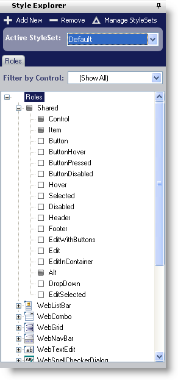

////

|metadata|
{
    "name": "webappstylist-style-explorer",
    "controlName": ["WebAppStylist"],
    "tags": ["Styling","Theming"],
    "guid": "{7366683B-B388-4C86-99FD-2F6DEEFC196A}",  
    "buildFlags": [],
    "createdOn": "0001-01-01T00:00:00Z"
}
|metadata|
////

= Style Explorer

The Style Explorer will help you do exactly what its name implies – explore shared and control-specific styles. Through the Style Explorer, you can add, remove, and manage all of your styles – most of these actions requiring just one mouse-click.

Click the Add New button to open the StyleSet Manager (learn more about the StyleSet Manager in link:webappstylist-creating-a-styleset.html[Creating a StyleSet]). The StyleSet Manager opens with a new StyleSet already created. Click the Remove button to instantly remove the selected StyleSet from your current Style Library. Clicking Manage StyleSets will again open the link:webappstylist-styleset-manager-dialog-box.html[StyleSet Manager], this time without creating a new StyleSet.

In the Style Explorer, you can also navigate through shared rolesand control-specific roles using the Roles tab.

Under the link:webappstylist-roles.html[Roles] tab, you will find a tree with the main Roles node. You can filter the tree by control to display only Roles based on a single control. The first child node in the tree is Shared, the rest of the nodes are specific to each stylable control. The roles in the Shared node are applied to every control. Although, you can override those styles by setting control-specific roles in a control's specific node. Each of these Roles have an image associated with them to the left of the Role's name. This image indicates whether or not that Role has been styled. If the image is a dark square, than that Role has been styled, and has an associated class in the style sheet. If the image is an empty square, there is no associated class in the style sheet.

Depending on whether a control is available in a StyleSet, the control-specific nodes may be dimmed. If a node is dimmed, this means that there is currently no CSS file associated with that control and it will not be styled when the StyleSet is applied to your Web site. For more information on including control-specific styles in your StyleSet, see the link:webappstylist-styleset-manager-dialog-box.html[StyleSet Manager Dialog Box].

