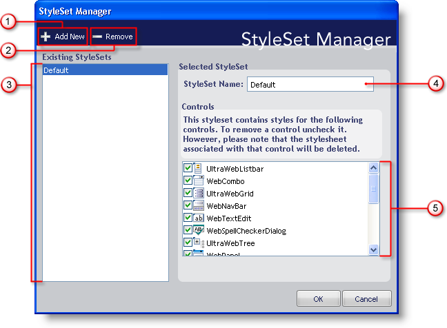

////

|metadata|
{
    "name": "webappstylist-styleset-manager-dialog-box",
    "controlName": ["WebAppStylist"],
    "tags": [],
    "guid": "{07B559D5-A095-4A2E-A9C2-5422AA0CF525}",  
    "buildFlags": [],
    "createdOn": "0001-01-01T00:00:00Z"
}
|metadata|
////

= StyleSet Manager Dialog Box

Manage all of your StyleSets from one convenient location using the StyleSet Manager. The StyleSet Manager can quickly add and remove StyleSets from your current Style Library as well as perform several other tasks. Below is a screenshot of the StyleSet Manager dialog box along with a description of each option.

[start=1]
. *Add New* -- Click this button to create a new StyleSet and add it to the current Style Library. Upon clicking the button, a new StyleSet will be created and named "NewStyleSet#" (where "#" is automatically incremented for each StyleSet created using the Add New button).
[start=2]
. *Remove* -- Click Remove to permanently delete the selected StyleSet from the Style Library. The Delete StyleSet? dialog box will display asking if you are sure you want to delete the chosen StyleSet. Click Yes to remove the StyleSet. Click No to keep the StyleSet.
[start=3]
. *Existing StyleSets* -- All StyleSets that exist in the current Style Library will be displayed in this list.
[start=4]
. *StyleSet Name* -- This text box displays the name of the selected StyleSet. Use this text box to edit the name of the StyleSet.
[start=5]
. *Controls* -- You can create a StyleSet that applies to one or more components. By default, all controls are included in a new StyleSet. When you deselect a control, you remove that control, and its associated CSS file, from the Style Library. Be careful when you deselect controls from an existing StyleSet, as those associated CSS files will be permanently deleted!