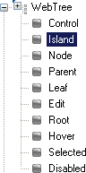
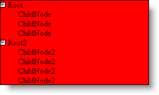
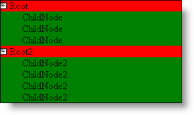
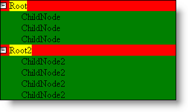
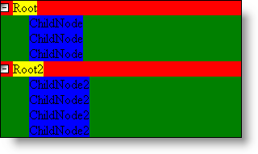
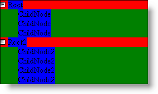

////

|metadata|
{
    "name": "webappstylist-styling-roles-through-inheritance",
    "controlName": ["WebAppStylist"],
    "tags": ["Styling","Theming"],
    "guid": "{74E36D01-581E-4BFF-8F53-7540E5091FFC}",  
    "buildFlags": [],
    "createdOn": "0001-01-01T00:00:00Z"
}
|metadata|
////

= Styling Roles Through Inheritance

Due to the underlying cascading style sheet (CSS), styling UI Roles using inheritance is a built-in feature of Infragistics AppStylist for ASP.NET. All UI Roles in the Roles tree are ordered in a general-to-specific fashion, the same way CSS works. For example, take a look at the UI Roles under the WebTree component in the Roles tree. You'll see the Control, Island, Node, and Parent UI Roles followed by the rest of the Roles.

The WebTree stylesheet is laid out exactly in this form, from Control all the way to Disabled. If we were to change the background color of the Control UI Role to Red, the background color for all unset UI Roles would now be Red (which would be all UI Roles if you started with a blank Style Library.

An all-red WebTree looks boring, so let's go down one level to the Island UI Role. If we were to change the background color of this UI Role to Green, you will notice that the entire background of all child nodes are now green. The Island UI Role is now overriding the Control UI Role.

Let's move to the Root UI Role and change the background color to Yellow. You notice that the Root nodes changed appearance but not the child nodes.

Now let's go back up the tree to the Node UI Role. If we change the background color of the Node UI Role to Blue, you'll notice that all the child nodes, not the root nodes, are now Blue. This is because we already overrode the style of the root node. Therefore, all changes made to UI Roles above the Root UI Role in the chain will not apply to the root node.

Let's move back to the Root UI Role one more time. If we click the Reset button at the upper right corner of the Designer, the UI Role will be reset back to its original state. The original state is that no properties are set. Resetting the UI Role removes the style from the Root UI Role and applies the next set style up the UI Role chain, the Node style, which is Blue.

== Inheritance and the Shared Roles

Don't forget that inheritance also comes into play with the Shared roles. You can set all the roles in Shared and thereby style most of the Infragistics ASP.NET controls. Most roles for several controls such as Control, Item, and Button are inherited from the Shared style sheet. Keeping this in mind will save you time when styling numerous controls. For a list of roles associated with controls and what styles they inherit, see link:webappstylist-styling-specific-components.html[Styling Specific Components].