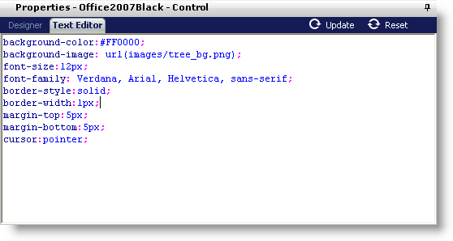

////

|metadata|
{
    "name": "webappstylist-text-editor",
    "controlName": ["WebAppStylist"],
    "tags": [],
    "guid": "{4BA91221-E721-49B6-8B23-E63B714C1322}",  
    "buildFlags": [],
    "createdOn": "0001-01-01T00:00:00Z"
}
|metadata|
////

= Text Editor

Web designers who know CSS well may feel more comfortable in the Text Editor. The Text Editor is a powerful CSS editor with AutoComplete functionality. The editor recognizes which property you are typing and offers the possible settings for it. You need only to select the setting from a popup list. Clicking Update, or pressing F5 on your keyboard, will refresh the current canvas.

The Text Editor is more powerful than the Designer because you can input any CSS properties. The Text Editor will write those properties to the CSS file and the Web browser itself will recognize it. The Designer will ignore any properties that it doesn't recognize.

