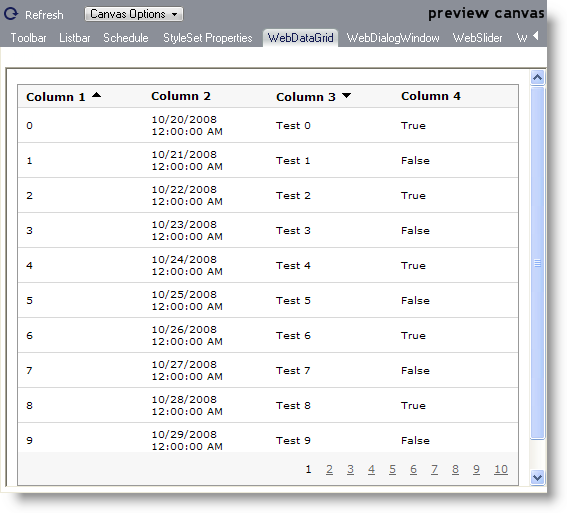

////

|metadata|
{
    "name": "webappstylist-webdatagrid",
    "controlName": ["WebAppStylist"],
    "tags": ["Styling","Theming"],
    "guid": "{FD657735-5353-402A-9066-8F719CCA9EF6}",  
    "buildFlags": [],
    "createdOn": "0001-01-01T00:00:00Z"
}
|metadata|
////

= WebDataGrid

View all of your styling modifications that involve the WebDataGrid control in the WebDataGrid canvas. You will find the following control on the WebDataGrid canvas:

* WebDataGrid

