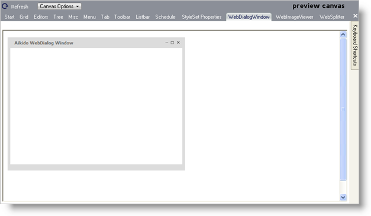

////

|metadata|
{
    "name": "webappstylist-webdialogwindow",
    "controlName": ["WebAppStylist"],
    "tags": ["Styling","Theming"],
    "guid": "{C725EF6A-87AB-4921-8312-F546E46627F0}",  
    "buildFlags": [],
    "createdOn": "0001-01-01T00:00:00Z"
}
|metadata|
////

= WebDialogWindow

View all of your styling modifications that involve the WebDialogWindow control in the WebDialogWindow canvas. The canvas shows the WebDialogWindow control in its default style. You will find the following control on the WebDialogWindow canvas:

* WebDialogWindow

