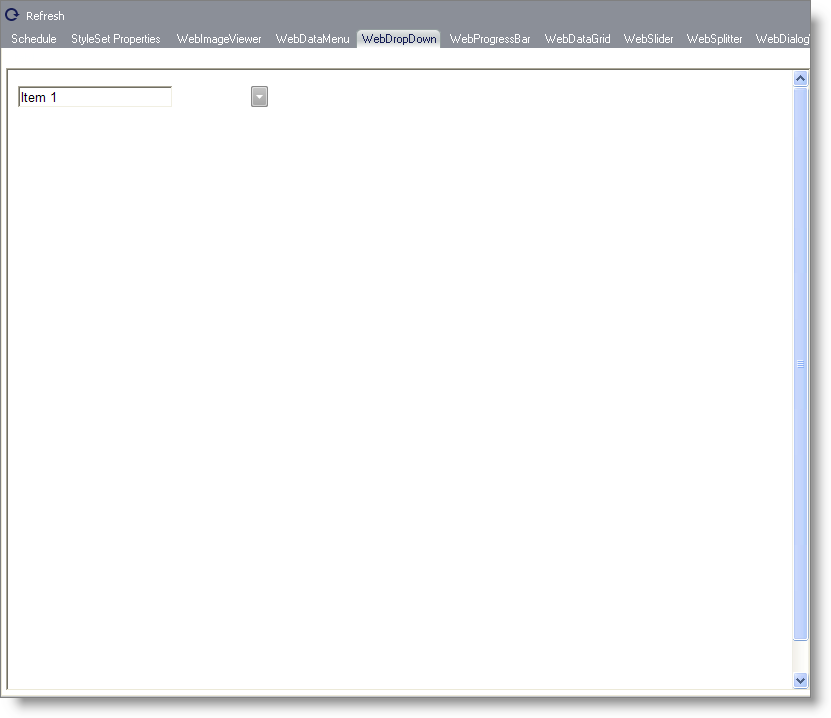

////

|metadata|
{
    "name": "webappstylist-webdropdown",
    "controlName": ["WebAppStylist"],
    "tags": [],
    "guid": "{47E30DBA-38B0-4680-A27A-B6836034C824}",  
    "buildFlags": [],
    "createdOn": "0001-01-01T00:00:00Z"
}
|metadata|
////

= WebDropDown

View all of your styling modifications that involve the WebDropDown control in the WebDropDown canvas. You will find the following control on the WebDropDown canvas:

* WebDropDown

