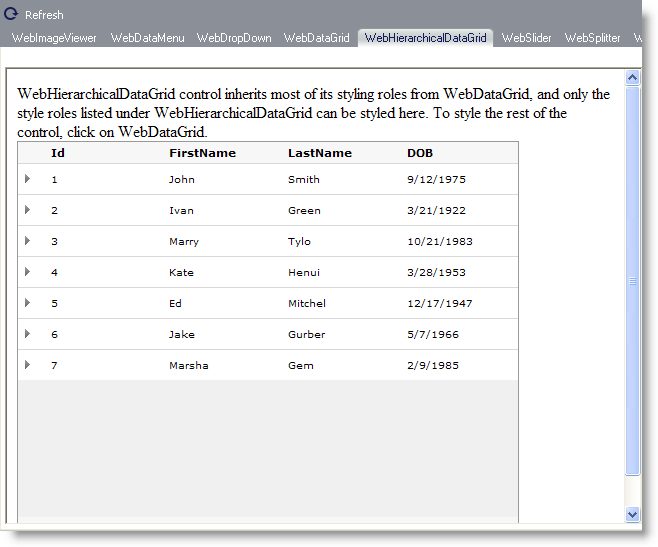

////

|metadata|
{
    "name": "webappstylist-webhierarchicaldatagrid",
    "controlName": ["WebAppStylist"],
    "tags": ["Grids","Styling","Theming"],
    "guid": "{59D1B218-627B-4B61-BC6B-946E8A6D36D7}",  
    "buildFlags": [],
    "createdOn": "0001-01-01T00:00:00Z"
}
|metadata|
////

= WebHierarchicalDataGrid

View all of your styling modifications that involve the WebHierarchicalDataGrid control in the WebHierarchicalDataGrid canvas. You will find the following control on the WebHierarchicalDataGrid canvas:

* WebHierarchicalDataGrid

