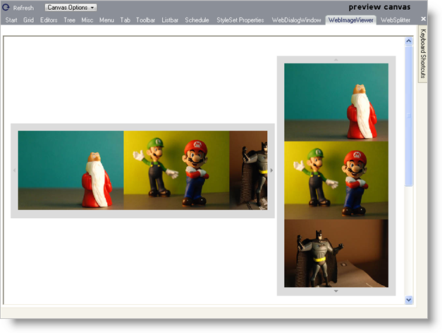

////

|metadata|
{
    "name": "webappstylist-webimageviewer",
    "controlName": ["WebAppStylist"],
    "tags": ["Styling","Theming"],
    "guid": "{D8FEB433-3280-4D61-BDAD-FAD8D9E16EFA}",  
    "buildFlags": [],
    "createdOn": "0001-01-01T00:00:00Z"
}
|metadata|
////

= WebImageViewer

View all of your styling modifications that involve the WebImageViewer control in the WebImageViewer canvas. The canvas shows the WebImageViewer control in horizontal and vertical orientations. You will find the following control on the WebImageViewer canvas:

* WebImageViewer

