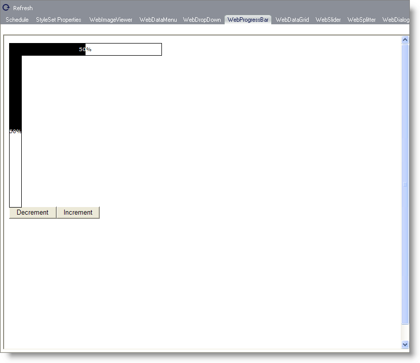

////

|metadata|
{
    "name": "webappstylist-webprogressbar",
    "controlName": ["WebAppStylist"],
    "tags": ["Styling","Theming"],
    "guid": "{EE0ED024-B962-4265-8BA4-FB511BF1591B}",  
    "buildFlags": [],
    "createdOn": "0001-01-01T00:00:00Z"
}
|metadata|
////

= WebProgressBar

View all of your styling modifications that involve the WebProgressBar control in the WebProgressBar canvas. You will find the following control on the WebProgressBar canvas:

* WebProgressBar

