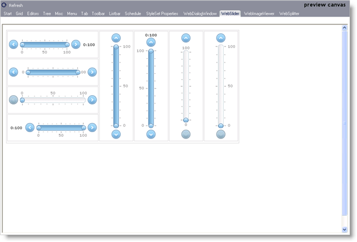

////

|metadata|
{
    "name": "webappstylist-webslider",
    "controlName": ["WebAppStylist"],
    "tags": ["Editing","Styling","Theming"],
    "guid": "{EF3DBD9A-6A2B-41FD-8E3D-A90693A7FC2F}",  
    "buildFlags": [],
    "createdOn": "0001-01-01T00:00:00Z"
}
|metadata|
////

= WebSlider

View all of your styling modifications that involve the WebSlider control in the WebSlider canvas. The canvas shows the WebSlider control in its default style. You will find the following control on the WebSlider canvas:

* WebSlider

