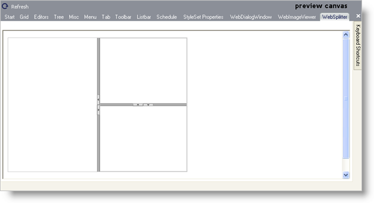

////

|metadata|
{
    "name": "webappstylist-websplitter",
    "controlName": ["WebAppStylist"],
    "tags": ["Styling","Theming"],
    "guid": "{A5D1FA5B-CEF8-40D6-9AD8-C15FE24B9E2C}",  
    "buildFlags": [],
    "createdOn": "0001-01-01T00:00:00Z"
}
|metadata|
////

= WebSplitter

View all of your styling modifications that involve the WebSplitter control in the WebSplitter canvas. The canvas shows one WebSplitter control nested inside another WebSplitter control. You will find the following control on the WebSplitter canvas:

* WebSplitter

