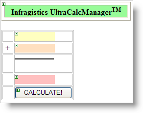
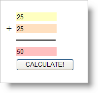

////

|metadata|
{
    "name": "webcalcmanager-summing-two-controls-at-run-time",
    "controlName": ["WebCalcManager"],
    "tags": ["Application Scenarios","How Do I"],
    "guid": "{3E6C9EB6-E239-4468-AA94-96E0A7CBEB11}",  
    "buildFlags": [],
    "createdOn": "0001-01-01T00:00:00Z"
}
|metadata|
////

= Summing Two Controls at Run Time

== Before You Begin:

You can interact with the WebCalcManager™ component at run time by getting or setting any of the properties associated with the elements in a calculation network on a form. This walk through is designed to show you how to set up a summation of the values of two text boxes and put the resulting value in a third text box.

== Follow These Steps:

[start=1]
. Begin with a ASP.NET project.
[start=2]
. Before you start writing any code, you should place using/imports directives in your code-behind so you don't need to always type out a member's fully qualified name.

*In Visual Basic:*

----
Imports Infragistics.WebUI.UltraWebCalcManager
----

*In C#:*

----
using Infragistics.WebUI.UltraWebCalcManager;
----

[start=3]
. On the form place an UltraWebCalcManager, three TextBoxes, and an server Button arrange them how you please.

[start=4]
. Create the Click event for the button you have placed on the form. Place the following code into newly created Click event.

*In Visual Basic:*

----
 Private Sub Button1_Click(ByVal sender As Object, _
  ByVal e As System.EventArgs) Handles Button1.Click
        ' Gets the CalcSettings for the extended element specified.
        Dim cs1 As CalcSettings = Me.UltraWebCalcManager1.GetCalcSettings(Me.TextBox1)
        ' Gets/sets which property of the control is used as either the source or target 
        ' of any calculations involving the control.
        cs1.PropertyName = "Text"
        ' This sets the CalcSettings extender property for the specified element. 
        Me.UltraWebCalcManager1.SetCalcSettings(Me.TextBox1, cs1)
        ' Gets the CalcSettings for the extended element specified.
        Dim cs2 As CalcSettings = Me.UltraWebCalcManager1.GetCalcSettings(Me.TextBox2)
        ' Gets/sets which property of the control is used as either the source or target 
        ' of any calculations involving the control.
        cs2.PropertyName = "Text"
        ' This sets the CalcSettings extender property for the specified element. 
        Me.UltraWebCalcManager1.SetCalcSettings(Me.TextBox2, cs2)
        ' Gets the CalcSettings for the extended element specified.
        Dim cs3 As CalcSettings = Me.UltraWebCalcManager1.GetCalcSettings(Me.TextBox3)
        ' Gets/sets which property of the control is used as either the source or target 
        ' of any calculations involving the control.
        cs3.PropertyName = "Text"
        ' The Formula which will be used to set the value of this object. 
        cs3.Formula = "[//TextBox1] + [//TextBox2]"
        ' This sets the CalcSettings extender property for the specified element. 
        Me.UltraWebCalcManager1.SetCalcSettings(Me.TextBox3, cs3)
End Sub
----

*In C#:*

----
private void  Button1_Click(object sender, System.EventArgs e)
{
        // Gets the CalcSettings for the extended element specified.
        CalcSettings cs1 = this.UltraWebCalcManager1.GetCalcSettings( this.TextBox1);
        // Gets/sets which property of the control is used as either the source or target 
        // of any calculations involving the control.
        cs1.PropertyName = "Text";
        // This sets the CalcSettings extender property for the specified element. 
        this.UltraWebCalcManager1.SetCalcSettings( this.TextBox1, cs1);
        // Gets the CalcSettings for the extended element specified.
        CalcSettings cs2 = this.UltraWebCalcManager1.GetCalcSettings( this.TextBox2);
        // Gets/sets which property of the control is used as either the source or target 
        // of any calculations involving the control.
        cs2.PropertyName = "Text";
        // This sets the CalcSettings extender property for the specified element. 
        this.UltraWebCalcManager1.SetCalcSettings( this.TextBox2, cs2);
        // Gets the CalcSettings for the extended element specified.
        CalcSettings cs3 = this.UltraWebCalcManager1.GetCalcSettings( this.TextBox3);
        // Gets/sets which property of the control is used as either the source or target 
        // of any calculations involving the control.
        cs3.PropertyName = "Text";
        // The Formula which will be used to set the value of this object. 
        cs3.Formula = "[//TextBox1] + [//TextBox2]";
        // This sets the CalcSettings extender property for the specified element. 
        this.UltraWebCalcManager1.SetCalcSettings( this.TextBox3, cs3);
}
----

[start=5]
. If you build project and run it, type in values into the first and second textbox, and press the Calculate button, the resulting calculation will display in the third textbox.

== What You Accomplished:

The following walk through guided you through the steps needed to setup a calculation of two textboxes and place the resulting value into a third textbox.