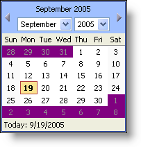

////

|metadata|
{
    "name": "webcalendarview-change-the-style-of-days-outside-of-the-month",
    "controlName": ["WebCalendarView"],
    "tags": ["How Do I"],
    "guid": "{BB6146F7-6A58-4ED8-9829-14F03F0F1087}",  
    "buildFlags": [],
    "createdOn": "0001-01-01T00:00:00Z"
}
|metadata|
////

= Change the Style of Days Outside of the Month

WebCalendarView™ has the ability to  pick:[asp-net="link:infragistics4.webui.shared.v{ProductVersion}~infragistics.webui.shared.style.html[Style]"]  days of months that are displayed, but aren't part of that actual month. Setting the  pick:[asp-net="link:infragistics4.webui.webschedule.v{ProductVersion}~infragistics.webui.webschedule.webcalendarview~othermonthdaystyle.html[OtherMonthDayStyle]"]  helps differentiate the days of the other month from the actual month's days more clearly.

The following code snippet sets the OtherMonthDayStyle BackColor to Purple.

*In Visual Basic:*

----
Private Sub Page_Load(ByVal sender As System.Object, ByVal e _
  As System.EventArgs) Handles MyBase.Load
        Me.WebCalendarView1.OtherMonthDayStyle.BackColor = Color.Purple
End Sub
----

*In C#:*

----
private void Page_Load(object sender, System.EventArgs e)
{
        this.WebCalendarView1.OtherMonthDayStyle.BackColor = Color.Purple;
}
----