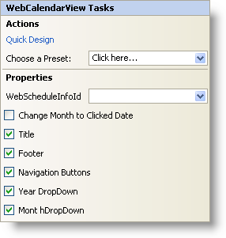

////
|metadata|
{
    "name": "webcalendarview-smart-tag",
    "controlName": ["WebSchedule"],
    "tags": ["Design Environment","Scheduling"],
    "guid": "{5011A638-0712-43DB-B71D-81D9C1436362}",
    "buildFlags": [],
    "createdOn": "2005-04-11T00:00:00Z"
}
|metadata|
////

= WebCalendarView Smart Tag

In Visual Studio 2005 (.NET Framework 2.0), each Infragistics ASP.NET control/component is equipped with a Smart Tag. By simply selecting the control/component, a Smart Tag anchor appears. When you click this anchor, a pop-up panel appears, providing you with quick and easy access to the most common properties and settings of the control/component.

The WebCalendarView™ Smart Tag contains the following sections:

* Actions -- Lets you perform common tasks (i.e., accessing the Quick Designer and loading presets).
* Properties -- Provides easy access to common properties such as Title.

See below for a description of the item (e.g., field, drop-down list, checkbox) in each section, as well as the item's corresponding property in the properties grid.

[options="header", cols="a,a"] 

|==== 

|Actions|Description

|Quick Design
|Click Quick Design to access the Quick Designer. This is the same functionality as if you right-clicked on the control and selected Quick Design from the context menu.

|Choose a Preset
|Click the "Click here" link and quickly select a preset for UltraWebTab. This is the same functionality as if you opened the Quick Designer, expanded Presets, and clicked on Manage Presets.

|====

[options="header", cols="a,a,a"]
|====
|Properties|Description|CorrespondingProperty

|WebScheduleInfoID
|Each view in WebSchedule requires a WebScheduleInfo to function properly. If you already have a WebScheduleInfo on your web form, then it will be visible in the WebScheduleInfoID drop-down.
| link:infragistics4.webui.webschedule.v{ProductVersion}~infragistics.webui.webschedule.webscheduleviewbase~webscheduleinfo.html[WebScheduleInfoID] 

|Change Month to Clicked Date
|This property will automatically change the displayed month when a day in the next or previous month is selected.
| link:infragistics4.webui.webschedule.v{ProductVersion}~infragistics.webui.webschedule.webcalendarview~changemonthtodateclicked.html[ChangeMonthToDateClicked]

|Title
|This option allows you to show or hide the title.
| link:infragistics4.webui.webschedule.v{ProductVersion}~infragistics.webui.webschedule.webscheduleviewbase~captionheadervisible.html[CaptionHeaderVisible]

|Footer
|This option allows you to show or hide the footer.
| link:infragistics4.webui.webschedule.v{ProductVersion}~infragistics.webui.webschedule.webcalendarview~footervisible.html[FooterVisible]

|Navigation Buttons
|This option will show or hide the month navigation buttons at the top of the calendar.
| link:infragistics4.webui.webschedule.v{ProductVersion}~infragistics.webui.webschedule.webscheduleviewbase~navigationbuttonsvisible.html[NavigationButtonsVisible]

|Year DropDown
|This option allows you to show or hide the year drop-down list.
| link:infragistics4.webui.webschedule.v{ProductVersion}~infragistics.webui.webschedule.webcalendarview~yeardropdownvisible.html[YearDropDownVisible]

|Month DropDown
|This option allows you to show or hide the month drop-down list.
| link:infragistics4.webui.webschedule.v{ProductVersion}~infragistics.webui.webschedule.webcalendarview~monthdropdownvisible.html[MonthDropDownVisible]

|====