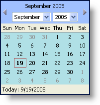

////

|metadata|
{
    "name": "webcalendarview-style-webcalendarviews-days",
    "controlName": ["WebCalendarView"],
    "tags": ["How Do I","Styling"],
    "guid": "{68A34552-EB13-42E4-B22E-93176D443025}",  
    "buildFlags": [],
    "createdOn": "0001-01-01T00:00:00Z"
}
|metadata|
////

= Style WebCalendarView's Days

You can style the WebCalendarView's™ days by using the  pick:[asp-net="link:infragistics4.webui.webschedule.v{ProductVersion}~infragistics.webui.webschedule.webcalendarview~daystyle.html[DayStyle]"]  object that is available. The DayStyle object uses the  pick:[asp-net="link:infragistics4.webui.shared.v{ProductVersion}~infragistics.webui.shared.style.html[Style]"]  object that is seen in several other Infragistics ASP.NET controls.

Note: That setting the DayStyle will apply the style change to all days visible on the calendar whether they are part of that actually month or not. To set the differentiate between days of the shown month and the side months use the  pick:[asp-net="link:infragistics4.webui.webschedule.v{ProductVersion}~infragistics.webui.webschedule.webcalendarview~othermonthdaystyle.html[OtherMonthStyle]"]  object. Review link:webcalendarview-change-the-style-of-days-outside-of-the-month.html[Change the Style of Days Outside of the Month] for information on using this style object.

The following code sets the DayStyle of the WebCalendarView to PowderBlue.

*In Visual Basic:*

----
Private Sub Page_Load(ByVal sender As System.Object, ByVal e _
  As System.EventArgs) Handles MyBase.Load
        Me.WebCalendarView1.DayStyle.BackColor = Color.PowderBlue
End Sub
----

*In C#:*

----
private void Page_Load(object sender, System.EventArgs e)
{
        this.WebCalendarView1.DayStyle.BackColor = Color.PowderBlue;
}
----