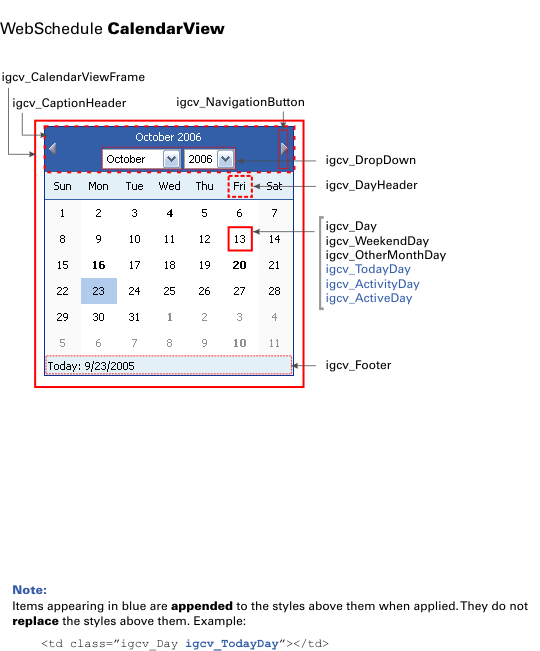

////

|metadata|
{
    "name": "webcalendarview-styling-webcalendarview",
    "controlName": ["WebCalendarView"],
    "tags": ["Styling"],
    "guid": "{B5DD5F65-AFF9-47C4-A87E-53876BCF48EE}",  
    "buildFlags": [],
    "createdOn": "0001-01-01T00:00:00Z"
}
|metadata|
////

= Styling WebCalendarView

The following diagram shows the WebCalendarView™ and how the different style objects you can set on it map to the UI.

link:http://help.infragistics.com/Help/Doc/ASPNET/20{ProductVersion}/CLR4.0/html/WebSchedule_CalendarView.pdf[Printable PDF]

