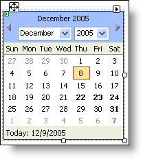
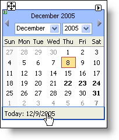

////

|metadata|
{
    "name": "webcalendarview-use-editable-designer-regions-in-webcalendarview",
    "controlName": ["WebCalendarView"],
    "tags": ["How Do I"],
    "guid": "{1C791E2B-B257-4F7B-B4C9-C35D879C73DA}",  
    "buildFlags": [],
    "createdOn": "0001-01-01T00:00:00Z"
}
|metadata|
////

= Use Editable Designer Regions in WebCalendarView

Editable regions are Visual Studio 2005's (.NET Framework 2.0) replacement for design-time templates. An editable region is simply a template that is always in Edit mode. In Visual Studio 2005, you can drag any web element into the editable region in just one step, rather than having to use the Edit Template feature in Visual Studio 2002/2003.

The WebCalendarView™ has an editable designer region in the footer of the calendar. Simply click on the footer and it becomes surrounded with a blue border. You may then edit the date in the footer.

