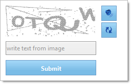

////

|metadata|
{
    "name": "webcaptcha-about-webcaptcha",
    "controlName": ["WebCaptcha"],
    "tags": ["Getting Started","How Do I","Validation"],
    "guid": "7b840355-2e69-4c72-ba7a-26526ebbc676",  
    "buildFlags": [],
    "createdOn": "2010-05-31T11:33:17.5256179Z"
}
|metadata|
////

= About WebCaptcha

The WebCaptcha™ control allows you to protect your applications against automated form submissions. It provides everything needed to ensure that the response is not generated by a spam bot and gives the application developer freedom to configure several protection modes.

WebCaptcha supports the following features:

* Captcha images, generated automatically
* Hidden textbox protection for form submission
* Timeout protection
* Captcha images, generated from a dictionary
* Math-like and logical question-answer captchas, instead of just image
* Button to regenerate image, if image is not readable by the end user
* Ability to style the image – font color, distortion, level of warping , background color, size
* Ability to configure error message and default input box message
* Ability to hide default input box and point to another input box on the form that will serve as the validation
* Validation error message display
* Ability to configure case sensitivity
* Ability to configure length of the text
* Support for numbers and characters , not only characters
* Audio support
* Image recognition – instead of using letters/numbers, the captcha can show a well known item and ask the user what it is, or ask the user to select it from a list of items.

== Related Topics

link:webcaptcha-getting-started-with-webcaptcha.html[Getting Started with WebCaptcha]

link:webcaptcha-using-webcaptcha.html[Using WebCaptcha]