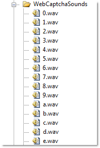

////

|metadata|
{
    "name": "webcaptcha-configuring-captcha-audio",
    "controlName": ["WebCaptcha"],
    "tags": ["Styling","Validation"],
    "guid": "6dc91855-785a-4cf7-a940-07e9d9504436",  
    "buildFlags": [],
    "createdOn": "2010-05-31T13:07:34.4958633Z"
}
|metadata|
////

= Configuring Captcha Audio

The WebCaptcha™ control supports the functionality to spell the randomly generated text code, word or answer of a question, depending on the link:infragistics4.web.v{ProductVersion}~infragistics.web.ui.editorcontrols.webcaptcha~captchadictionarymode.html[CaptchaDictionaryMode] that is being used. The control has embedded sounds for every character (alphanumeric only) and it is spelled in English. The audio file is generated by concatenating “.wav” files, where each file corresponds to a character from the text code.

Using link:infragistics4.web.v{ProductVersion}~infragistics.web.ui.editorcontrols.webcaptcha~captchasoundspath.html[CaptchaSoundsPath] property you can specify your own sounds. To do that, there must be a folder with ”.wav” files for every possible character that can appear on the captcha image. The name of these files must be named as the character itself.

== Related Topics

link:webcaptcha-protection-modes.html[Protection Modes]

link:webcaptcha-dictionary-modes.html[Dictionary Modes]

link:webcaptcha-captcha-validation.html[Captcha Validation]

link:webcaptcha-configuring-captcha-buttons.html[Configuring Captcha Buttons]

link:webcaptcha-configuring-captcha-image-properties.html[Configuring Captcha Image Properties]

link:webcaptcha-configuring-captcha-input-field.html[Configuring Captcha Input Field]