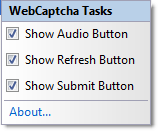

////

|metadata|
{
    "name": "webcaptcha-configuring-captcha-buttons",
    "controlName": ["WebCaptcha"],
    "tags": ["Design Environment","Styling","Validation"],
    "guid": "8ce07d53-7a00-4619-83a6-83c238590e37",  
    "buildFlags": [],
    "createdOn": "2010-05-31T13:04:23.9918633Z"
}
|metadata|
////

= Configuring Captcha Buttons

By default, the WebCaptcha™ control renders three buttons – the Audio button, Refresh button, and Submit button. Each one of these can be styled independently. Here is what the default markup of these buttons looks like:

*In HTML:*

----
<ig:WebCaptcha ID="WebCaptcha1" runat="server">
     <RefreshButton Visible="true"></RefreshButton>
     <SubmitButton runat="server" Text="Submit"Visible="true"></SubmitButton>
     <AudioButton Visible="true"></AudioButton>
</ig:WebCaptcha>
----

By default, the link:infragistics4.web.v{ProductVersion}~infragistics.web.ui.framework.imageobject~visible.html[Visible] property is set to True for all buttons. You can easily make a button invisible by setting its Visible property to False or just using the WebCaptcha’s SmartTag.

Here is a list of the other properties provided:

* link:infragistics4.web.v{ProductVersion}~infragistics.web.ui.framework.imageobject~alttext.html[AltText] – specifies alternate text to display if the image specified by the ImageUrl property is not available.
* link:infragistics4.web.v{ProductVersion}~infragistics.web.ui.framework.imageobject~hoverimageurl.html[HoverImageUrl] – the URL of the image, applied when the button is hovered.
* link:infragistics4.web.v{ProductVersion}~infragistics.web.ui.framework.imageobject~imageurl.html[ImageUrl] – the URL of the image that is displayed.
* link:infragistics4.web.v{ProductVersion}~infragistics.web.ui.editorcontrols.captchaimagebutton~pressedimageurl.html[PressedImageUrl] – the URL of the image, applied when the button is pressed.
* link:infragistics4.web.v{ProductVersion}~infragistics.web.ui.framework.imageobject~tooltip.html[ToolTip] – represents a small description text window when the button is hovered.

== Related Topics

link:webcaptcha-protection-modes.html[Protection Modes]

link:webcaptcha-dictionary-modes.html[Dictionary Modes]

link:webcaptcha-captcha-validation.html[Captcha Validation]

link:webcaptcha-configuring-captcha-image-properties.html[Configuring Captcha Image Properties]

link:webcaptcha-configuring-captcha-input-field.html[Configuring Captcha Input Field]

link:webcaptcha-configuring-captcha-audio.html[Configuring Captcha Audio]