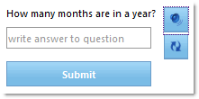

////

|metadata|
{
    "name": "webcaptcha-dictionary-modes",
    "controlName": ["WebCaptcha"],
    "tags": ["API","Validation"],
    "guid": "1f7676ea-9bd9-4f59-8318-41ca3dc09784",  
    "buildFlags": [],
    "createdOn": "2010-05-31T13:01:28.3608633Z"
}
|metadata|
////

= Dictionary Modes

In its standard functionality of generating random characters, the WebCaptcha™ control can be used in two modes: words, or logical questions and answers. To specify which one of these you want to use, the link:infragistics4.web.v{ProductVersion}~infragistics.web.ui.editorcontrols.webcaptcha~captchadictionarymode.html[CaptchaDictionaryMode] property has to be involved.

* link:infragistics4.web.v{ProductVersion}~infragistics.web.ui.editorcontrols.webcaptcha~captchadictionarymode.html[CaptchaDictionaryMode] set to Off – this is the default mode. In this mode the end user has to input randomly generated characters. To see how to configure the captcha image in this mode, see the link:webcaptcha-configuring-captcha-image-properties.html[Configuring Captcha Image Properties] topic.

* link:infragistics4.web.v{ProductVersion}~infragistics.web.ui.editorcontrols.webcaptcha~captchadictionarymode.html[CaptchaDictionaryMode] set to Words – in this mode the control uses words predefined in an external text file. You can set the path to your .txt file by using the link:infragistics4.web.v{ProductVersion}~infragistics.web.ui.editorcontrols.webcaptcha~captchadictionarypath.html[CaptchaDictionaryPath] property. The control gets a random line of this text file and generates the captcha image from it. So if you want to generate a captcha image from just one word, it must be on a separate line.

* link:infragistics4.web.v{ProductVersion}~infragistics.web.ui.editorcontrols.webcaptcha~captchadictionarymode.html[CaptchaDictionaryMode] set to LogicalQuestionAnswer- in this mode the control uses predefined questions and answers in an external text file. The path to your text file is set as it is in the Words mode – by setting link:infragistics4.web.v{ProductVersion}~infragistics.web.ui.editorcontrols.webcaptcha~captchadictionarypath.html[CaptchaDictionaryPath] property. The control gets a random pair of question and answer, assuming that the first line goes for the question and the next one goes for the answer. There should be no empty lines. Here is an example of a text file with logical questions and answers:

How many months are in a year?

12

How many days are in a week?

7

How many minutes are in an hour?

60

== Related Topics

link:webcaptcha-protection-modes.html[Protection Modes]

link:webcaptcha-captcha-validation.html[Captcha Validation]

link:webcaptcha-configuring-captcha-buttons.html[Configuring Captcha Buttons]

link:webcaptcha-configuring-captcha-image-properties.html[Configuring Captcha Image Properties]

link:webcaptcha-configuring-captcha-input-field.html[Configuring Captcha Input Field]

link:webcaptcha-configuring-captcha-audio.html[Configuring Captcha Audio]