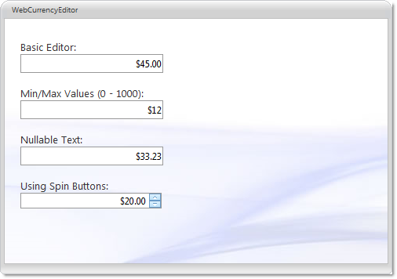

////

|metadata|
{
    "name": "webcurrencyeditor-about-webcurrencyeditor",
    "controlName": ["WebCurrencyEditor"],
    "tags": ["Editing","Getting Started"],
    "guid": "{39D6AC3F-D22B-4A76-A64B-E2682A199978}",  
    "buildFlags": [],
    "createdOn": "2009-03-06T16:28:05Z"
}
|metadata|
////

= About WebCurrencyEditor

WebCurrencyEditor™ is an editor control which allows currency editing functionality and provides various appearance and behavior based properties. WebCurrencyEditor is built using the Infragistics ASP.NET AJAX Framework to leverage a proven code base that promotes a high performance and responsive end-user experience. You can find WebCurrencyEditor in the  pick:[asp-net="link:infragistics4.web.v{ProductVersion}~infragistics.web.ui.editorcontrols_namespace.html[Infragistics.Web.UI.EditorControls]"]  namespace.

Like all Infragistics ASP.NET AJAX controls, WebCurrencyEditor seamlessly integrates into the Infragistics® Application Styling Framework. With CSS based properties you can manually customize the WebCurrencyEditor by leveraging your existing style sheets.

WebCurrencyEditor also exposes a robust model within the client-side Javascript programming environment. The client-side object model (CSOM) consists of full-fledged properties and methods that enable developers to program significant units of functionality without the need of server-side postbacks.

Some of the WebCurrencyEditor control’s features include:

* *High-Performance* -- Lightweight markup and optimized code improve performance.
* *Spin Buttons* -- End-users can easily spin through a list of values.
* *Standard Validators support* -- Supports ASP.NET validator controls.
* *NegativeCssClass* -- This is applied to the editor when the value is negative.
* *DisplayFactor* -- Applies a multiplier to the value(List of supported values : 1, 10,100,1000,10000,100000,1000000).
* *Min and Max values* -- You can easily specify the allowable range of numbers that can be entered into the editor.
* *MinDecimalPlaces* -- Allows you to set the minimum number of decimal places to be displayed when the control loses focus.
* *DataMode* -- Allows you to set the type of object that is used to wrap the value in the control.
* *SelectionOnFocus* -- You can set different selection types for whenever entering edit mode.
* *Culture* -- You can set the CultureInfo object used by the control for localized formatting.
* *MaxLength* -- Allows you to set the maximum length of a text string that can be entered into the control.