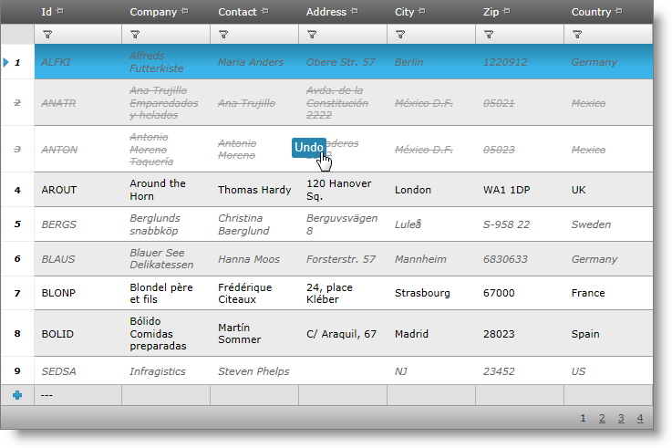

////

|metadata|
{
    "name": "webdatagird-batch-updating-overview",
    "controlName": ["WebDataGrid"],
    "tags": ["Drilldown","Editing","Getting Started","Grids","Performance"],
    "guid": "4aedfdce-8da3-4d2c-b23e-8501bb5d61e6",  
    "buildFlags": [],
    "createdOn": "2011-10-26T07:21:29.6404003Z"
}
|metadata|
////

= Overview

== Introduction

The batch updating functionality of the WebDataGrid™ control allows you to modify, insert, and delete rows without calling the server when switching to another row during the editing process: that is, the changes made exist only in the client and they are not is persisted to the server until a postback is executed.

The picture below demonstrates a WebDataGrid with batch updating enabled. Note that the modified rows (added, update and deleted) are indicated through a special style. Deleted rows also have an Undo button which appears upon mouse hover. This style indication will stay until the first postback to the server.

== Batch Updating Main Features

Following are the main features of the batch updating functionality:

* Modification of unlimited number of rows before the changes are persisted to the server
* Unlimited Undo capability (all changes made can be reverted) before the changes are persisted to the server
* Dynamic recalculation on the client if there are summaries enabled
* Support for client-side events
* Using the existing server events for updating, adding, and deleting rows

== Related Topics

link:webdatagrid-editting.html[WebDataGrid Editing]

link:webdatagrid-batch-updating-enabling.html#_enabling_batch_updating[Enabling Batch Updating]

link:webdatagrid-batch-updating-events.html[WebDataGrid Batch Updating Events]

link:webdatagrid-batch-updating-summaries.html[WebDataGrid Batch Updating Summaries]

link:known-issues-known-issues-and-breaking-changes-revision-history.html[Known Issues and Breaking Changes]

link:webdatagrid-accessibility-compliance.html[WebDataGrid Accessibility Compliance]