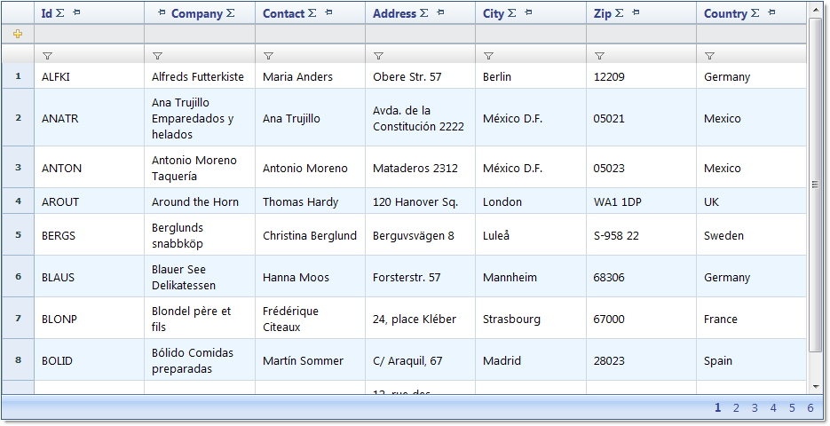

////

|metadata|
{
    "name": "webdatagrid-about-webdatagrid",
    "controlName": ["WebDataGrid"],
    "tags": ["Grids"],
    "guid": "{89790776-61A7-45F1-BC17-7993AA3DD5EB}",  
    "buildFlags": [],
    "createdOn": "0001-01-01T00:00:00Z"
}
|metadata|
////

= About WebDataGrid

WebDataGrid™ is built on top of the Infragistics ASP.NET AJAX framework. It is an efficient and scalable grid control, with native AJAX capabilities. WebDataGrid incorporates an intuitive, easy-to-use design interface, allowing you to customize every aspect of its functionality with ease. The control's many features and functionalities can be accessed through the Behaviors collection. Add any behavior you need and only the required elements for that behavior is generated, eliminating any unnecessary overhead.

Like all Infragistics ASP.NET AJAX controls, WebDataGrid seamlessly integrates into the Infragistics® Application Styling framework. With CSS based properties, you can manually customize the WebDataGrid control by leveraging your existing style sheets.

All the functionalities for a flexible, feature-rich grid control are present in WebDataGrid.

Some of WebDataGrid's features include:

* *High-Performance* - Lightweight markup and optimized code improve performance.
* *Standards Conformance* - CSS 2 and XHTML 1.0 compliance.
* *Numerous Supported Data Sources* - Support for a large range of bindable data sources including standard Microsoft data source controls and objects implementing IEnumerable.
* *Native AJAX Support* - Because the Infragistics ASP.NET AJAX controls are built on top of the Microsoft® ASP.NET AJAX Extensions, most of WebDataGrid’s functionalities are executed using AJAX, eliminating the hindrance of full page postbacks.

Some of WebDataGrid's behaviors are listed below:

* *Column Resizing* - Resize columns dynamically.
* *Editing* - Cell editing, row adding, row deleting, and a Row Editing Template for customizable editing, with automatic updates to the data source.
* *Filtering* - Customizable filter conditions and values allow for a more tailored filtering experience according to your needs and specifications.
* *Paging* - Break up your data into smaller, viewable pages of data.
* *Row Selectors* - For easy selection and manipulation of rows.
* *Sorting* - Sort WebDataGrid's data for a more organized display.
* *Templates* - Most of the elements in WebDataGrid can be templated allowing for maximum flexibility and customization.

