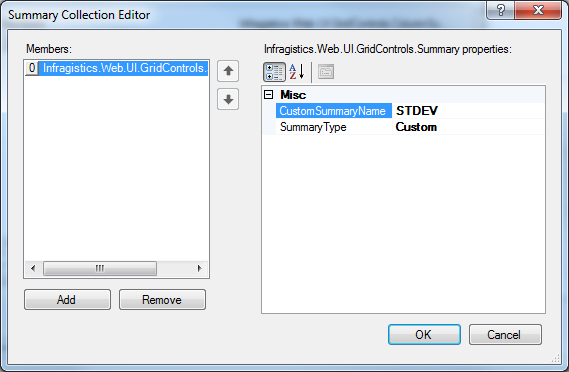
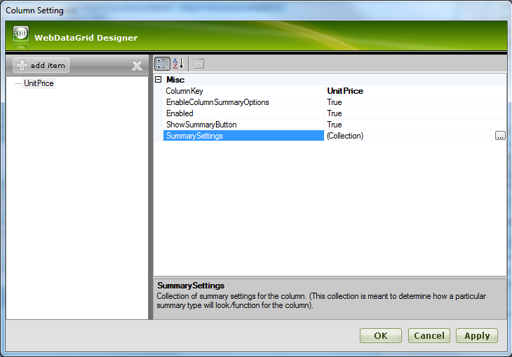
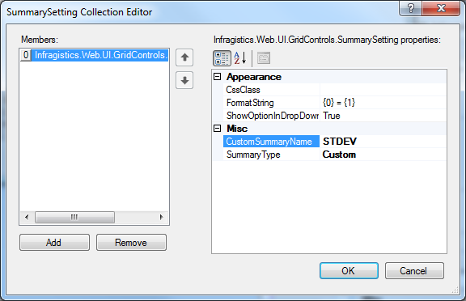
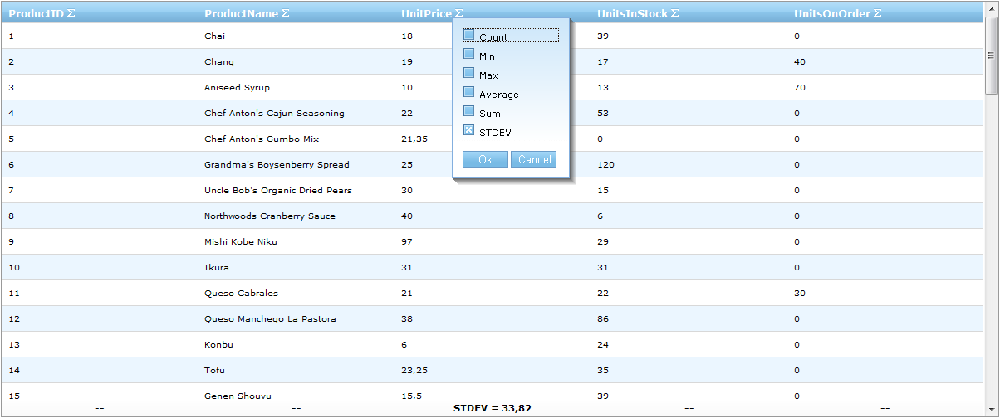

////

|metadata|
{
    "name": "webdatagrid-adding-custom-summary",
    "controlName": ["WebDataGrid"],
    "tags": ["Grids","Summaries"],
    "guid": "3dd729cf-3d42-466a-b9a4-e7c3d16674ef",  
    "buildFlags": [],
    "createdOn": "2010-09-29T11:02:00.6721245Z"
}
|metadata|
////

= Adding Custom Summary

== Before You Begin

Beside the standard summaries, you can add and display custom ones.

== What You Will Accomplish

You will learn how to add (as an option in the summary drop down) and display a custom summary.

== Follow these Steps

[start=1]
. Follow the steps from 1 to 6 from the link:webdatagrid-summary-row.html[Summary Row] topic.
[start=2]
. At Collection Editor Dialog click Add button. Choose Custom from link:{ApiPlatform}web{ApiVersion}~infragistics.web.ui.gridcontrols.summarytype.html[SummaryType] and type STDEV against CustomSummaryName. The link:{ApiPlatform}web{ApiVersion}~infragistics.web.ui.gridcontrols.summary~customsummaryname.html[CustomSummaryName] property is shown at the summary row against the custom summary value.

[start=3]
. From the Edit Grid Behaviors Dialog and Summary Row properties window, click on the link:{ApiPlatform}web{ApiVersion}~infragistics.web.ui.gridcontrols.summaryrow~columnsettings.html[ColumnSettings] ellipsis(…) to launch the link:{ApiPlatform}web{ApiVersion}~infragistics.web.ui.gridcontrols.columnsetting.html[ColumnSetting] Dialog.
[start=4]
. At the Column Setting Dialog, click on add item button. Choose UnitPrice against the link:{ApiPlatform}web{ApiVersion}~infragistics.web.ui.gridcontrols.columnsetting~columnkey.html[ColumnKey] property.

[start=5]
. Click on the link:{ApiPlatform}web{ApiVersion}~infragistics.web.ui.gridcontrols.summarysettings.html[SummarySettings] ellipsis(…) to launch the link:{ApiPlatform}web{ApiVersion}~infragistics.web.ui.gridcontrols.summarysetting.html[SummarySetting] Collection Editor Dialog.
[start=6]
. Click on the Add button and choose Custom from the link:{ApiPlatform}web{ApiVersion}~infragistics.web.ui.gridcontrols.summarysetting~summarytype.html[SummaryType] drop down. Type Standard Deviation against the link:{ApiPlatform}web{ApiVersion}~infragistics.web.ui.gridcontrols.summarysetting~customsummaryname.html[CustomSummaryName], which is shown at the summary select drop-down.

The following markup should be generated:

*In HTML:*

----
<Behaviors>
    <ig:SummaryRow AnimationType="Bounce">
        <ColumnSummaries>
            <ig:ColumnSummaryInfo ColumnKey="UnitPrice">
                <Summaries>
                <ig:Summary SummaryType="Custom" CustomSummaryName="STDEV" />
                </Summaries>
            </ig:ColumnSummaryInfo>
        </ColumnSummaries>
        <ColumnSettings>
            <ig:SummaryRowSetting ColumnKey="UnitPrice">
                <SummarySettings>
                    <ig:SummarySetting CustomSummaryName="Standard Deviation" SummaryType="Custom" />
                </SummarySettings>
            </ig:SummaryRowSetting>
        </ColumnSettings>
    </ig:SummaryRow>
</Behaviors>
----

The following code shows how to add custom summary from the code-behind:

*In Visual Basic:*

----
Dim unitPriceSetting As New SummaryRowSetting(Me.WebDataGrid1, "UnitPrice")
Dim stdevSetting As New SummarySetting()
stdevSetting.SummaryType = SummaryType.[Custom]
stdevSetting.CustomSummaryName = "STDEV"
stdevSetting.FormatString = "STDEV = {1}"
unitPriceSetting.SummarySettings.Add(stdevSetting)
WebDataGrid1.Behaviors.SummaryRow.ColumnSettings.Add(unitPriceSetting)
Dim stdevInfo As New ColumnSummaryInfo()
stdevInfo.ColumnKey = "UnitPrice"
Dim stdevSummary As New Summary()
stdevSummary.SummaryType = SummaryType.[Custom]
stdevSummary.CustomSummaryName = "STDEV"
stdevInfo.Summaries.Add(stdevSummary)
WebDataGrid1.Behaviors.SummaryRow.ColumnSummaries.Add(stdevInfo)
----

*In C#:*

----
SummaryRowSetting unitPriceSetting = new SummaryRowSetting(this.WebDataGrid1, "UnitPrice");
SummarySetting stdevSetting = new SummarySetting();
stdevSetting.SummaryType = SummaryType.Custom;
stdevSetting.CustomSummaryName = "STDEV";
stdevSetting.FormatString = "STDEV = {1}";
unitPriceSetting.SummarySettings.Add(stdevSetting);
WebDataGrid1.Behaviors.SummaryRow.ColumnSettings.Add(unitPriceSetting);
ColumnSummaryInfo stdevInfo = new ColumnSummaryInfo();
stdevInfo.ColumnKey = "UnitPrice";
Summary stdevSummary = new Summary();
stdevSummary.SummaryType = SummaryType.Custom;
stdevSummary.CustomSummaryName = "STDEV";
stdevInfo.Summaries.Add(stdevSummary);
WebDataGrid1.Behaviors.SummaryRow.ColumnSummaries.Add(stdevInfo);
----

[start=7]
. In order to add custom summaries, we need to handle a link:{ApiPlatform}web{ApiVersion}~infragistics.web.ui.gridcontrols.summaryrow~calculatecustomsummary_ev.html[CalculateCustomSummary] event. After you attach to the event, add the following code:

*In Visual Basic:*

----
Protected Function WebDataGrid1_CalculateCustomSummary(sender As Object, e As CustomSummaryEventArgs) As Object
    'calculate the St.dev summary
    If e.Summary.CustomSummaryName = "STDEV" Then
        'calculate the sum of all values
        Dim sum As Double = 0.0
        Dim n As Integer = 0
        For Each gr As GridRecord In Me.WebDataGrid1.Rows
            sum += Convert.ToDouble(gr.Items(2).Value)
            n += 1
        Next
        'calculate the sum of squared deviations
        Dim mean As Double = sum / n
        sum = 0
        For Each gr As GridRecord In Me.WebDataGrid1.Rows
            sum += Math.Pow(mean - Convert.ToDouble(gr.Items(2).Value), 2)
        Next
        sum = sum / (n - 1)
        Return Math.Round(Math.Sqrt(sum), 2)
    End If
    Return Nothing
End Function
----

*In C#:*

----
protected object WebDataGrid1_CalculateCustomSummary(object sender, CustomSummaryEventArgs e)
 {
     //calculate the St.dev summary
     if (e.Summary.CustomSummaryName == "STDEV")
     {
         //calculate the sum of all values
         double sum = 0.0;
         int n = 0;
         foreach (GridRecord gr in this.WebDataGrid1.Rows)
         {
             sum += Convert.ToDouble(gr.Items[2].Value);
             ++n;
         }
         //calculate the sum of squared deviations
         double mean = sum / n;
         sum = 0;
         foreach (GridRecord gr in this.WebDataGrid1.Rows)
         {
             sum += Math.Pow(mean - Convert.ToDouble(gr.Items[2].Value), 2);
         }
         sum = sum / (n - 1);
         return Math.Round(Math.Sqrt(sum), 2);
     }
     return null;
 }
----

[start=8]
. Save and run your application. At the UnitPrice column footer you’ll find STDEV summary.

== Related Topics

link:webdatagrid-summary-settings.html[Summary Settings]

link:webdatagrid-compact-rendering.html[Compact Rendering]