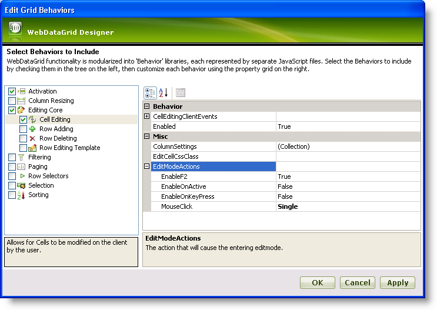

////

|metadata|
{
    "name": "webdatagrid-cell-editing",
    "controlName": ["WebDataGrid"],
    "tags": ["Editing","Grids"],
    "guid": "{C552E743-3057-412E-AB7B-D1C4137A47BF}",  
    "buildFlags": [],
    "createdOn": "0001-01-01T00:00:00Z"
}
|metadata|
////

= Cell Editing (WebDataGrid)

The  pick:[asp-net="link:{ApiPlatform}web{ApiVersion}~infragistics.web.ui.gridcontrols.behaviors~editingcore.html[EditingCore]"]  and  pick:[asp-net="link:{ApiPlatform}web{ApiVersion}~infragistics.web.ui.gridcontrols.cellediting.html[CellEditing]"]  behaviors are essential for cell editing in WebDataGrid™. You can edit a cell through the UI or by using code.

== 

== Before You Begin

To enable data editing in WebDataGrid™, add the  pick:[asp-net="link:{ApiPlatform}web{ApiVersion}~infragistics.web.ui.gridcontrols.cellediting.html[CellEditing]"]  behavior to the  pick:[asp-net="link:{ApiPlatform}web{ApiVersion}~infragistics.web.ui.gridcontrols.behaviors.html[Behaviors]"]  collection. The  pick:[asp-net="link:{ApiPlatform}web{ApiVersion}~infragistics.web.ui.gridcontrols.editablebehaviorbase~editmodeactions.html[EditModeActions]"]  property of the CellEditing behavior lets you determine what actions will cause a cell to enter edit mode.

If you have handled the  pick:[asp-net="link:{ApiPlatform}web{ApiVersion}~infragistics.web.ui.gridcontrols.editingcore~rowupdating_ev.html[RowUpdating]"]  event, changes will commit immediately to your data source as you lose focus on the edited row. For a row to obtain or lose focus, you must have the  pick:[asp-net="link:{ApiPlatform}web{ApiVersion}~infragistics.web.ui.gridcontrols.behaviors~activation.html[Activation]"]  behavior enabled. For more information on the Activation behavior, see link:webdatagrid-activation.html[Activation].

.Note:
[NOTE]
====
You must have a supported data source for this type of automatic update to occur. For a list of data sources that can take advantage of this feature, see link:webdatagrid-supported-data-sources.html[Supported Data Sources]. If your data source cannot be automatically updated by WebDataGrid, you must handle the update events and update the data manually.
====

== What You Will Accomplish

You will learn how to update data from the Customers table with the WebDataGrid control bound to a SqlDataSource component.

== Follow these Steps

[start=1]
. Bind WebDataGrid to a SqlDataSource component retrieving data from the Customers table. For more information on doing this, see link:webdatagrid-getting-started-with-webdatagrid.html[Getting Started with WebDataGrid].
[start=2]
. In the Microsoft® Visual Studio™ property window for WebDataGrid, Set the  pick:[asp-net="link:{ApiPlatform}web{ApiVersion}~infragistics.web.ui.framework.data.flatdataboundcontrol~datakeyfields.html[DataKeyFields]"]  property to CustomerID so that changes in WebDataGrid can be updated to the data source.
[start=3]
. In the same window, locate the Behaviors property and click the ellipsis (...) button to launch the Behaviors Editor Dialog.
[start=4]
. Check the CheckBox next to Cell Editing from the list on the left to add and enable the behavior. Notice that the  pick:[asp-net="link:{ApiPlatform}web{ApiVersion}~infragistics.web.ui.gridcontrols.behaviors~editingcore.html[EditingCore]"]  behavior is added as well.
[start=5]
. In the Cell Editing property section, under the EditModeActions property, set the  pick:[asp-net="link:{ApiPlatform}web{ApiVersion}~infragistics.web.ui.gridcontrols.editmodeactions~mouseclick.html[MouseClick]"]  property to Single. This specifies that a cell enters edit mode on a single click.

[start=6]
. Click Apply then Ok. The following markup should be generated:

*In HTML:*

----
<Behaviors>
    <ig:EditingCore>
        <Behaviors>
            <ig:CellEditing>
                    <EditModeActions MouseClick="Single" />
             </ig:CellEditing>
        </Behaviors>
    </ig:EditingCore>
</Behaviors>
----

To add a cell editing behavior from the code-behind, add the following code:

*In Visual Basic:*

[source,vb]
----
WebDataGrid1.Behaviors.CreateBehavior(Of Infragistics.Web.UI.GridControls.EditingCore)()
WebDataGrid1.Behaviors.EditingCore.Behaviors.CreateBehavior(Of Infragistics.Web.UI.GridControls.CellEditing)()
WebDataGrid1.Behaviors.EditingCore.Behaviors.CellEditing.EditModeActions.MouseClick = Infragistics.Web.UI.GridControls.EditMouseClickAction.Single
----

*In C#:*

----
WebDataGrid1.Behaviors.CreateBehavior<Infragistics.Web.UI.GridControls.EditingCore>();
WebDataGrid1.Behaviors.EditingCore.Behaviors.CreateBehavior<Infragistics.Web.UI.GridControls.CellEditing>();
WebDataGrid1.Behaviors.EditingCore.Behaviors.CellEditing.EditModeActions.MouseClick = Infragistics.Web.UI.GridControls.EditMouseClickAction.Single;
----

[start=7]
. Go to the events view of the property window for WebDataGrid and handle the RowUpdating event. You do not have to add any code to the event handler.
[start=8]
. Check that  pick:[asp-net="link:{ApiPlatform}web{ApiVersion}~infragistics.web.ui.gridcontrols.webdatagrid~enableajax.html[EnableAjax]"]  is True in the property window of WebDataGrid. If not, set it to True.
[start=9]
. Run the application. When you click on a cell, the cell enters edit mode allowing you to change the data. Once you click off of the cell you just edited, the change is committed to your data source via AJAX.

With CellEditing enabled, you can enter edit mode using the following code.

*In JavaScript:*

----
var grid = $find("WebDataGrid1");
// Get cell to edit
var cell = grid.get_rows().get_row(0).get_cell(0);
// Get CellEditing behavior to call enterEditMode method
grid.get_behaviors().get_editingCore().get_behaviors().get_cellEditing().enterEditMode(cell);
----

== *Access and Edit a Cell*

Editing a cell's value in WebDataGrid™ is restricted to client-side only. You can edit the value of a cell by getting a reference to that cell and calling its set value method.

On the server, a cell’s value is read-only; however, you can retrieve the value for operations such as data validation. You can retrieve a cell’s value both server-side and client-side.

The following code shows you how to retrieve and edit the value of a cell in WebDataGrid.

.Note:
[NOTE]
====
You need only the  pick:[asp-net="link:{ApiPlatform}web{ApiVersion}~infragistics.web.ui.gridcontrols.behaviors~editingcore.html[EditingCore]"]  behavior enabled in order to edit cells programmatically.
====

*In Visual Basic:*

----
' cell value of first item in control 
Dim cellValue As String = Me.WebDataGrid1.Rows(0).Items(0).Value.ToString()
----

*In C#:*

----
// cell value of first item in control
string cellValue = this.WebDataGrid1.Rows[0].Items[0].Value.ToString();
----

*In JavaScript:*

----
var grid = $find("WebDataGrid1");
var oldValue = grid.get_rows().get_row(0).get_cell(0).get_value();
grid.get_rows().get_row(0).get_cell(0).set_value("new string value");
----

Related Topics

link:webdatagrid-enabling-row-deleting.html[Row Deleting]

link:webdatagrid-row-adding.html[Row Adding]

link:webdatagrid-row-editing-template.html[Row Editing Template]