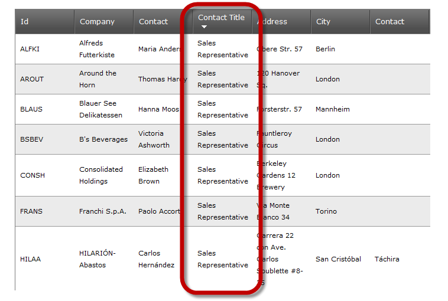
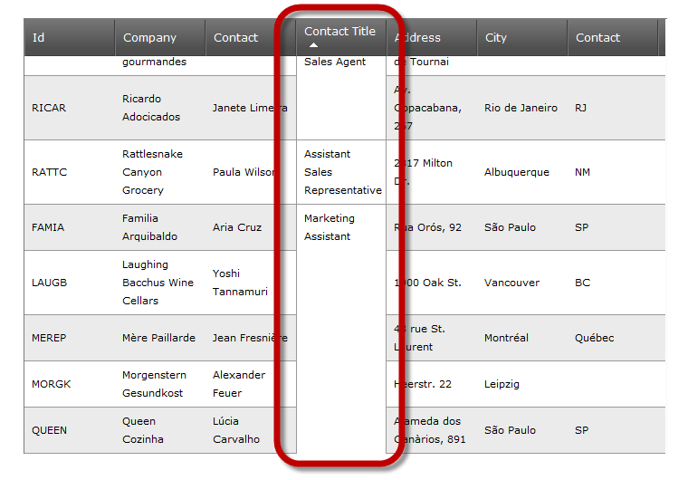

////
|metadata|
{
    "name": "webdatagrid-cell-merging-overview",
    "controlName": ["WebDataGrid"],
    "tags": ["Grids","Grouping"],
    "guid": "aebb359b-1821-4008-8b11-542992ebef3c",
    "buildFlags": [],
    "createdOn": "2012-04-16T16:38:23.035163Z"
}
|metadata|
////

= Cell Merging Overview (WebDataGrid)

=== Purpose

This topic provides an overview of the Cell Merging feature of the  _WebDataGrid_™.

=== Required Background

The following table lists the materials required as a prerequisite to understanding this topic.

[options="header", cols="a,a"]
|====
|Topic|Purpose

| link:webdatagrid-sorting.html[Sorting]
|This topic explains, with code examples, how to enable sorting for the users of the _WebDataGrid_ .

|====

== Cell Merging Summary

=== Cell Merging Summary

Cell merging is a feature that enables users to merge grid cells that have same values. The cells are merged only visually, i.e. the grid structure is not affected by the user’s merging action. Cell merging works on link:webdatagrid-sorting.html[sorting].

The two pictures that follow demonstrate a column with unmerged (left) and merged (right) values.

[cols="a,a"]
|====
||

|====

By default, Cell Merging is disabled. For details on how to enable it, refer to the link:webdatagrid-enabling-cell-merging.html[Enabling Cell Merging (WebDataGrid)] topic.

If the grid is configured for client-side rendering, Cell Merging will be performed on the client. (The default is on the server.) For details, refer to link:webdatagrid-enabling-cell-merging.html[Enabling Cell Merging (WebDataGrid).]

== Related Content

=== Topics

The following topics provide additional information related to this topic.

[options="header", cols="a,a"]
|====
|Topic|Purpose

|* *link:webdatagrid-enabling-cell-merging.html[Enabling Cell Merging (WebDataGrid)]*
|

|* *link:webdatagrid-sorting.html[Sorting]*
|

|====

=== Samples

The following samples provide additional information related to this topic.

[options="header", cols="a,a"]
|====
|Sample|Purpose

| link:{SamplesURL}/samples/webdatagrid/organization/sortingcellmerging/default.aspx?cn=data-grid&sid=bc564381-8ac9-4bb6-84e1-7c36e8010857[Cell Merging with Sorting]
|This sample demonstrates the cell merging capabilities of the sorting behavior in WebDataGrid™.

|====