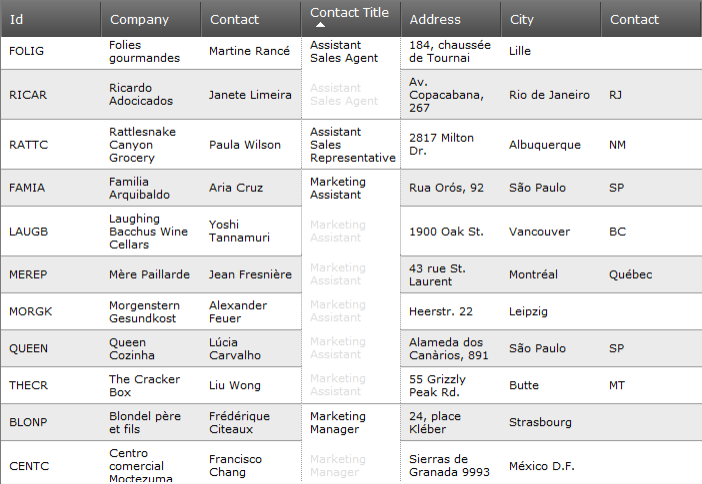

////

|metadata|
{
    "name": "webdatagrid-cell-merging",
    "controlName": ["WebDataGrid"],
    "tags": ["Grids","Grouping"],
    "guid": "7e4bec9d-c837-429c-8abd-9d65d2f41e27",  
    "buildFlags": [],
    "createdOn": "2012-04-12T18:51:24.5806894Z"
}
|metadata|
////

= Cell Merging

=== Introduction

The Cell Merging features of the WebDataGrid™ control provides you with the capability to perform visual merging of cells with the same value.

=== Topics

Detailed information regarding Cell Merging is provided in the following topics:

* link:webdatagrid-cell-merging-overview.html[Overview]
* link:webdatagrid-enabling-cell-merging.html[Enabling Cell Merging]

== Related Content

The following topics provide additional information related to this topic.

[options="header", cols="a,a"]
|====
|Topic|Purpose

| link:webdatagrid-sorting.html[Sorting]
|How to enable sorting of the WebDataGrid™.

|====

=== Samples

The following samples provide additional information related to this topic.

[options="header", cols="a,a"]
|====
|Sample|Purpose

| link:{SamplesURL}/samples/webdatagrid/organization/sortingcellmerging/default.aspx?cn=data-grid&sid=bc564381-8ac9-4bb6-84e1-7c36e8010857[Cell Merging with Sorting]
|This sample demonstrates the cell merging capabilities of the sorting behavior in WebDataGrid™.

|====