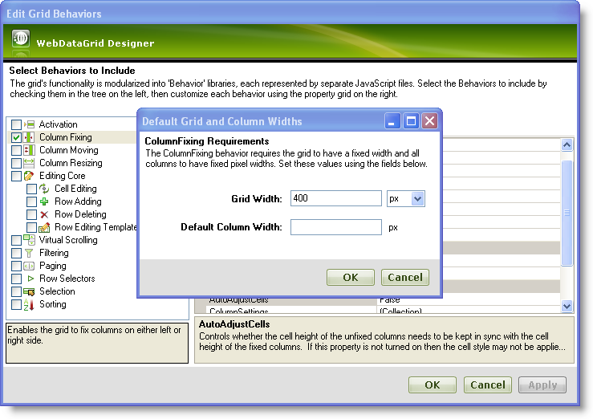
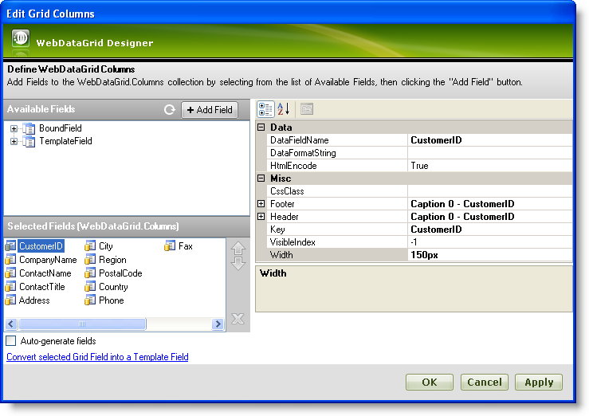
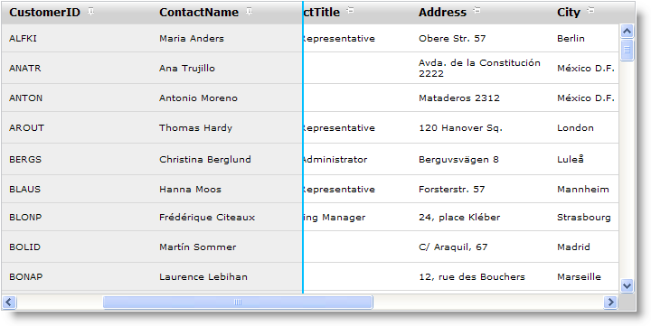

////

|metadata|
{
    "name": "webdatagrid-column-fixing",
    "controlName": ["WebDataGrid"],
    "tags": ["Grids"],
    "guid": "{366097E9-C5F8-4C8B-802D-2DD10F0295B2}",  
    "buildFlags": [],
    "createdOn": "2009-08-06T10:22:31Z"
}
|metadata|
////

= Column Fixing

WebDataGrid™ allows the end-user to fix columns within the grid area; this operation is performed on the client. The fixed columns will remain visible at all times within the grid even when the end-user scrolls the grid horizontally.

.Note:
[NOTE]
====
In order to use Column Fixing behavior, width must be set on the grid as well as all the columns.
====

You can add the column fixing behavior on WebDataGrid through the designer, through the Microsoft® Visual Studio® Property Window, or by using the following code:

*In Visual Basic:*

[source,vb]
----
WebDataGrid1.Behaviors.CreateBehavior(Of Infragistics.Web.UI.GridControls.ColumnFixing)()
----

*In C#:*

----
WebDataGrid1.Behaviors.CreateBehavior<Infragistics.Web.UI.GridControls.ColumnFixing>();
----

WebDataGrid provides you with the following customizing options when column fixing is enabled:

* Hide/Show push pin buttons on column headers for all the columns or for individual columns.
* Align button to left/right of the caption.
* Align button to left/right of the caption.

.Note:
[NOTE]
====
If column moving behavior is also enabled, then column moving can be performed within its own fixed /unfixed column region. For instance, the end-user cannot move a column from fixed area to unfixed area or vice versa; however column moving can be performed within the fixed area or the unfixed area.
====

== Fixing a column with keyboard :

WebDataGrid allows fixing and unfixing of columns through keyboard shortcuts. In order to support this feature, you must enable the  pick:[asp-net="link:infragistics4.web.v{ProductVersion}~infragistics.web.ui.gridcontrols.behaviors~columnfixing.html[ColumnFixing]"]  and  pick:[asp-net="link:infragistics4.web.v{ProductVersion}~infragistics.web.ui.gridcontrols.behaviors~activation.html[Activation]"]   pick:[asp-net="link:infragistics4.web.v{ProductVersion}~infragistics.web.ui.gridcontrols.webdatagrid~behaviors.html[Behaviors]"]  . Once enabled, your end users simply activate a cell in the column that they wish to fix or unfix and then and press the Ctrl+Shift+F keys.

== *Enabling Column Fixing*

Follow these steps to enable column fixing by using the WebDataGrid Designer.

[start=1]
. From the Microsoft® Visual Studio® Toolbox, drag and drop a ScriptManager component and a WebDataGrid control onto the form.
[start=2]
. Bind WebDataGrid to a SqlDataSource component and configure it to retrieve data from the Customers table. For more information on doing this, see the link:webdatagrid-getting-started-with-webdatagrid.html[Getting Started with WebDataGrid] topic.
[start=3]
. In the property window, locate the  pick:[asp-net="link:infragistics4.web.v{ProductVersion}~infragistics.web.ui.gridcontrols.webdatagrid~behaviors.html[Behaviors]"]  property and click the ellipsis (…) button to launch the Edit Grid Behaviors Dialog.
[start=4]
. Check the Column Fixing Behavior to enable it and you will see the Default Grid and Column Widths dialog which provides you with the option of setting the widths of the grid and the columns at design time similar to the following image:

.Note:
[NOTE]
====
In order to use the Column Fixing behavior, a width must be set on the grid as well as on all the columns.
====

[start=5]
. Set the Grid Width to 700px and the Default Column Width to 150px and click OK to close the GridWidthColumnWidthDialog.

However you can also set the widths of the grid and the columns (in case you want to set different widths for the columns) by following these steps:

** Set the width of the grid to 700px by setting the control's link:http://msdn.microsoft.com/query/dev10.query?appId=Dev10IDEF1&l=EN-US&k=k(System.Web.UI.WebControls.WebControl.Width)&rd=true[Width] property.
** In the property window, locate the  pick:[asp-net="link:infragistics4.web.v{ProductVersion}~infragistics.web.ui.gridcontrols.webdatagrid~columns.html[Columns]"]  property and click the ellipsis(…) button to launch the WebDataGrid Designer Dialog.
** From the Selected Fields(WebDataGrid.Columns) section, select each field and set their  pick:[asp-net="link:infragistics4.web.v{ProductVersion}~infragistics.web.ui.gridcontrols.gridfield~width.html[Width]"]  property to 150px as shown in the following image:

** Click Apply and OK to close the the designer.

[start=6]
. Save and run your application. Click on the pin icons next to the CustomerID and ContactName columns to fix them; clicking the pin icon again unfixes the column. You will observe that when you scroll through the data horizontally, the fixed columns are always visible similar to the following image:

To fix columns programatically, add the following code snippet to the CustomerID and CompanyName columns on the left and right side of the grid respectively.

*In Visual Basic:*

----
            Dim behavior As ColumnFixing = Me.WebDataGrid1.Behaviors.GetBehavior(Of ColumnFixing)()
            If behavior Is Nothing Then
                behavior = Me.WebDataGrid1.Behaviors.CreateBehavior(Of ColumnFixing)()
            End If
            'Fixes the CustomerID column on the left
            behavior.FixedColumns.Add(New FixedColumnInfo("CustomerID", FixLocation.Left))
            'Fixes the CompanyName column on the right
            behavior.FixedColumns.Add(New FixedColumnInfo("CompanyName", FixLocation.Right))
----

*In C#:*

----
            ColumnFixing behavior = this.WebDataGrid1.Behaviors.GetBehavior<ColumnFixing>();
            if(behavior == null)
            {
                behavior = this.WebDataGrid1.Behaviors.CreateBehavior<ColumnFixing>();
            }
            //Fixes the CustomerID column on the left
            behavior.FixedColumns.Add(new FixedColumnInfo("CustomerID", FixLocation.Left));
            //Fixes the CompanyName column on the right
            behavior.FixedColumns.Add(new FixedColumnInfo("CompanyName" , FixLocation.Right));
----

.Note:
[NOTE]
====
To fix columns using client-side code, you must enable the column fixing feature on the server-side.
====

*In JavaScript:*

----
             var grid = $find("WebDataGrid1");
            //Get the Column Fixing behavior object
            var columnFixing = grid.get_behaviors().get_columnFixing();
            if (columnFixing != null) {
                //Fixes the CustomerID column on the left
                columnFixing.fixColumnByKey("CustomerID", $IG.FixLocation.Left);
                //Fixes the CompanyName column on the right
                columnFixing.fixColumnByKey("CompanyName", $IG.FixLocation.Right);
      }
----

