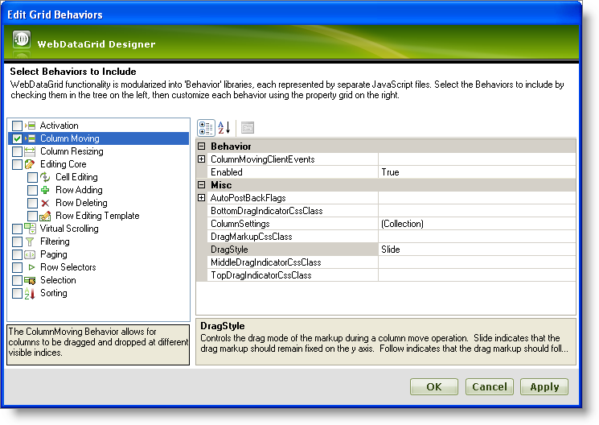
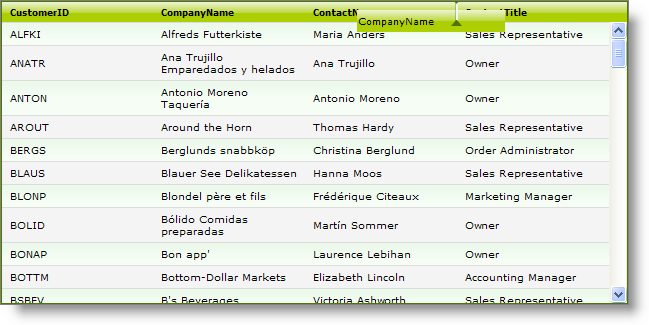

////

|metadata|
{
    "name": "webdatagrid-column-moving",
    "controlName": ["WebDataGrid"],
    "tags": ["Editing","Grids"],
    "guid": "{21891AF0-4A52-4526-9973-8D886AB678DC}",  
    "buildFlags": [],
    "createdOn": "0001-01-01T00:00:00Z"
}
|metadata|
////

= Column Moving

WebDataGrid™ allows column moving. To move a column, the end-user should left click with the mouse and drag the header to the desired position. A drag indicator appears as the end-user drags the column and the column moves to the new location as soon as the mouse click is released. The grid scrolls columns into view as the column is moved over the last visible column to the left or right.

You can add column moving behavior on the WebDataGrid through the designer or using the Microsoft® Visual Studio® Property Window or by using the following code:

*In Visual Basic:*

[source,vb]
----
WebDataGrid1.Behaviors.CreateBehavior(Of Infragistics.Web.UI.GridControls.ColumnMoving)()
----

*In C#:*

----
WebDataGrid1.Behaviors.CreateBehavior<Infragistics.Web.UI.GridControls.ColumnMoving>();
----

== Drag Styles

The column can be dragged in the following two different styles :

* Slide -- The drag markup remains fixed on the Y axis.
* Follow -- The drag markup follows the mouse.

You can set the drag style through the designer or the property window or through the following code:

*In Visual Basic:*

----
WebDataGrid1.Behaviors.ColumnMoving.DragStyle = Infragistics.Web.UI.GridControls.HeaderDragStyle.Follow
----

*In C#:*

----
WebDataGrid1.Behaviors.ColumnMoving.DragStyle = Infragistics.Web.UI.GridControls.HeaderDragStyle.Follow;
----

== *Enabling Column Moving*

Follow these steps to enable column moving by using the WebDataGrid Designer.

[start=1]
. From the Visual Studio™ Toolbox, drag and drop a ScriptManager component and a WebDataGrid control onto the form.
[start=2]
. Bind WebDataGrid to a SqlDataSource component retrieving data from the Customers table. Retrieve the CustomerID, CompanyName, ContactName, and ContactTitle data. For more information on doing this, see the link:webdatagrid-getting-started-with-webdatagrid.html[Getting Started with WebDataGrid] topic.
[start=3]
. In the property window, locate the  pick:[asp-net="link:infragistics4.web.v{ProductVersion}~infragistics.web.ui.gridcontrols.webdatagrid~behaviors.html[Behaviors]"]  property and click the ellipsis(…) button to launch the Edit Behaviors Dialog.
[start=4]
. Check the Column Moving behavior to enable it as shown in the following image :

[start=5]
. Click Apply and OK to close the Edit Grid Behaviors dialog.
[start=6]
. Save and run your application. Your WebDataGrid looks similar to the following image as you drag the header of the column CompanyName :

