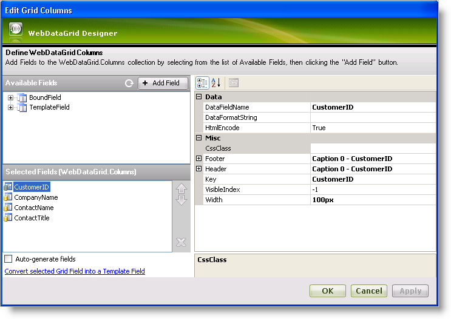
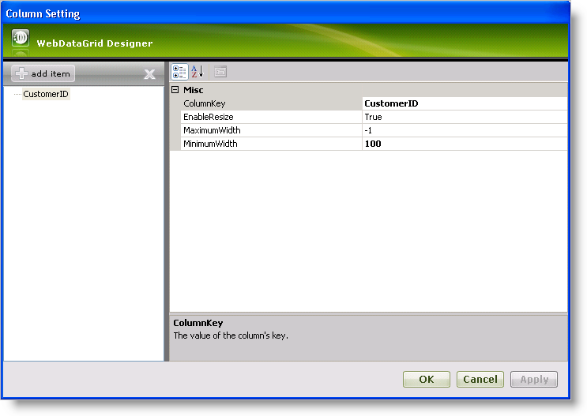
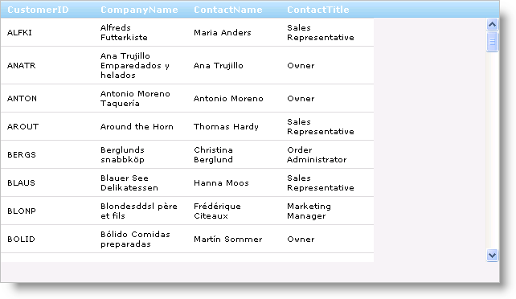

////

|metadata|
{
    "name": "webdatagrid-column-resizing",
    "controlName": ["WebDataGrid"],
    "tags": ["Grids"],
    "guid": "{6B581D24-F9CB-4B11-BE20-C7508722882C}",  
    "buildFlags": [],
    "createdOn": "2008-10-09T15:36:32Z"
}
|metadata|
////

= Column Resizing

WebDataGrid™ allows column resizing. To resize a column, an end-user clicks on the right edge of the column header and drags. A line appears to show the edge of the column while dragging. Only when dragging stops will the column resizes itself.

You can add column resizing behavior on the WebDataGrid through the designer or using the Microsoft® Visual Studio® Property Window or by using the following code:

*In Visual Basic:*

[source,vb]
----
WebDataGrid1.Behaviors.CreateBehavior(Of Infragistics.Web.UI.GridControls.ColumnResizing)()
----

*In C#:*

----
WebDataGrid1.Behaviors.CreateBehavior<Infragistics.Web.UI.GridControls.ColumnResizing>();
----

The way resizing behaves depends on what is set for the width of WebDataGrid’s columns. There are two types of sizes you can set: pixels and percentages. By default, the width of WebDataGrid’s columns are empty, which is the equivalent of percentage sizing.

== Percentage-Based Resizing

When all of WebDataGrid’s columns have percentage widths, resizing occurs so that all columns fit within the control. When an end-user resizes one column, all other columns resize as well, filling in the necessary proportions.

For example, there are 5 columns, each using 20% of WebDataGrid’s width. An end-user resizes one column to 30 % of the width. The remaining 70 % of WebDataGrid’s total width will be divided evenly amongst the other columns based on their proportional value; so since we have 4 columns, each with equal widths they will be assigned widths of 70/4 or roughly 17% so that the total width used is 100%.

== Pixel-Based Resizing

As for pixel sizes, other columns retain their widths when one column resizes. A scrollbar displays if the total column widths exceed that of the control.

.Note:
[NOTE]
====
It is not recommended that you use percentage widths together with pixel widths when you have column resizing enabled. The reason is that columns may resize unpredictably; at that point it is up to the browser to determine the widths of each column when a resize occurs.
====

== Min/Max Width

You can set a minimum and maximum width on a column. This restricts resizing to go beyond these values. Restricting a column’s width requires that you to add a  pick:[asp-net="link:{ApiPlatform}web{ApiVersion}~infragistics.web.ui.gridcontrols.columnresizesetting.html[Column Resizing Setting]"]  for the  pick:[asp-net="link:{ApiPlatform}web{ApiVersion}~infragistics.web.ui.gridcontrols.columnresizing.html[ColumnResizing]"]  behavior. The Column Resizing Setting has a  pick:[asp-net="link:{ApiPlatform}web{ApiVersion}~infragistics.web.ui.gridcontrols.columnresizesetting~minimumwidth.html[MinimumWidth]"]  and  pick:[asp-net="link:{ApiPlatform}web{ApiVersion}~infragistics.web.ui.gridcontrols.columnresizesetting~maximumwidth.html[MaximumWidth]"]  property for which you can set a minimum or maximum value for a column, respectively.

.Note:
[NOTE]
====
You cannot set a percentage min or max value. Further, percentage columns will ignore min/max constraints.
====

== Multi-Column Resizing

You can resize more than one column at a time. You can select multiple columns and drag one column to resize. After you let go of the column, all selected columns resize to the same width. Only resizing a selected column will resize all selected columns; resizing an unselected column will resize only that column.

.Note:
[NOTE]
====
Multi-Column resizing requires that you enable the  pick:[asp-net="link:{ApiPlatform}web{ApiVersion}~infragistics.web.ui.gridcontrols.behaviors~selection.html[Selection]"]  behavior for multiple columns. For information on doing this, see link:webdatagrid-selection.html[Selection].
====

== *Enabling Column Resizing*

== Before You Begin

The WebDataGrid™ control’s columns are resizable. To allow column resizing, you must enable the  pick:[asp-net="link:{ApiPlatform}web{ApiVersion}~infragistics.web.ui.gridcontrols.columnresizing.html[ColumnResizing]"]  behavior. Since column widths are empty by default, enabling column resizing alone makes WebDataGrid resize using percentages.

== What You Will Accomplish

You will learn how to enable pixel-based column resizing on all columns of WebDataGrid. In addition, you will set a minimum size for the primary key column.

== Follow these Steps

[start=1]
. Bind WebDataGrid to a SqlDataSource component retrieving data from the Customers table. Retrieve the CustomerID, CompanyName, ContactName, and ContactTitle data. For more information on doing this, see link:webdatagrid-getting-started-with-webdatagrid.html[Getting Started with WebDataGrid].
[start=2]
. In the Microsoft® Visual Studio™ property window, locate the  pick:[asp-net="link:{ApiPlatform}web{ApiVersion}~infragistics.web.ui.gridcontrols.webdatagrid~columns.html[Columns]"]  property and click the ellipsis (...) button to launch the Columns Editor Dialog.
[start=3]
. Set a pixel width for each column in the control. This allows for resizing to be based on pixels.

.. Select the CustomerID column from the Selected Fields area.
.. In the properties, set the Width to 100px.
.. Repeat steps a and b for columns CompanyName, ContactName and ContactTitle.

[start=4]
. Click Ok to close the dialog.
[start=5]
. Locate the  pick:[asp-net="link:{ApiPlatform}web{ApiVersion}~infragistics.web.ui.gridcontrols.behaviors.html[Behaviors]"]  property and click the ellipsis (...) button to launch the Behaviors Editor Dialog.
[start=6]
. Check the Column Resizing behavior to enable it.
[start=7]
. In the properties for the behavior, locate the  pick:[asp-net="link:{ApiPlatform}web{ApiVersion}~infragistics.web.ui.gridcontrols.columnresizing~columnsettings.html[ColumnSettings]"]  property and click the ellipsis (…) button to launch the Column Settings Designer.
[start=8]
. Click Add to add a column setting.
[start=9]
. Set the  pick:[asp-net="link:{ApiPlatform}web{ApiVersion}~infragistics.web.ui.gridcontrols.columnsetting~columnkey.html[ColumnKey]"]  property to CustomerID.
[start=10]
. Set the  pick:[asp-net="link:{ApiPlatform}web{ApiVersion}~infragistics.web.ui.gridcontrols.columnresizesetting~minimumwidth.html[MinimumWidth]"]  property to 100. This restricts the column from being resized any lower than 100 pixels. You can leave the  pick:[asp-net="link:{ApiPlatform}web{ApiVersion}~infragistics.web.ui.gridcontrols.columnresizesetting~maximumwidth.html[MaximumWidth]"]  property at -1, allowing your end-users to expand the column to any size.

[start=11]
. Click Apply then Ok.
[start=12]
. Click Apply then Ok again to accept changes and close the dialog.
[start=13]
. Run your application. WebDataGrid displays 4 columns each at 100 pixels. All columns are resizable with the CustomerID column restricted to a minimum width of 100 pixels.

