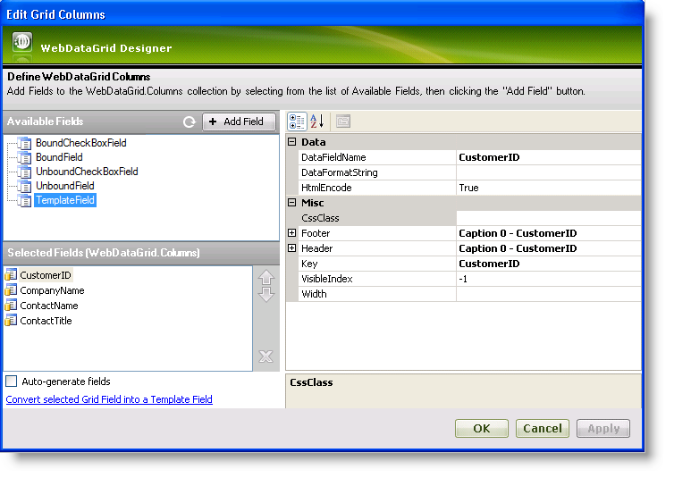

////

|metadata|
{
    "name": "webdatagrid-columns",
    "controlName": ["WebDataGrid"],
    "tags": ["Grids"],
    "guid": "{D6522128-71A8-4942-9527-7B732C3A002D}",  
    "buildFlags": [],
    "createdOn": "2008-10-09T11:16:46Z"
}
|metadata|
////

= Columns

The columns of the WebDataGrid™ control can exist in a bound, unbound and checkbox variants of both and template. Bound columns are generated from the underlying data source while unbound columns are defined in code.

Each column represents the initial column schema of WebDataGrid and you may change the schema to your specifications. If you just want the default schema from the data source without customizing or altering the columns, a simple way to achieve this is to manually remove all of the columns from the designer user interface and then check the Auto-generate check box. By doing this, the WebDataGrid control renders all of the Columns from your underlying data source using the default property settings. Unbound columns of any kind can be added from the designer.

== Columns Designer

Clicking the ellipsis (…) button of the Columns property for WebDataGrid brings up the Columns Designer.

In the top left section you will find the  pick:[asp-net="link:infragistics4.web.v{ProductVersion}~infragistics.web.ui.gridcontrols.boundcheckboxfield.html[BoundCheckBoxField]"] , the  pick:[asp-net="link:infragistics4.web.v{ProductVersion}~infragistics.web.ui.gridcontrols.bounddatafield.html[BoundField]"] , the  pick:[asp-net="link:infragistics4.web.v{ProductVersion}~infragistics.web.ui.gridcontrols.unboundcheckboxfield.html[UnboundCheckBoxField]"] , the  pick:[asp-net="link:infragistics4.web.v{ProductVersion}~infragistics.web.ui.gridcontrols.unboundfield.html[UnboundField]"]  and the  pick:[asp-net="link:infragistics4.web.v{ProductVersion}~infragistics.web.ui.gridcontrols.templatedatafield.html[TemplateField]"]  nodes. The columns nested within these nodes are columns available to the WebDataGrid control. You can select one of these columns and click the *Add* button to add a column to the columns collection, displaying them in the grid.

The Selected Fields section displays columns currently defined in the grid. This is the section where you can set up the column schema that you want for the control.

Beneath the selected fields are options to auto-generate fields or convert a field into a template field. Checking the check box for auto-generating fields generates all columns based on the data source in addition to the columns defined in the Selected Fields section. The “convert” option converts a selected field to a template field or converts it back to a bound field if it is already a template.

On the right side are all the properties associated with a selected column. Here you can set options such as the format string, header/footer properties, key,  pick:[asp-net="link:infragistics4.web.v{ProductVersion}~infragistics.web.ui.gridcontrols.bounddatafield~datafieldname.html[DataFieldName]"] , and width for a column. The DataFieldName property specifies which field name in the underlying data source associated with the selection column. The header and footer properties allow you to set properties such as text for the header and footer.

.Note:
[NOTE]
====
In case of a template field, make sure to set the header text if you want to display a caption in the column header.
====

== Bound Field

A bound field is a column generated from the data source. All available fields retrieved from the data source are grouped under BoundField in the Columns Designer. You can select a bound field and add it to the grid to display it.

== Bound Checkbox Field

A bound checkbox field is a field generated from the data source that is rendered as a checkbox. The bound checkbox field can represent any kind of data, however non-Boolean data must be converted using a converter class implementing the  pick:[asp-net="link:infragistics4.web.v{ProductVersion}~infragistics.web.ui.gridcontrols.ibooleanconverter.html[IBooleanConverter]"]  interface.

== Unbound Field

An unbound field is a field that the user has to set the value of in code. It is not bound to a data source and changing its value on runtime doesn’t cause data binding events to trigger.

== Unbound Checkbox Field

An unbound checkbox field is a field that the user has to set the value of in code and which is rendered as a checkbox. It represents only nullable Boolean data. The column’s header can be a checkbox itself, allowing check/uncheck actions to be applied on all rows at once.

== Template Field

A template field is a field which is blank until you apply a template. Available template fields are grouped under TemplateField in the Columns Designer. You can add a template field the same way as adding a bound field.

== Related Topics

link:webdatagrid-add-or-remove-a-column.html[Add or Remove a Column]

link:webdatagrid-setting-column-settings-for-a-behavior.html[Setting Column Settings for a Behavior]