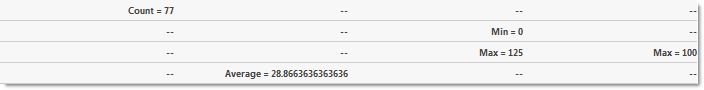
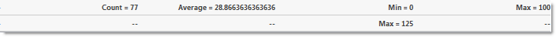
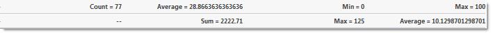
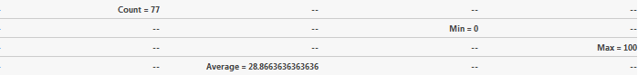

////

|metadata|
{
    "name": "webdatagrid-compact-rendering",
    "controlName": ["WebDataGrid"],
    "tags": ["Grids","Summaries"],
    "guid": "53f66f97-8743-49f4-922e-bf2c9534c1f0",  
    "buildFlags": [],
    "createdOn": "2010-09-29T13:03:13.3829338Z"
}
|metadata|
////

= Compact Rendering and Summaries Filter Properties

The Summary Row behavior has a property called link:infragistics4.web.v{ProductVersion}~infragistics.web.ui.gridcontrols.summaryrow~compactrendering.html[CompactRendering], which specifies how the summaries are rendered. There are three available options:

* Auto (default) – if the maximum number of summaries is one or less, the summaries will be rendered compactly. Otherwise each summary occupies a separate line.

* On – the summaries are rendered compactly, even mixing different summaries on the same line.

* Off – each summary type is rendered on a separate line.

== Summary Row and Filtering Behavior

When Summary Row and Filtering behaviors are enabled, the summary value can be calculated for the filtered data. There is a property called link:infragistics4.web.v{ProductVersion}~infragistics.web.ui.gridcontrols.summaryrow~enablesummariesfilter.html[EnableSummariesFilter], which specifies how the summaries are calculated:

* When EnableSummariesFilter is set to (default), the summaries are calculated for the data that has been filtered.
* When EnableSummariesFilter is set to , the filtering conditions are ignored and the summaries are calculated for the whole data.

.Note:
[NOTE]
====
The summaries are always calculated for the whole data, except for filtered or edited data i.e. when you edit (CRUD) or filter the data in the grid, the summary value is calculated for the filtered or edited data. For the other behaviors (paging, scrolling, etc.), the calculated summary value is for the whole data.
====