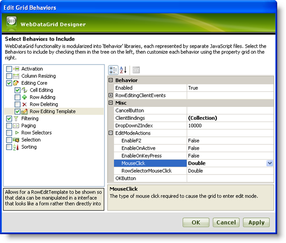
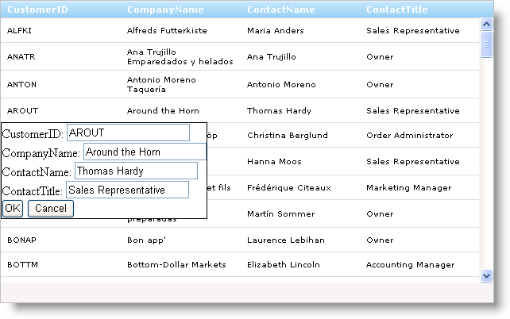

////

|metadata|
{
    "name": "webdatagrid-enabling-row-editing-template",
    "controlName": ["WebDataGrid"],
    "tags": ["Editing","Grouping"],
    "guid": "{631A773D-749C-4F31-9291-C5F16E6F1E34}",  
    "buildFlags": [],
    "createdOn": "2008-12-08T16:15:52Z"
}
|metadata|
////

= Enabling Row Editing Template

== Before You Begin

To supply the end-user with a custom template for data editing in WebDataGrid™, enable the  pick:[asp-net="link:{ApiPlatform}web{ApiVersion}~infragistics.web.ui.gridcontrols.roweditingtemplate.html[Row Editing Template]"]  behavior. The template allows the end-user to edit a row's data through a pop-up that can contain any controls. Changes that occur in the template are applied back to the data source.

== What You Will Accomplish

You will set up the Row Editing Template for data editing in WebDataGrid.

== Follow these Steps

[start=1]
. Bind WebDataGrid to a SqlDataSource component retrieving data from the Customers table. For more information on doing this, see link:webdatagrid-getting-started-with-webdatagrid.html[Getting Started with WebDataGrid].
[start=2]
. In the Microsoft® Visual Studio™ property window, Set the  pick:[asp-net="link:{ApiPlatform}web{ApiVersion}~infragistics.web.ui.framework.data.flatdataboundcontrol~datakeyfields.html[DataKeyFields]"]  property to CustomerID so that changes in WebDataGrid can be updated to the data source.
[start=3]
. In the same window, locate the  pick:[asp-net="link:{ApiPlatform}web{ApiVersion}~infragistics.web.ui.gridcontrols.behaviors.html[Behaviors]"]  property and click the ellipsis (...) button to launch the Behaviors Editor Dialog.
[start=4]
. Check the CheckBox next to Row Editing Template from the list on the left to add and enable the behavior. Notice the  pick:[asp-net="link:{ApiPlatform}web{ApiVersion}~infragistics.web.ui.gridcontrols.behaviors~editingcore.html[EditingCore]"]  behavior is added as well.
[start=5]
. In the properties for Row Editing Template, set the actions that will pop up the template.

.. Expand  pick:[asp-net="link:{ApiPlatform}web{ApiVersion}~infragistics.web.ui.gridcontrols.roweditingtemplate~editmodeactions.html[EditModeActions]"]  and set  pick:[asp-net="link:{ApiPlatform}web{ApiVersion}~infragistics.web.ui.gridcontrols.roweditmodeactions~rowselectormouseclick.html[RowSelectorMouseClick]"]  to None. Since we do not have row selectors at this point, we do not need this action enabled.
.. Set  pick:[asp-net="link:{ApiPlatform}web{ApiVersion}~infragistics.web.ui.gridcontrols.roweditmodeactions~mouseclick.html[MouseClick]"]  to Double. This will bring up the template when the end-user double-clicks on a cell in WebDataGrid.

.Note:
[NOTE]
====
If you want updates to persist immediately after you edit a row, you need to enable the  pick:[asp-net="link:{ApiPlatform}web{ApiVersion}~infragistics.web.ui.gridcontrols.behaviors~activation.html[Activation]"]  behavior as well as handle the  pick:[asp-net="link:{ApiPlatform}web{ApiVersion}~infragistics.web.ui.gridcontrols.editingcore~rowupdating_ev.html[RowUpdating]"]  server-side event of WebDataGrid. For more information on data editing in WebDataGrid, see link:webdatagrid-editting.html[Editing].
====

[start=6]
. Click Apply then Ok.
[start=7]
. Right-click WebDataGrid. Highlight Edit Template from the context menu and select Row Editing Template. A prompt to populate the template with default controls appears.

.Note:
[NOTE]
====
If you are using more than one behavior template, you will see Behavior Templates as a selection in the Edit Template submenu.
====

[start=8]
. Click Ok to automatically populate the template.

.Note:
[NOTE]
====
You can also cancel the prompt and add controls yourself; However, this will require manual binding of the controls in the template to fields in WebDataGrid. For more information on this, see Binding Controls in Row Edit Template.
====

[start=9]
. Right-click the template view and select End Template Editing. You are returned to the normal grid view in the designer.
[start=10]
. Run the application. You can double-click on a cell of WebDataGrid to bring up the Row Editing Template for that row. Click Ok to commit changes from the template back to WebDataGrid's cells.

== Related Topic

link:webdatagrid-using-client-bindings.html[Using Client Bindings]