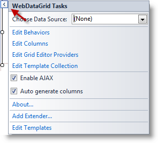
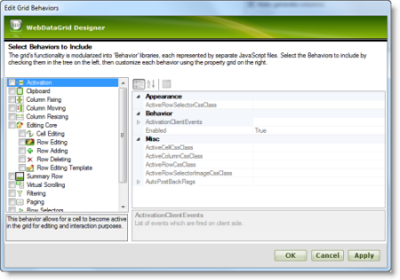
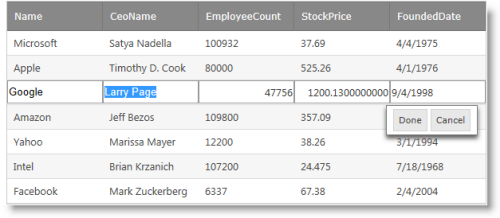

////
|metadata|
{
    "name": "webdatagrid-enabling-row-editing",
    "controlName": [],
    "tags": [],
    "guid": "0d1d6751-8792-4f4e-ad69-c54c4efe0cde",
    "buildFlags": [],
    "createdOn": "2014-03-10T16:14:34.4765316Z"
}
|metadata|
////

= Enabling Row Editing (WebDataGrid)

== Topic Overview

=== Purpose

This topic details how to enable the Row Editing behavior in the  _WebDataGrid_   __™__ .

=== Required background

The following topics are prerequisites to understanding this topic:

[options="header", cols="a,a"]
|====
|Topic|Purpose

| link:webdatagrid-row-editing-overview.html[Row Editing Overview ( _WebDataGrid_ )]
|This topic provides an overview of the _WebDataGrid_ Row Editing behavior’s features and functionality.

| link:webdatagrid-getting-started-with-webdatagrid.html[Getting Started with _WebDataGrid_ ]
|This topic demonstrates how to set up a basic _WebDataGrid_ bound to a SqlDataSource.

|====

=== In this topic

This topic contains the following sections:

* <<_Ref382246037, Introduction >>

** <<OLE_LINK236,Enabling row editing summary>>
** <<_Ref382246047,Enabling row editing summary chart>>

* <<_Ref381995172, Enabling Row Editing with the WebDataGrid Designer >>

** <<_Ref382246110,Introduction>>
** <<OLE_LINK77,Preview>>
** <<OLE_LINK41,Prerequisites>>
** <<OLE_LINK63,Overview>>
** <<_Ref382246140,Steps>>

* <<_Ref381993876, Enabling Row Editing in ASPX Markup >>

** <<_Ref382246150,Introduction>>
** <<_Ref382246154,Preview>>
** <<_Ref382246161,Prerequisites>>
** <<_Ref382246165,Overview>>
** <<_Ref382246175,Steps>>

* <<_Ref381993884, Enabling Row Editing in the Code-Behind >>

** <<_Ref382246188,Introduction>>
** <<_Ref382246198,Preview>>
** <<_Ref382246207,Prerequisites>>
** <<_Ref382246212,Overview>>
** <<_Ref382246217,Steps>>

* <<_Ref382204263, Related Content >>

** <<_Ref382246241,Topics>>
** <<_Ref382246245,Samples>>

[[_Ref382246037]]
== Introduction

By default, row editing is disabled. You can enable it from the  _WebDataGrid_   Designer, from the ASPX markup, or in the code-behind. Each of these is explained in detail below.

[[_Ref382246047]]

=== Enabling row editing summary chart

The following table summarizes the ways to enable row editing for the  _WebDataGrid_  . The full procedures are available after this summary table.

[options="header", cols="a,a"]
|====
|Procedure|Details

|<<_Ref381993851,Enabling Row Editing with the Designer>>
|You enable the Row Editing and Editing Core behaviors by setting the respective options from _WebDataGrid_ ’s smart tag.

|<<_Ref381993876,Enabling Row Editing in ASPX Markup>>
|You enable the Row Editing and Editing Core behaviors by adding the respective ASPX markup to the web form.

|<<_Ref381993884,Enabling Row Editing in the Code-Behind>>
|You enable the Row Editing and Editing Core behaviors by creating them in the code-behind.

|====

[[_Ref381993851]]

[[_Ref381995172]]
== Enabling Row Editing with the  _WebDataGrid_  Designer

[[_Ref382246110]]

=== Introduction

This procedure enables the Row Editing and Editing Core behaviors of the  _WebDataGrid_   using the control’s Designer. You enable these behaviors by setting the respective options from  _WebDataGrid_  ’s smart tag.

=== Preview

The following screenshot is a preview of the final result – the  _WebDataGrid_   has row editing enabled as evidenced by a row that has entered Edit mode as a result of a user action.

image::Images/Enabling_Row_Editing_(WebDataGrid)_1.png[]

=== Prerequisites

To complete the procedure, you need the following:

* An ASP.NET Visual Studio® web site or web application
* A ScriptManager or  _WebScriptManager_™ added to the web form
* A  _WebDataGrid_   added to the web form and bound to any data source

Following is a conceptual overview of the process:

*1. Accessing the Behaviors’ options*

*2.*   *Enabling row editing in the options*

*3.*   _(Optional)_    *Verifying the result*

[[_Ref382246140]]

=== Steps

The following steps demonstrate how to enable the Row Editing behavior in the designer.

=== 1. Access the Behaviors options.

*1. Open the*   *_WebDataGrid’s_*   *smart tag*  *.*

In the Designer, click the smart tag button to open the  _WebDataGrid_  ‘s Designer.

 

*2. Click*  Edit Behaviors *.* 

This opens the designer for the  _WebDataGrid’s_   behaviors.

=== 2. Enable row editing in the options.

*1. Check the box for*  Row Editing Behavior

*2. Click*  OK to commit your changes and close the Designer window *.* The Row Editing behavior takes a dependency on the Editing Core behavior and thus that behavior is checked automatically.

=== 3. (Optional) Verify the result.

**To verify the result,**  *run the project and double-click on a row* . You will see the row editing behavior.

[[_Ref381993876]]
== Enabling Row Editing in ASPX Markup

[[_Ref382246150]]

=== Introduction

You enable the Row Editing and Editing Core behaviors by adding the respective ASPX markup to the web form. This is the same markup that is generated when using the Designer (See <<_Ref381995172,Enabling Row Editing with the WebDataGrid Designer>>). Because the Row Editing behavior requires the EditingCore behavior, you will add that as well.

[[_Ref382246154]]

=== Preview

The following screenshot is a preview of the final result.

[[_Ref382246161]]

=== Prerequisites

To complete the procedure, you need the following:

* An ASP.NET Visual Studio web site or web application
* A  _WebDataGrid_   added to the web form and bound to any data source
* The  _ig_res_   folder and styleset included in the project and configured in the  _web.config_   file
* The  _Infragistics.Web.UI_   and  _Infragistics.Web.UI.GridControls_   namespaces registered on the web form with the `ig` tag prefix

[[_Ref382246165]]

=== Overview

Following is a conceptual overview of the process:

*1. Adding the EditingCore behavior*

*2. Adding the RowEditing behavior*

*3.*   _(Optional)_    *Verifying the result*

[[_Ref382246175]]

=== Steps

The following steps demonstrate how to enable the Row Editing behavior in ASPX markup.

=== 1. Add the EditingCore behavior.

*Add the EditingCore Behavior to the*   *_WebDataGrid_*   *behaviors collection.*

The `Behaviors` tag is nested within the `WebDataGrid` tags. If you already have other behaviors defined, the EditingCore behavior is added as a sibling of those behaviors within the `Behaviors` tag.

*In ASPX:*

[source,html]
----
<ig:WebDataGrid ID="WebDataGrid1" runat="server">
    <Behaviors>
        <ig:EditingCore>
        </ig:EditingCore>
    </Behaviors>
</ig:WebDataGrid>
----

=== 2. Add the Row Editing behavior.

*Add the RowEditing behavior within the EditingCore`s behaviors collection*. The EditingCore behavior has a 'Behaviors' collection similar to the grid. The RowEditing behavior is defined within the 'Behaviors' tag of the 'EditingCore' tag.

*In ASPX:*

[source,html]
----
<ig:EditingCore>
    <Behaviors>
        <ig:RowEditing></ig:RowEditing>
    </Behaviors>
</ig:EditingCore>
----

=== 3. (Optional) Verifying the result.

**To verify the result,**  *save and run the project and double-click on a row* . You will see the row editing behavior. 

*1. Save the ASPX for your page.*

At this point, the code and grid should have the following code elements and functionality.

*In ASPX:*

[source,html]
----
<ig:WebDataGrid ID="WebDataGrid1" runat="server">
    <Behaviors>
        <ig:EditingCore>
            <Behaviors>
                <ig:RowEditing></ig:RowEditing>
            </Behaviors>
        </ig:EditingCore>
    </Behaviors>
</ig:WebDataGrid>
----

*2. Run the project and double click on a row. You will see the row editing behavior.*

[[_Ref381993884]]
== Enabling Row Editing in the Code-Behind

[[_Ref382246188]]

=== Introduction

This procedure adds the RowEditing behavior to the  _WebDataGrid_   at run-time in the code-behind. This approach is useful when you want to add the behavior conditionally. The RowEditing behavior is added to the EditingCore behavior’s Behaviors collection so you will add the EditingCore behavior at runtime as well. You can use the page init or the page load events to add the behaviors during the page lifecycle. This example uses page load.

[[_Ref382246198]]

=== Preview

The following screenshot is a preview of the final result.

[[_Ref382246207]]

=== Prerequisites

To complete the procedure, you need the following:

* An ASP.NET Visual Studio web site or web application
* A  _WebDataGrid_   added to the web form with and bound to any data source
* The  _ig_res_   folder and styleset included in the project and configured in the  _web.config_   file
* A using statement for the  _Infragistics.Web.UI.GridControls_   namespace

[[_Ref382246212]]

=== Overview

Following is a conceptual overview of the process:

*1. Adding the EditingCore behavior*

*2. Adding the RowEditing behavior*

*3.*   _(Optional)_    *Verifying the result*

[[_Ref382246217]]

=== Steps

The following steps demonstrate how to enable the Row Editing behavior in the code-behind.

=== 1. Enable Row Editing in the Code-Behind.

*Add the EditingCore Behavior to the*   *_WebDataGrid_*   *behaviors collection*

The EditingCore behavior is added directly to the  _WebDataGrid’s_   `Behaviors` collection using the link:infragistics4.web.v{ProductVersion}~infragistics.web.ui.gridcontrols.gridbehaviorcollection~createbehavior.html[CreateBehavior] method.

*In C#:*

[source,csharp]
----
protected void Page_Load(object sender, EventArgs e)
{
    WebDataGrid1.Behaviors.CreateBehavior<EditingCore>();
}
----

=== 2. Add the Row Editing behavior

 *Add the RowEditing behavior to the EditingCore’s behaviors collection.* The EditingCore behavior has a `Behaviors` collection similar to the grid. The RowEditing behavior is added to the `Behaviors` collection of the EditingCore behavior.

*In C#:*

[source,csharp]
----
WebDataGrid1.Behaviors.EditingCore.Behaviors.CreateBehavior<RowEditing>();
----

=== 3. (Optional) Verify the result.

**To verify the result,**  *save and run the project and double-click on a row* . You will see the row editing behavior. *1. Save the code-behind file.*

At this point, the code should include the following:

*In C#:*

[source,csharp]
----
using Infragistics.Web.UI.GridControls;
protected void Page_Load(object sender, EventArgs e)
{
    WebDataGrid1.Behaviors.CreateBehavior<EditingCore>();
    WebDataGrid1.Behaviors.EditingCore.Behaviors.CreateBehavior<RowEditing>();
}
----

*2. Run the project and double click on a row. You will see the row editing behavior.*

[[_Ref382204263]]

== Related Content

[[_Ref382246241]]

=== Topics

The following topics provide additional information related to this topic.

[options="header", cols="a,a"]
|====
|Topic|Purpose

| link:webdatagrid-editting.html[Editing Behavior Overview (WebDataGrid)]
|This topic provides a conceptual overview of the Editing feature (`EditingCore` behavior) of the _WebDataGrid_ .

| link:whdg-enabling-row-editing.html[Enabling Row Editing (WebHierarchicalDataGrid)]
|This topic details how to enable the Row Editing behavior in the _WebHierarchicalDataGrid_™.

|====

[[_Ref382246245]]

=== Samples

The following samples provide additional information related to this topic.

[options="header", cols="a,a"]
|====
|Sample|Purpose

| link:{SamplesUrl}/data-grid/row-editing[Row Editing Behavior]
|This sample demonstrates row editing behavior with Done/Cancel buttons and an editor appearing in every cell of the editable row.

| link:{SamplesUrl}/data-grid/customized-row-editing-appearance[Customized Row Editing Appearance]
|You can customize the appearance of the Row Editing behavior by hiding the Done/Cancel buttons or by providing custom HTML and CSS classes for the buttons.

| link:{SamplesUrl}/data-grid/row-editing-client-events[Row Editing Client Events]
|This sample demonstrates how to use the `EnteringEditMode` and `ExitingEditMode` events to customize the row editing behavior.

|====