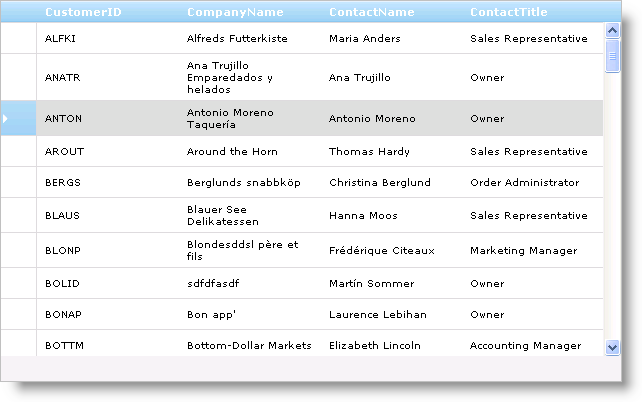

////
|metadata|
{
    "name": "webdatagrid-enabling-row-selectors",
    "controlName": ["WebDataGrid"],
    "tags": ["Grids","Selection"],
    "guid": "{26B63148-9B2D-44FE-9C18-97BA21728177}",
    "buildFlags": [],
    "createdOn": "0001-01-01T00:00:00Z"
}
|metadata|
////

= Enabling Row Selectors

== Before You Begin

A row selector is an element that appears in front of each row in WebDataGrid™. Row selectors are primarily used for selecting or activating rows; however, clicking a row selector allows you to perform any custom action on that row by handling the row selector’s various events. You can also display row numbers in the row selectors. To enable row selectors, enable the  pick:[asp-net="link:{ApiPlatform}web{ApiVersion}~infragistics.web.ui.gridcontrols.behaviors~rowselectors.html[RowSelectors]"]  behavior.

To configure row selectors to automatically select rows when clicked, you must enable the  pick:[asp-net="link:{ApiPlatform}web{ApiVersion}~infragistics.web.ui.gridcontrols.behaviors~selection.html[Selection]"]  behavior. For more information on this, see link:webdatagrid-selection.html[Selection]. You can also enable automatic activation by adding the  pick:[asp-net="link:{ApiPlatform}web{ApiVersion}~infragistics.web.ui.gridcontrols.behaviors~activation.html[Activation]"]  behavior in addition to row selectors. For more information on row activation, see link:webdatagrid-activation.html[Activation].

== What You Will Accomplish

You will learn how to enable row selectors to select rows in WebDataGrid.

== Follow these Steps

[start=1]
. Bind WebDataGrid to a SqlDataSource component retrieving data from the Customers table. For more information on doing this, see link:webdatagrid-getting-started-with-webdatagrid.html[Getting Started with WebDataGrid].
[start=2]
. In the Microsoft® Visual Studio™ property window for WebDataGrid, locate the  pick:[asp-net="link:{ApiPlatform}web{ApiVersion}~infragistics.web.ui.gridcontrols.behaviors.html[Behaviors]"]  property and click the ellipsis (...) button to launch the Behaviors Editor Dialog.
[start=3]
. Check the CheckBox next to Row Selectors in the list on the left-hand side to add and enable the behavior. Do the same for Selection.

.Note:
[NOTE]
====
At this point, you can enable row numbering by setting  pick:[asp-net="link:{ApiPlatform}web{ApiVersion}~infragistics.web.ui.gridcontrols.rowselectors~rownumbering.html[RowNumbering]"]  to True, or handle one of the row selector’s various events under  pick:[asp-net="link:{ApiPlatform}web{ApiVersion}~infragistics.web.ui.gridcontrols.rowselectors~rowselectorclientevents.html[RowSelectorClientEvents]"]  to add a custom functionality.
====

The following markup is generated:

*In HTML:*

[source]
----
<Behaviors>   
<ig:Selection>
    </ig:Selection>
    <ig:RowSelectors>
    </ig:RowSelectors>
 </Behaviors>
----

To add a row selectors behavior from the code-behind, add the following code:

*In Visual Basic:*

----
WebDataGrid1.Behaviors.CreateBehavior(Of Infragistics.Web.UI.GridControls.RowSelectors)()
WebDataGrid1.Behaviors.CreateBehavior(Of Infragistics.Web.UI.GridControls.Selection)()
----

*In C#:*

----
WebDataGrid1.Behaviors.CreateBehavior<Infragistics.Web.UI.GridControls.RowSelectors>();
WebDataGrid1.Behaviors.CreateBehavior<Infragistics.Web.UI.GridControls.Selection>();
----

[start=4]
. Click Ok to close the dialog window. To select a row in WebDataGrid, your end users need only click on the row selector.

== Related Topic

link:webdatagrid-selection.html[Selection]