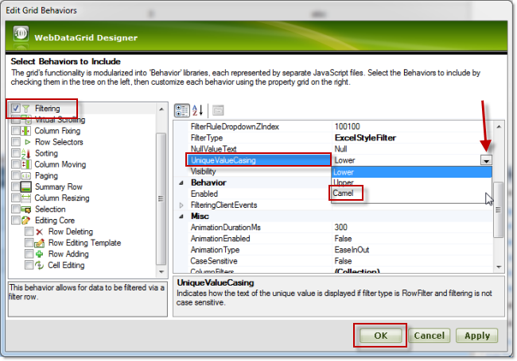
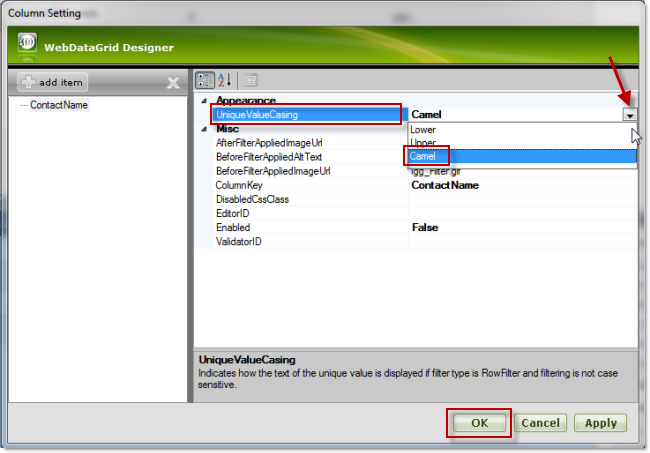
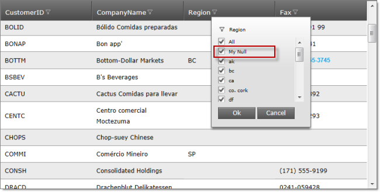
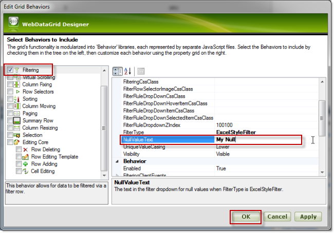

////
|metadata|
{
    "name": "webdatagrid-excelstylefiltering-configuring",
    "controlName": ["WebDataGrid"],
    "tags": ["Filtering","Grids"],
    "guid": "e6fc414c-deb0-4aaf-8746-bad2e2bf5d51",
    "buildFlags": [],
    "createdOn": "2012-07-16T12:50:19.9299654Z"
}
|metadata|
////

= Configuring Excel Style Filtering

== Topic Overview

=== Purpose

This topic explains how to configure the link:webdatagrid-excelstylefiltering-landingpage.html[Excel-Style Filtering] options of the  _WebDataGrid_™ control.

=== Required background

The following topics are prerequisites to understanding this topic:

[options="header", cols="a,a"]
|====
|Topic|Purpose

| link:webdatagrid-getting-started-with-webdatagrid.html[Getting Started with WebDataGrid]
|This topic demonstrates how to add the _WebDataGrid_ to your page and retrieve the customers table of the Northwind database.

| link:webdatagrid-excelstylefiltering-overview.html[Excel-Style Filtering Overview (WebDataGrid)]
|This topic introduces the Excel-Style Filtering feature of the _WebDataGrid_ control.

| link:webdatagrid-excelstylefiltering-enabling.html[Enabling Excel-Style Filtering (WebDataGrid)]
|This topic provides reference about the properties that are specific to the Excel-Style Filtering feature of the _WebDataGrid_ control.

|====

=== In this topic

This topic contains the following sections:

* <<_Ref336019679,Excel-Style Filtering Configuration Summary>>
* <<_Ref336019695,Configuring the Capitalization of the Unique Values in the Filtering Drop-Down>>

* <<_Ref329857486,Overview>>
* <<_Ref329857490,Property settings>>
* <<_Ref329857547,Prerequisites>>
* <<_Ref336019721,Configuring the capitalization of unique values using the Designer>>
* <<_Ref336022251,Configuring the capitalization of unique values in the ASPX markup>>

* <<_Ref329857565,Configuring the capitalization of unique values in the code-behind>>

* <<_Ref329857572,Configuring the Text for the Null Values in the Filtering Drop-Down>>

* <<_Ref329857580,Overview>>
* <<_Ref329857590,Property settings>>
* <<_Ref329857593,Prerequisites>>
* <<_Ref329857597,Configuring the text for the null values using the designer>>
* <<_Ref336022322,Configuring the text for the null values in the ASPX markup>>
* <<_Ref329857603,Configuring the text for the null values in the code-behind>>

* <<_Ref336022386,Related Content>>

* <<_Ref336022394,Topics>>
* <<_Ref336022398,Samples>>

[[_Ref329857460]]
[[_Ref336019679]]
== Excel-Style Filtering Configuration Summary

=== Excel-Style Filtering configuration summary chart

The following table lists the configurable aspects of the Excel-Style Filtering feature of the  _WebDataGrid_   control.

[options="header", cols="a,a,a"]
|====
|Configurable aspects|Details|Properties

|<<_Ref336019695,Configuring the Capitalization of the Unique Values in the Filtering Drop-Down>>
|You can specify the capitalization of values into the filtering dropdown. The available options are: lowercase capitalization, uppercase capitalization, and camelcase capitalization.
|
* link:{ApiPlatform}web{ApiVersion}~infragistics.web.ui.gridcontrols.columnfilteringsetting~uniquevaluecasing.html[UniqueValueCasing] 

|<<_Ref329857572,Configuring the Text for the Null Values in the Filtering Drop-Down>>
|You can specify custom text for Null values in the filtering drop-down.
|
* link:{ApiPlatform}web{ApiVersion}~infragistics.web.ui.gridcontrols.columnfilteringsetting~nullvaluetext.html[NullValueText]

|====

[[_Ref329857481]]
[[_Ref336019695]]
== Configuring the Capitalization of the Unique Values in the Filtering Drop-Down

[[_Ref329857486]]

=== Overview

The capitalization options for the unique values are the following:

*  *Lowercase capitalization*  (default) – the items appear in lowercase letters
*  *Uppercase*   *capitalization*  – the items appear in uppercase letters (all caps)
*  *Camelcase capitalization*  – the items appear with sentence capitalization (Only the first letter of the item is capitalized even if the item consists of more than one words.)

The capitalization is managed by the link:{ApiPlatform}web{ApiVersion}~infragistics.web.ui.gridcontrols.filtering~uniquevaluecasing.html[UniqueValueCasing] property.

The capitalization of unique values can be set on two levels – per column and for the whole grid depending on whether the respective property of the grid or of the column is being set. The column setting takes priority.

[[_Ref329857490]]

=== Property settings

The following table maps the desired capitalization configurations of the property settings that configure them:

[options="header", cols="a,a,a"]
|====
|In order to:|Use this property:|And set it to:

|Configure lowercase capitalization for the items in the filtering drop-down in lower case
| link:{ApiPlatform}web{ApiVersion}~infragistics.web.ui.gridcontrols.filtering~uniquevaluecasing.html[UniqueValueCasing]
| _Lower_ 

|Configure uppercase capitalization for the items in the filtering drop-down in upper case
| link:{ApiPlatform}web{ApiVersion}~infragistics.web.ui.gridcontrols.filtering~uniquevaluecasing.html[UniqueValueCasing]
| _Upper_ 

|Configure camelcase capitalization for the items in the filtering drop-down with only the first capitalized
| link:{ApiPlatform}web{ApiVersion}~infragistics.web.ui.gridcontrols.filtering~uniquevaluecasing.html[UniqueValueCasing]
| _Camel_ 

|Configure the capitalization for a particular column
|The column name

|====

[[_Ref329857547]]

=== Prerequisites

To complete the procedure, you need the following:

* An ASP.NET Web project with a  _WebDataGrid_   instantiated on a web page

* The  _WebDataGrid_   bound to a SqlDataSource component and configured to retrieve the  _CustomerID_  ,  _CompanyName_  ,  _ContactName_  , and  _ContactTitle_   fields from the  _Customers_   table of the Northwind sample database. (For details, see the link:webdatagrid-getting-started-with-webdatagrid.html[Getting Started with WebDataGrid] topic.)

[[_Ref336019721]]

=== Configuring the capitalization of unique values using the Designer

==== Configuring the capitalization on grid level

To set the link:{ApiPlatform}web{ApiVersion}~infragistics.web.ui.gridcontrols.columnfilteringsetting~uniquevaluecasing.html[UniqueValueCasing] property to  _Camel_   on grid-level using the designer:

*1.*  From the smart tag of the  _WebDataGrid_  , open the WebDataGrid Designer.

*2.*  In the left pane, select the desired filtering behavior.

*3.*  In the right pane, set the link:{ApiPlatform}web{ApiVersion}~infragistics.web.ui.gridcontrols.columnfilteringsetting~uniquevaluecasing.html[UniqueValueCasing] property to  _Camel_  .

*4.*  Click the OK button.

==== Configuring the capitalization on column level

For the purpose of this example, the setting will be applied to a column with the key  _ContactName_  . The procedure assumes that the  _ContactName_    __column has been added in advance.__  For information on how to add the column, see the link:webdatagrid-excelstylefiltering-enabling.html[Enabling Excel-Style Filtering (WebDataGrid)] topic.

To set the link:{ApiPlatform}web{ApiVersion}~infragistics.web.ui.gridcontrols.columnfilteringsetting~uniquevaluecasing.html[UniqueValueCasing] property to  _Camel_   on the column level:

*1.*  From the smart tag of the  _WebDataGrid_  , open the WebDataGrid Designer.

*2.*  In the left pane, select the desired filtering behavior.

*3.*  In the left pane, locate the link:http://help.infragistics.com/NetAdvantage/aspnet/2012.1/CLR4.0/?page=Infragistics4.Web.v12.1~Infragistics.Web.UI.GridControls.Filtering~ColumnSettings.html[ColumnSettings] property and click the ellipsis (…) button. The Column Setting dialog opens up.

In the column setting, from the drop-down, select the ContactName column.

Under the Appearance section, from the drop-down of the link:{ApiPlatform}web{ApiVersion}~infragistics.web.ui.gridcontrols.columnfilteringsetting~uniquevaluecasing.html[UniqueValueCasing] property, select  _Camel_  .

*4.*  Click the OK button.

[[_Ref329857558]]

=== Configuring the capitalization of unique values in the ASPX markup

==== Configuring the capitalization on grid level

The following code demonstrates how to set the link:{ApiPlatform}web{ApiVersion}~infragistics.web.ui.gridcontrols.filtering~uniquevaluecasing.html[UniqueValueCasing] property to  _Camel_   on grid level in the ASPX markup.

*In ASPX:*

[source,html]
----
<Behaviors>
    <ig:Filtering FilterType="ExcelStyleFilter" UniqueValueCasing="Camel">
    </ig:Filtering>
</Behaviors>
----

==== Configuring the capitalization on column level

The following code demonstrates how to set the link:{ApiPlatform}web{ApiVersion}~infragistics.web.ui.gridcontrols.filtering~uniquevaluecasing.html[UniqueValueCasing] property to  _Camel_   on grid level in the ASPX markup. The setting is applied to a column with the key  _“_   _ContactName_   _”_  .

*In ASPX:*

[source,html]
----
<Behaviors>
    <ig:Filtering FilterType="ExcelStyleFilter">
        <ColumnSettings>
            <ig:ColumnFilteringSetting ColumnKey="ContactName" UniqueValueCasing="Camel" />
        </ColumnSettings>
    </ig:Filtering>
</Behaviors>
----

[[_Ref329857565]]

=== Configuring the capitalization of unique values in the code-behind

==== Configuring the capitalization on grid level

The following code demonstrates how to set the link:{ApiPlatform}web{ApiVersion}~infragistics.web.ui.gridcontrols.filtering~uniquevaluecasing.html[UniqueValueCasing] property to  _Camel_   on grid level in the code-behind.

*In C#:*

[source,csharp]
----
//Create a Filtering Behavior
this.WebDataGrid2.Behaviors.CreateBehavior<Filtering>();
//Set Filtering Behavior to Excel Style Filter
this.WebDataGrid2.Behaviors.Filtering.FilterType = 
    Infragistics.Web.UI.GridControls.FilteringType.ExcelStyleFilter;
//Set the UniqueValueCasing to Camel on Grid level
this.WebDataGrid2.Behaviors.Filtering.UniqueValueCasing = UniqueValueCasing.Camel;
----

==== Configuring the capitalization on column level

The following code demonstrates how to set the link:{ApiPlatform}web{ApiVersion}~infragistics.web.ui.gridcontrols.filtering~uniquevaluecasing.html[UniqueValueCasing] property to  _Camel_   on grid level in the code-behind. The setting is applied to a column with the key  _“_   _ContactName_   _”_  .

*In C#:*

[source,csharp]
----
//Create a Filtering Behavior
this.WebDataGrid2.Behaviors.CreateBehavior<Filtering>();
//Set Filtering Behavior to Excel Style Filter
this.WebDataGrid2.Behaviors.Filtering.FilterType = 
    Infragistics.Web.UI.GridControls.FilteringType.ExcelStyleFilter;
//Create a ColumnFilteringSetting 
ColumnFilteringSetting settingColumn = new ColumnFilteringSetting();
//Set the ColumnKey
settingColumn.ColumnKey = "ContactName";
//Set the UniqueValueCasing to Camel on column level
settingColumn.UniqueValueCasing = UniqueValueCasing.Camel;
//Add the created ColumnSetting
this.WebDataGrid2.Behaviors.Filtering.ColumnSettings.Add(settingColumn);
----

[[_Ref329857572]]
== Configuring the Text for the Null Values in the Filtering Drop-Down

[[_Ref329857580]]

=== Overview

Setting the null value text allows you to change the text for the item in the filter drop-down. This text will be displayed for the items that have a Null value in the data source / database. The link:{ApiPlatform}web{ApiVersion}~infragistics.web.ui.gridcontrols.filtering~nullvaluetext.html[NullValueText] property is of type string and has a default value of  _Null_  .

=== Preview

Following is the result after link:{ApiPlatform}web{ApiVersion}~infragistics.web.ui.gridcontrols.columnfilteringsetting~nullvaluetext.html[NullValueText] property is set to  _My Null_  .

[[_Ref329857590]]

=== Property settings

The following table maps the desired configuration of the link:{ApiPlatform}web{ApiVersion}~infragistics.web.ui.gridcontrols.filtering~nullvaluetext.html[NullValueText] property settings:

[options="header", cols="a,a,a"]
|====
|In order to:|Use this property:|And set it to:

|Set the text for the items with null values to _My Null_
| link:{ApiPlatform}web{ApiVersion}~infragistics.web.ui.gridcontrols.filtering~nullvaluetext.html[NullValueText]
| _My Null_ 

|====

[[_Ref329857593]]

=== Prerequisites

To complete the procedure, you need the following:

* An ASP.NET Web project with a  _WebDataGrid_   instantiated on a web page
* The  _WebDataGrid_   bound to a SqlDataSource component and configured to retrieve the  _CustomerID_  ,  _CompanyName_  ,  _ContactName_  , and  _ContactTitle_   fields from the  _Customers_   table of the Northwind sample database. (For details, see the link:webdatagrid-getting-started-with-webdatagrid.html[Getting Started with WebDataGrid] topic.)

[[_Ref329857597]]

=== Configuring the text for the null values using the designer

To set the link:{ApiPlatform}web{ApiVersion}~infragistics.web.ui.gridcontrols.filtering~nullvaluetext.html[NullValueText] to  _My Null_   on  _WebDataGrid_   using the Designer:

*1.*  From the smart tag of the WebDataGrid, open the WebDataGrid Designer.

*2.*  From the left pane, select the desired filtering behavior.

*3.*  From the right pane, set the link:{ApiPlatform}web{ApiVersion}~infragistics.web.ui.gridcontrols.filtering~nullvaluetext.html[NullValueText] property to  _My Null_  .

*4.*  Click the OK button.

[[_Ref329857600]]

=== Configuring the text for the null values in the ASPX markup

The following code demonstrates how to set the link:{ApiPlatform}web{ApiVersion}~infragistics.web.ui.gridcontrols.filtering~nullvaluetext.html[NullValueText] of the  _WebDataGrid_   to  _“My Null”_   in the markup.

*In ASPX:*

[source,html]
----
<Behaviors>
    <ig:Filtering FilterType="ExcelStyleFilter" NullValueText="My Null">
    </ig:Filtering>
</Behaviors>
----

[[_Ref329857603]]

=== Configuring the text for the null values in the code-behind

The following code demonstrates how to set the link:{ApiPlatform}web{ApiVersion}~infragistics.web.ui.gridcontrols.filtering~nullvaluetext.html[NullValueText] of the  _WebDataGrid_   to  _“My Null”_   in the code behind:

*In C#:*

[source,csharp]
----
//Create a Filtering Behavior
this.WebDataGrid2.Behaviors.CreateBehavior<Filtering>();
//Set Filtering Behavior to Excel Style Filter
this.WebDataGrid2.Behaviors.Filtering.FilterType = 
    Infragistics.Web.UI.GridControls.FilteringType.ExcelStyleFilter;
//Set the NullValueText property to "My Null"
this.WebDataGrid2.Behaviors.Filtering.NullValueText = "My Null";
----

[[_Ref336022386]]
== Related Content

[[_Ref336022394]]

=== Topics

The following topics provide additional information related to this topic:

[options="header", cols="a,a"]
|====
|Topic|Purpose

| link:webdatagrid-excelstylefiltering-propertyreference.html[Excel-Style Filtering Property Reference (WebDataGrid)]
|This topic provides reference information about the properties that are specific to the Excel-Style Filtering feature of the _WebDataGrid_ control.

|====

[[_Ref336022398]]

=== Samples

The following samples provide additional information related to this topic.

[options="header", cols="a,a"]
|====
|Sample|Purpose

|[[_Hlk335939592]] 

link:{SamplesUrl}/data-grid/excel-style-filtering-unique-value-casing[Excel-Style Filtering Unique Value Casing]
|This sample demonstrates using of the the Excel-Style Filtering’s `UniqueValueCasing` property.

| link:{SamplesUrl}/data-grid/excel-style-filtering-bound-unbound-fields[Excel-Style Filtering - Bound/Unbound Fields]
|This sample demonstrates Excel-Style Filtering with Bound and Unbound fields as well as with Bound and Unbound checkboxes.

| link:{SamplesUrl}/data-grid/excel-style-filtering-dropdown-null-value-text[Excel-Style Filtering Drop-Down Null Value Text]
|This sample demonstrates h the `NullValueText` property of the Excel-Style Filtering, setting the string to _Null_ .

| link:{SamplesUrl}/data-grid/excel-style-filtering-with-crud-enabled[Excel-Style Filtering with CRUD Enabled]
|This sample demonstrates Excel-Style Filtering with editing.

|====