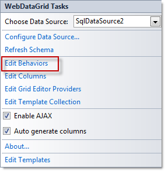
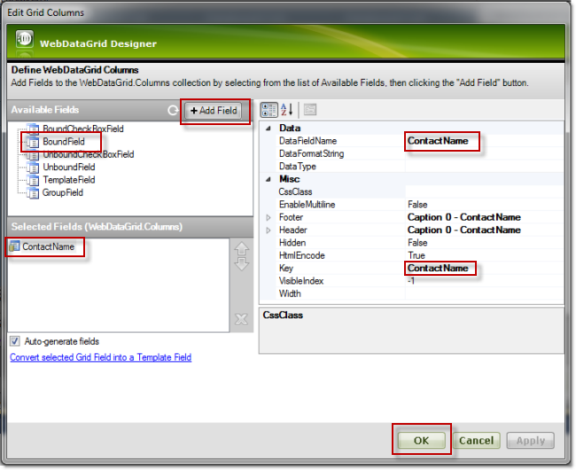

////
|metadata|
{
    "name": "webdatagrid-excelstylefiltering-enabling",
    "controlName": ["WebDataGrid"],
    "tags": ["Filtering","Grids"],
    "guid": "fe0bce49-a414-4446-9dce-5bc8299dfb78",
    "buildFlags": [],
    "createdOn": "2012-07-16T12:48:13.2953032Z"
}
|metadata|
////

= Enabling Excel Style Filtering

== Topic Overview

=== Purpose

This topic demonstrates how to enable the link:webdatagrid-excelstylefiltering-landingpage.html[*Excel-Style Filtering* ] feature of the  _WebDataGrid_™ control.

=== Required background

The following topics are prerequisites to understanding this topic:

[options="header", cols="a,a"]
|====
|Topic|Purpose

| link:webdatagrid-getting-started-with-webdatagrid.html[Getting Started with _WebDataGrid_ ]
|This topic demonstrates how to add _WebDataGrid_ to a page and retrieve the Customers table of the Northwind sample database.

| link:webdatagrid-excelstylefiltering-overview.html[Excel-Style Filtering Overview ( _WebDataGrid_ )]
|This topic introduces the Excel-Style Filtering feature of the _WebDataGrid_ control.

|====

=== In this topic

This topic contains the following sections:

* <<_Ref329698612,Introduction>>

** <<_Ref336016015,Enabling Excel-Style Filtering summary>>

** <<_Ref336016195,Enabling Excel-Style Filtering property settings>>

* <<_Ref329698680,Enabling Excel-Style Filtering Using the Designer>>

** <<_Ref329698685,Introduction>>
** <<OLE_LINK77,Preview>>
** <<OLE_LINK41,Prerequisites>>
** <<OLE_LINK63,Overview>>
** <<_Ref329698700,Steps>>

* <<_Ref336016234,Enabling Excel-Style Filtering in the ASPX Markup>>

** <<_Ref329698642,Overview>>
** <<_Ref336016255,Code>>

* <<_Ref329698661,Enabling Excel-Style Filtering in the Code-Behind>>

** <<_Ref329698667,Overview>>
** <<_Ref336016304,Code>>

* <<_Ref329858114,Related Content>>

** <<_Ref329858121,Topics>>
** <<_Ref329858125,Samples>>

[[_Ref329698612]]
== Introduction

[[_Ref336016015]]

=== Enabling Excel-Style Filtering summary

By default, in  _WebDataGrid_  , the standard (non-Excel type) of filtering is enabled. Excel-Style Filtering option is enabled by setting the  _WebDataGrid_  ’s link:infragistics4.web.v{ProductVersion}~infragistics.web.ui.gridcontrols.filtering~filtertype.html[FilterType] property to  _ExcelStyleFilter_  . This enables Excel-Style Filtering on all columns, but you can use the link:infragistics4.web.v{ProductVersion}~infragistics.web.ui.gridcontrols.filtering~columnsettings.html[ColumnFilteringSetting] property to disable the feature on per-column basis.

The following sections demonstrate how to enable Excel-Style Filtering on all columns except one and disable filtering for that one column:

* <<_Ref329698680,Enabling Excel-Style Filtering Using the Designer>>
* <<_Ref336016234,Enabling Excel-Style Filtering in ASPX Markup>>
* <<_Ref329698661,Enabling Excel-Style Filtering in the Code-Behind>>

.Note:
[NOTE]
====
Excel-Style Filtering requires the  _WebDataGrid_   to bind its entire data source on each filter operation in order to create the filtered data set. Take this into consideration when tuning your application performance.
====

[[_Ref336016195]]

=== Enabling Excel-Style Filtering property settings

The following table maps the desired filtering behavior to the property settings that configure it:

[options="header", cols="a,a,a"]
|====
|In order to:|Use this property:|And set it to:

|Enable Excel-Style Filtering
| link:infragistics4.web.v{ProductVersion}~infragistics.web.ui.gridcontrols.filtering~filtertype.html[FilterType]
|_ExcelStyleFilter_

|Disable filtering on a column
| link:infragistics4.web.v{ProductVersion}~infragistics.web.ui.gridcontrols.filtering~columnsettings.html[Enable (of ColumnSetting)]
| _false_ 

|====

[[_Ref329698635]]

[[_Ref329698680]]
== Enabling Excel-Style Filtering Using the Designer

[[_Ref329698685]]

=== Introduction

This example demonstrates how to enable Excel-Style Filtering on all columns except one (ContactName) and disable filtering for that one column using the Designer.

=== Preview

The following screenshot is a preview of the final result:

=== Prerequisites

To complete this procedure, you need to the following:

* An ASP.NET Web Project with a  _WebDataGrid_   instantiated in a web page
* The  _WebDataGrid_   bound to a SqlDataSource component and configured to retrieve the  _CustomerID_  ,  _CompanyName_  ,  _ContactName_  , and  _ContactTitle_   fields from the  _Customers_   table of the Northwind sample database. (For details, see the link:webdatagrid-getting-started-with-webdatagrid.html[Getting Started with WebDataGrid] topic.)

=== Overview

Following is a conceptual overview of the process: 

*1. Enabling Excel-Style Filtering* 

*2. Disabling Filtering on one column*

*3.*   _(Optional)_    *Verifying the result*

[[_Ref329698700]]

=== Steps

The following steps demonstrate how to enable the Excel-Style Filtering feature for the  _WebDataGrid_   and how to disable filtering for the ContactName column.

=== 1. Enable Excel-Style Filtering.

*1. Launch the Behaviors Editor Dialog.*

Click on the smart tag of the  _WebDataGrid_   and then  *select the*  Edit Behaviors  *option* .

The WebDataGrid Designer dialog opens up.

*2. Enable Filtering*.*

A. In the WebDataGrid Designer dialog, in the left-hand side panel,  *check*  Filtering.

B. In the right-hand side panel,  *set the*  FilterType  *property to*  ExcelStyleFilter.

B.  *Click the*  Apply  *button* .

=== 2. Disable Filtering on one column.

*1. Add a new column.* 

A. Launch the Column Setting dialog.

With the Filtering box in the left pane checked,  *locate the*  link:infragistics4.web.v{ProductVersion}~infragistics.web.ui.gridcontrols.filtering~columnsettings.html[ColumnSettings]  *property and click the ellipsis (…) button* .

The  *Column Setting*  dialog opens up.

B. Add a new column setting.

a. In the left-hand side pane,  *click the add item option* . The new column setting appears in the column settings collection.

b. In the right-hand side pane, from the ColumnKey drop-down,  *select*  Add/Modify Columns.

The Edit Grid Columns dialog opens up.

C. Define the ContactName column.

a. In the Edit Grid Columns dialog, from the Available Fields panel,  *select*  BoundField.

b.  *Click on the*  Add Field  *button.*  The newly added field appears in the Selected Fields panel. (By default, its name is  _BoundColumn_0_  .)

c. From the Selected Fields panel,  *select the column*  which was just added.

d. In the right-hand side pane,  *set the*  DataFieldName  *property to*   _ContactName_  .

e. In the right-hand side pane,  *set the*  Key  *property to*   _ContactName_  .

d.  *Click*  OK to commit.

D. Assign the newly created column to the ColumnKey property.

From the ColumnKey drop-down,  *select the*  ContactName  *column* .

*2.*  *Disable*filtering for the new column.*

*Set the*  Enabled  *property to*   _False_   and then click OK to commit.

=== 3. (Optional) Verify the result.

To verify the result, save and run the project, then test the filtering behavior of the  _WebDataGrid_  .

[[_Ref336016234]]
== Enabling Excel-Style Filtering in the ASPX Markup

[[_Ref329698642]]

=== Overview

This example demonstrates how to enable Excel-Style Filtering on all columns except one (ContactName) and disable filtering for that one column in the ASPX markup.

[[_Ref336016255]]

=== Code

*In ASPX:*

[source,html]
----
<Behaviors>
    <ig:Filtering FilterType="ExcelStyleFilter">
        <ColumnSettings>
            <ig:ColumnFilteringSetting ColumnKey="ContactName" Enabled=" />
        </ColumnSettings>
    </ig:Filtering>
</Behaviors>
----

[[_Ref329698661]]
== Enabling Excel-Style Filtering in the Code-Behind

[[_Ref329698667]]

=== Overview

This example demonstrates how to enable Excel-Style Filtering on all columns except one (ContactName) and disable filtering for that one column in the code behind.

[[_Ref336016304]]

=== Code

This code snippet must be inserted into the `Page_Load` event of the ASP.NET web page.

*In C#:*

[source,csharp]
----
//Create a Filtering Behavior
this.WebDataGrid2.Behaviors.CreateBehavior<Filtering>();
//Set Filtering Behavior to Excel Style Filter
this.WebDataGrid2.Behaviors.Filtering.FilterType = Infragistics.Web.UI.GridControls.FilteringType.ExcelStyleFilter;
//Create a ColumnFilteringSetting 
ColumnFilteringSetting settingColumn = new ColumnFilteringSetting();
//Set the ColumnKey
settingColumn.ColumnKey = "ContactName";
//Set Enabled property to false
settingColumn.Enabled = false;
//Add the created ColumnSetting
this.WebDataGrid2.Behaviors.Filtering.ColumnSettings.Add(settingColumn);
----

[[_Ref329858114]]
== Related Content

[[_Ref329858121]]

=== Topics

The following topics provide additional information related to this topic:

[options="header", cols="a,a"]
|====
|Topic|Purpose

| link:webdatagrid-excelstylefiltering-configuring.html[Configuring Excel-Style Filtering (WebDataGrid)]
|This topic explains how to configure the Excel-Style Filtering options of the _WebDataGrid_ control.

| link:webdatagrid-excelstylefiltering-propertyreference.html[Excel-Style Filtering Property Reference (WebDataGrid)]
|This topic provides reference information about the properties that are specific to the Excel-Style Filtering feature of the _WebDataGrid_ control.

|====

[[_Ref329858125]]

=== Samples

The following samples provide additional information related to this topic.

[options="header", cols="a,a"]
|====
|Sample|Purpose

| link:{SamplesUrl}/data-grid/excel-style-filtering-unique-value-casing[Excel-Style Filtering Unique Value Casing]
|This sample demonstrates the Excel-Style Filtering’s `` link:infragistics4.web.v{ProductVersion}~infragistics.web.ui.gridcontrols.columnfilteringsetting~uniquevaluecasing.html[UniqueValueCasing]`` property.

| link:{SamplesUrl}/data-grid/excel-style-filtering-bound-unbound-fields[Excel-Style Filtering - Bound/Unbound Fields]
|This sample demonstrates Excel-Style Filtering with Bound and Unbound fields as well as with Bound and Unbound checkboxes.

| link:{SamplesUrl}/data-grid/excel-style-filtering-dropdown-null-value-text[Excel-Style Filtering Drop-Down Null Value Text]
|This sample demonstrates h the `` link:infragistics4.web.v{ProductVersion}~infragistics.web.ui.gridcontrols.columnfilteringsetting~nullvaluetext.html[NullValueText]`` property of the Excel-Style Filtering, setting the string to _Null_ .

| link:{SamplesUrl}/data-grid/excel-style-filtering-with-crud-enabled[Excel-Style Filtering with CRUD Enabled]
|This sample demonstrates Excel-Style Filtering with editing.

|====