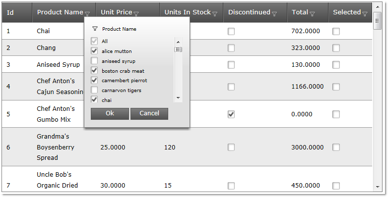
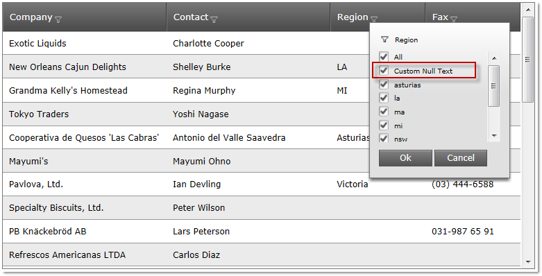

////

|metadata|
{
    "name": "webdatagrid-excelstylefiltering-overview",
    "controlName": ["WebDataGrid"],
    "tags": ["Filtering","Grids"],
    "guid": "bc16db84-6ac8-4149-901a-6910392e024d",  
    "buildFlags": [],
    "createdOn": "2012-07-16T12:46:40.1319878Z"
}
|metadata|
////

= Excel Style Filtering Overview

== Topic Overview

=== Purpose

This topic introduces the link:webdatagrid-excelstylefiltering-landingpage.html[*Excel-Style Filtering* ] feature of the  _WebDataGrid_™ control.

=== Required background

The following topics are prerequisites to understanding this topic:

[options="header", cols="a,a"]
|====
|Topic|Purpose

| link:http://www.infragistics.com/help/topic/6AC996BB-3C11-46BD-B7BB-EFE868315EA2[] link:webdatagrid-getting-started-with-webdatagrid.html[Getting Started with WebDataGrid]
|This topic demonstrates how to add _WebDataGrid_ to a page and retrieve the Customers table of the Northwind sample database.

|====

=== In this topic

This topic contains the following sections:

* <<_Ref335941575,Introduction>>
* <<_Ref335941591,Excel-Style Filtering Options>>

* <<_Ref335941644,Excel-style filtering options summary chart>>
* <<_Ref335941665,Unique values’ capitalization>>

* <<_Ref335941675,Configurable text for the Null values>>

* <<_Ref335941735,Related Content>>

* <<_Ref329858121,Topics>>
* <<_Ref329858125,Samples>>

[[_Ref335941575]]
== Introduction

=== Excel-Style Filtering summary

The Excel-Style Filtering feature of the  _WebDataGrid_   filters the data in the grid using the filtering conventions employed by Microsoft® Excel® worksheets. The feature basically breaks the data into a smaller subset that matches your filter criteria and displays the matches.

The user selects the filtering criteria in a filtering drop-down. The values in the drop-down are the values available the column being filtered. Once the user commits their choice with the OK button, the request to the server is made and the filtered subset of data is received and rendered.

[[_Ref335941591]]
== Excel-Style Filtering Options

[[_Ref335941644]]

=== Excel-style filtering options summary chart

The following table summarizes the configurable options of the Excel-Style Filtering of the  _WebDataGrid_™ control.

[options="header", cols="a,a"]
|====
|Option|Description

|<<_Ref335941665,Unique values’ capitalization in the filtering drop-down>>
|You can specify the capitalization of values into the filtering dropdown. The available options are: lowercase capitalization, uppercase capitalization, and camelcase capitalization.

|<<_Ref335941675,Configurable text for the Null values in the filtering drop-down>>
|You can specify custom text for Null values in the filtering drop-down.

|====

[[_Ref335941665]]

=== Unique values’ capitalization

This option can be set on two levels – on column and on whole grid. The column setting takes priority. The capitalization options are the following:

*  *Lowercase capitalization*  (default) – the items appear in lowercase letters
*  *Uppercase*   *capitalization*  – the items appear in uppercase letters (all caps)
*  *Camelcase capitalization*  – the items appear with sentence capitalization (Only the first letter of the item is capitalized.)

[options="header", cols="a,a,a"]
|====
|Lowercase capitalization|Uppercase capitalization|Camelcase capitalization

|image::images/WDG_ExcelStyleFiltering_Overview_2.png[]
|image::images/WDG_ExcelStyleFiltering_Overview_3.png[]
|image::images/WDG_ExcelStyleFiltering_Overview_4.png[]

|====

==== Related Topics:

* link:webdatagrid-excelstylefiltering-configuring.html[Configuring Excel-Style Filtering (WebDataGrid)]

[[_Ref335941675]]

=== Configurable text for the Null values

You can configure custom text to be displayed in the filtering drop-down for cells with Null values. This custom value is only for the item’s text in the drop-down and is not committed to the data source. In the following screenshot, the Null value is set to  _Custom Null Text_  .

==== Related Topics:

* link:webdatagrid-excelstylefiltering-configuring.html[Configuring Excel-Style Filtering (WebDataGrid)]

[[_Ref335941735]]
== Related Content

[[_Ref329858121]]

=== Topics

The following topics provide additional information related to this topic.

[options="header", cols="a,a"]
|====
|Topic|Purpose

| link:webdatagrid-excelstylefiltering-enabling.html[Enabling Excel-Style Filtering (WebDataGrid)]
|This topic provides reference about the properties that are specific to the Excel-Style Filtering feature of the _WebDataGrid_ control.

| link:webdatagrid-excelstylefiltering-configuring.html[Configuring Excel-Style Filtering (WebDataGrid)]
|This topic explains how to configure the Excel-Style Filtering options of the _WebDataGrid_ control.

| link:webdatagrid-excelstylefiltering-propertyreference.html[Excel-Style Filtering Property Reference (WebDataGrid)]
|This topic provides reference information about the properties that are specific to the Excel-Style Filtering feature of the _WebDataGrid_ control.

|====

[[_Ref329858125]]

=== Samples

The following samples provide additional information related to this topic.

[options="header", cols="a,a"]
|====
|Sample|Purpose

| link:{SamplesUrl}/data-grid/excel-style-filtering-unique-value-casing[Excel-Style Filtering Unique Value Casing]
|This sample demonstrates the Excel-Style Filtering’s ` link:{ApiPlatform}web{ApiVersion}~infragistics.web.ui.gridcontrols.columnfilteringsetting~uniquevaluecasing.html[UniqueValueCasing]` property.

| link:{SamplesUrl}/data-grid/excel-style-filtering-bound-unbound-fields[Excel-Style Filtering - Bound/Unbound Fields]
|This sample demonstrates Excel- Style Filtering with Bound and Unbound fields as well as with Bound and Unbound checkboxes.

| link:{SamplesUrl}/data-grid/excel-style-filtering-dropdown-null-value-text[Excel-Style Filtering Drop-Down Null Value Text]
|This sample demonstrates h the ` link:{ApiPlatform}web{ApiVersion}~infragistics.web.ui.gridcontrols.columnfilteringsetting~nullvaluetext.html[NullValueText]` property of the Excel Style Filtering, setting the string to _Null_ .

| link:{SamplesUrl}/data-grid/excel-style-filtering-with-crud-enabled[Excel-Style Filtering with CRUD Enabled]
|This sample demonstrates Excel-Style Filtering with editing.

|====