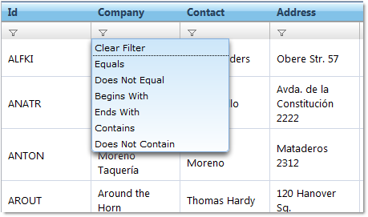
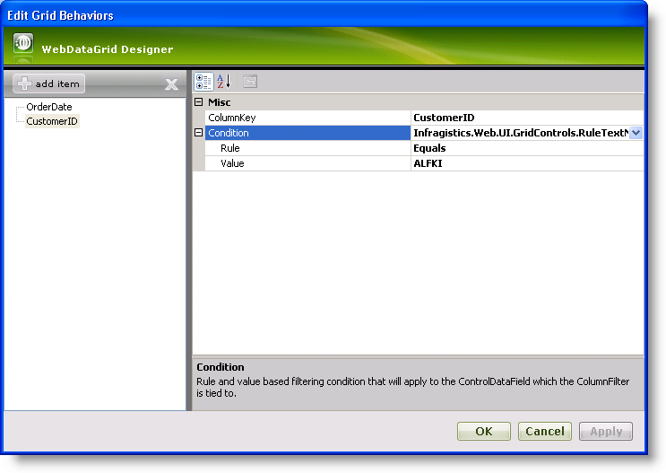
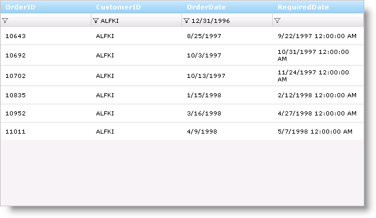

////

|metadata|
{
    "name": "webdatagrid-filtering",
    "controlName": ["WebDataGrid"],
    "tags": ["Filtering","Grids"],
    "guid": "{66932F5B-9110-4EBE-84A5-654AD78E3231}",  
    "buildFlags": [],
    "createdOn": "2008-12-09T16:31:33Z"
}
|metadata|
////

= Filtering

WebDataGrid™ has the ability to filter the data it is bound to. Filtering breaks the data into a smaller subset that matches your filter criteria and displays it. This makes the data more viewable and manageable to your end-users. If AJAX is enabled, WebDataGrid performs the filtering asynchronously. You can filter using the API provided for WebDataGrid or through the filter row UI.

== Filter Row

The filter row contains an Editor Provider which is automatically chosen depending on the column’s data type (as long as the grid knows the column’s data type) and dropdown list for each column. Your end-users are allowed to type filter values into the Editor Provider, and based on the filter rule in the dropdown list, WebDataGrid filters the data accordingly.

You can position the filter row at the top or bottom of WebDataGrid and it remains there regardless of scrolling.

== Filter Rule

Filter rules are represented by Enums. The filter rules of a column depend on the data type of that column. The filter rules for data types are detailed below.

.Note:
[NOTE]
====
Filter rules default to All if not specified, showing all values for a column.
====

*Boolean Filter Rules* – applies to Boolean columns.

*  pick:[asp-net="link:infragistics4.web.v{ProductVersion}~infragistics.web.ui.gridcontrols.booleanfilterrules.html[BooleanFilterRules]"] .True - value is true
* BooleanFilterRules.False - value is false

*Date/Time filter rules* - applies to DateTime columns.

*  pick:[asp-net="link:infragistics4.web.v{ProductVersion}~infragistics.web.ui.gridcontrols.datetimefilterrules.html[DateTimeFilterRules]"] .Equals – The value is equal to the provided value
* DateTimeFilterRules.Before – The value falls before today’s date
* DateTimeFilterRules.After – The value falls after today’s date
* DateTimeFilterRules.Tomorrow – The value equals tomorrow's date
* DateTimeFilterRules.Today – The value equals today’s date
* DateTimeFilterRules.Yesterday – The value equals yesterday’s date
* DateTimeFilterRules.NextWeek – The value falls in next week’s date range
* DateTimeFilterRules.ThisWeek - The value falls in this week’s date range
* DateTimeFilterRules.LastWeek - The value falls in last week’s date range
* DateTimeFilterRules.NextMonth - The value falls in next month’s date range
* DateTimeFilterRules.ThisMonth - The value falls in this month’s date range
* DateTimeFilterRules.LastMonth - The value falls in last month’s date range
* DateTimeFilterRules.NextQuarter - The value falls in next quarter’s date range
* DateTimeFilterRules.ThisQuarter - The value falls in this quarter’s date range
* DateTimeFilterRules.LastQuarter - The value falls in last quarter’s date range
* DateTimeFilterRules.NextYear - The value falls in next year’s date range
* DateTimeFilterRules.ThisYear - The value falls in this year’s date range
* DateTimeFilterRules.LastYear - The value falls in last year’s date range
* DateTimeFilterRules.YearToDate – The value falls into the Year-To-Date date range

*Numeric filter rules* - applies to numeric columns.

*  pick:[asp-net="link:infragistics4.web.v{ProductVersion}~infragistics.web.ui.gridcontrols.numericfilterrules.html[NumericFilterRules]"] .Equals – The cell value equals the provide value
* NumericFilterRules.DoesNotEqual – The cell value does not equal the provided value
* NumericFilterRules.GreaterThan – The cell value is greater than the provided value
* NumericFilterRules.GreaterThanOrEqualTo – The cell value is greater than or equal to the provided value
* NumericFilterRules.LessThan – The cell value is less than the provided value
* NumericFilterRules.LessThanOrEqualTo – The cell values is less than or equal to the provided value

*Text filter rules* - applies to String columns.

*  pick:[asp-net="link:infragistics4.web.v{ProductVersion}~infragistics.web.ui.gridcontrols.textfilterrules.html[TextFilterRules]"] .Equals – Cell value completely equals the provided value
* TextFilterRules.DoesNotEqual – The Cell value does not equal the provided value
* TextFilterRules.BeginsWith – The cell value begins with the provided value
* TextFilterRules.EndsWith – The cell value ends with the provided value
* TextFilterRules.Contains – The cell value contains the provided value
* TextFilterRules.DoesNotContain – The cell value does not contain the provided value

== Filter Value

You can type any value into the TextBox of the filter row. The filter rule together with the filter value makes up the filter condition. Any records that matches the filter condition is returned and display in WebDataGrid. If the value your end-users type in does not exist or the filter condition does not match, no records are returned and an empty WebDataGrid is displayed.

== Filter Condition

The classes that represent filter conditions are as follows:

[options="header", cols="a,a"]
|====
|Classes|Filter Data Type

| pick:[asp-net="link:infragistics4.web.v{ProductVersion}~infragistics.web.ui.gridcontrols.ruleboolnode.html[RuleBoolNode]"] 
|Boolean

| pick:[asp-net="link:infragistics4.web.v{ProductVersion}~infragistics.web.ui.gridcontrols.ruledatenode.html[RuleDateNode]"] 
|DateTime

| pick:[asp-net="link:infragistics4.web.v{ProductVersion}~infragistics.web.ui.gridcontrols.rulenumbernode.html[RuleNumberNode]"] 
|Numeric

| pick:[asp-net="link:infragistics4.web.v{ProductVersion}~infragistics.web.ui.gridcontrols.ruletextnode.html[RuleTextNode]"] 
|Text

|====

== Filter Compatibility

Filtering works together with features such as sorting and paging. Filtering is on the entire set of data when these features are enabled. Sorting is applied on the entire data, not just the filtered in rows. Paging will adjust to display only pages with filtered in rows.

== Enabling Filtering

[start=1]
. Bind WebDataGrid to a SqlDataSource component retrieving data from the Orders table. Retrieve only the OrderID, CustomerID, OrderDate, and RequiredDate fields. For more information on doing this, see link:webdatagrid-getting-started-with-webdatagrid.html[Getting Started with WebDataGrid].
[start=2]
. In the Microsoft® Visual Studio™ property window, locate the  pick:[asp-net="link:infragistics4.web.v{ProductVersion}~infragistics.web.ui.gridcontrols.behaviors.html[Behaviors]"]  property and click the ellipsis (...) button to launch the Behaviors Editor Dialog.
[start=3]
. Check the CheckBox for the Filtering behavior from the list on the left to enable it.
[start=4]
. Set the initial filtering condition so that WebDataGrid only filters in data within a certain date.

.. Locate the  pick:[asp-net="link:infragistics4.web.v{ProductVersion}~infragistics.web.ui.gridcontrols.filtering~columnfilters.html[ColumnFilters]"]  property and click the ellipsis (...) button to launch the Column Filter Editor Dialog.
.. Add two Column Filters by clicking the Add Item button.
.. Set one filter’s  pick:[asp-net="link:infragistics4.web.v{ProductVersion}~infragistics.web.ui.gridcontrols.columnfilter~columnkey.html[ColumnKey]"]  property as OrderDate and the other as CustomerID, to specify the columns to filter.
.. Click the expansion indicator of the  pick:[asp-net="link:infragistics4.web.v{ProductVersion}~infragistics.web.ui.gridcontrols.columnfilter~condition.html[Condition]"]  property for the OrderDate column. The Rule and Value properties appear.
.. Set the Rule to After and the Value to 12/31/1996.

.. Click the expansion indicator of the Condition property for the CustomerID column. The Rule and Value properties appear.
.. Set the Rule to Equals and the Value to “ALFKI”. WebDataGrid will now only display data for the customer ALFKI for order dates after 1996.

.. Click Apply then Ok to close the Column Filter Editor Dialog.
.. Click Apply then Ok to close the Behaviors Editor Dialog.

[start=5]
. You can also do the above steps using the code below.

.Note:
[NOTE]
====
: In all cases, you must call the method to apply filter or WebDataGrid does not filter until the next postback. On the client side, when adding multiple filters, you must add them as an array of filters using the add_columnFilterRange method.
====

*In Visual Basic:*

----
Me.WebDataGrid1.Behaviors.CreateBehavior(Of Filtering)()
' Set up column filter for OrderDate column 
Dim dateTimeCondition As New RuleDateNode(DateTimeFilterRules.After, New DateTime(1996, 12, 31)) 
Dim columnFilter1 As New ColumnFilter() 
columnFilter1.ColumnKey = "OrderDate" 
columnFilter1.Condition = dateTimeCondition 
' Set up column filter for CustomerID column 
Dim textCondition As New RuleTextNode(TextFilterRules.Equals, "ALFKI") 
Dim columnFilter2 As New ColumnFilter() 
columnFilter2.ColumnKey = "CustomerID" 
columnFilter2.Condition = textCondition 
Me.WebDataGrid1.Behaviors.Filtering.ColumnFilters.Add(columnFilter1) 
Me.WebDataGrid1.Behaviors.Filtering.ColumnFilters.Add(columnFilter2) 
' Need to apply filter before results are shown 
Me.WebDataGrid1.Behaviors.Filtering.ApplyFilter()
----

*In C#:*

----
this.WebDataGrid1.Behaviors.CreateBehavior();
// Set up column filter for OrderDate column
RuleDateNode dateTimeCondition = new RuleDateNode(DateTimeFilterRules.After, new DateTime(1996, 12, 31));
ColumnFilter columnFilter1 = new ColumnFilter();
columnFilter1.ColumnKey = "OrderDate";
columnFilter1.Condition = dateTimeCondition;
// Set up column filter for CustomerID column
RuleTextNode textCondition = new RuleTextNode(TextFilterRules.Equals, "ALFKI");
ColumnFilter columnFilter2 = new ColumnFilter();
columnFilter2.ColumnKey = "CustomerID";
columnFilter2.Condition = textCondition;
this.WebDataGrid1.Behaviors.Filtering.ColumnFilters.Add(columnFilter1);
this.WebDataGrid1.Behaviors.Filtering.ColumnFilters.Add(columnFilter2);
// Need to apply filter before results are shown
this.WebDataGrid1.Behaviors.Filtering.ApplyFilter();
----

*In JavaScript:*

----
var grid = $find("WebDataGrid1");
// Set up column filter for OrderDate column
var columnFilter = grid.get_behaviors().get_filtering().create_columnFilter("OrderDate");
var condition = columnFilter.get_condition();
condition.set_rule($IG.DateTimeFilterRules.After);
condition.set_value("12/31/1996");
// Set up column filter for CustomerID column
var columnFilter2 = grid.get_behaviors().get_filtering().create_columnFilter("CustomerID");
var condition2 = columnFilter2.get_condition();
condition2.set_rule($IG.TextFilterRules.Equals);
condition2.set_value("ALFKI");
// Create an array for the two filters
var columnFilters = new Array(columnFilter, columnFilter2);
// Add array of filters
grid.get_behaviors().get_filtering().add_columnFilterRange(columnFilters);
// Call apply filter
grid.get_behaviors().get_filtering().applyFilters();
----

[start=6]
. Run the application. WebDataGrid displays records for customer ALFKI after order date of 1996. You can filter the data further by clicking on a dropdown list in one of the columns, choosing a condition, and typing in a value. WebDataGrid will filter the existing data.

