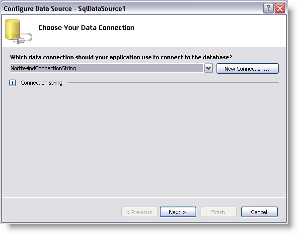
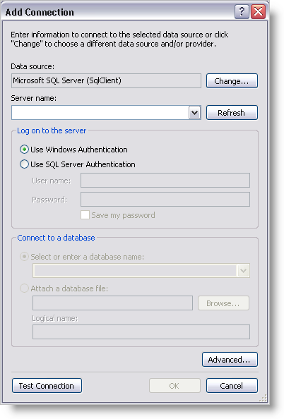
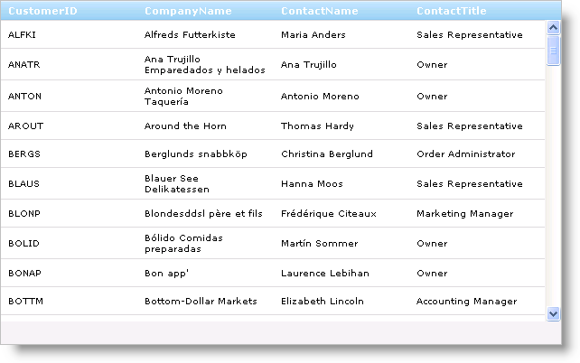

////

|metadata|
{
    "name": "webdatagrid-getting-started-with-webdatagrid",
    "controlName": ["WebDataGrid"],
    "tags": ["Data Binding","Grids"],
    "guid": "{84AA0A4E-A183-4A8A-8B46-3401F1A57D23}",  
    "buildFlags": [],
    "createdOn": "0001-01-01T00:00:00Z"
}
|metadata|
////

= Getting Started with WebDataGrid

== Before You Begin

WebDataGrid™ allows many features to be enabled for complex behaviors and dynamic operations. The most common use however, is to display data. Binding and displaying data with WebDataGrid is a simple process.

== What You Will Accomplish

You will learn how to add WebDataGrid to your page, retrieving customers table of the Northwind database.

== Follow these Steps

[start=1]
. Create an ASP.NET web page.
[start=2]
. Drag a ScriptManager component from the Microsoft® Visual Studio™ toolbox onto the page.
[start=3]
. Drag a WebDataGrid control onto the page.
[start=4]
. Drag a SqlDataSource component onto the page.
[start=5]
. Click the smart tag of the SqlDataSource component and select Configure Data Source. The Configure Data Source configuration wizard appears.

[start=6]
. Click New Connection to configure the connection string. The Add Connection dialog appears.

[start=7]
. Set the server name to the server you are using, .\SQLEXPRESS in this case. Set the database to Northwind.
[start=8]
. Click Ok. You are returned to the Configure Connection screen.
[start=9]
. Click Next.
[start=10]
. Select Specify Columns from a Table or View and do the following:

.. Choose the Customers table from the drop-down list.
.. In the Columns section, select CustomerID, CompanyName, ContactName, and ContactTitle to display those columns.
.. At this point you have the option to click the Advanced button to specify that the SqlDataSource component should generate Insert, Update, and Delete statements for the data retrieved.

[start=11]
. Click Next.
[start=12]
. Test your query to make sure SqlDataSource retrieves your data.
[start=13]
. Click Finish to close the configuration wizard. SqlDataSource is set up to retrieve the Customers data from the Northwind database.
[start=14]
. In the properties window for WebDataGrid, set  pick:[asp-net="link:infragistics4.web.v{ProductVersion}~infragistics.web.ui.framework.data.flatdataboundcontrol~datasourceid.html[DataSourceID]"]  to be the id of the SqlDataSource component.
[start=15]
. Set the  pick:[asp-net="link:infragistics4.web.v{ProductVersion}~infragistics.web.ui.framework.data.flatdataboundcontrol~datakeyfields.html[DataKeyFields]"]  property to CustomerID.
[start=16]
. Run the application. WebDataGrid binds to the customers table and displays its data.

