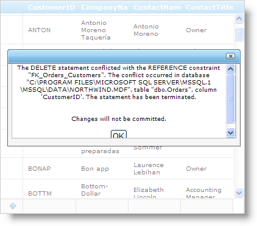

////

|metadata|
{
    "name": "webdatagrid-handling-server-side-exceptions-using-ajax",
    "controlName": ["WebDataGrid"],
    "tags": ["Events","Grids"],
    "guid": "{FCA79C1E-B88B-49BA-84EF-EAFCE92E6327}",  
    "buildFlags": [],
    "createdOn": "0001-01-01T00:00:00Z"
}
|metadata|
////

= Handling Server Side Exceptions Using AJAX

== Before You Begin

By default, an AJAX-enabled WebDataGrid™ control pops up a message to display any server-side exceptions encountered. If you want to handle the exception and display your own custom message, you can do so through the AJAXResponse client-side event. The AJAXResponse event fires for every AJAX response from the server. This is an ideal place to relay messages from server to client.

== What You Will Accomplish

You will learn how to handle exceptions from CRUD operations and relaying the error message to the client, displaying a custom message to your end-users with a WebDialogWindow™ control.

== Follow these Steps

[start=1]
. Bind WebDataGrid to the Customers table using a SqlDataSource component. For more information on this, see link:webdatagrid-getting-started-with-webdatagrid.html[Getting Started with WebDataGrid].
[start=2]
. Create a method named HandleError that you can call in any of WebDataGrid's data editing events (RowDeleted, RowAdded, RowUpdated). These events give you the exception message, if any, that you can set and relay back to the client. The GridResponse object is the place to set messages that you want to pass back for AJAX calls.

*In Visual Basic:*

----
Protected Sub HandleError(sender As Object, e As Infragistics.Web.UI.GridControls.EditedEventArgs)
   If Not (e.Exception Is Nothing) Then
      ' Set exception message to pass to client 
      Me.WebDataGrid1.GridResponse.Message = e.Exception.Message
      ' Set reason for exception 
      Me.WebDataGrid1.GridResponse.Tag = "Error"
      ' Set that server-side exception is handled 
      e.ExceptionHandled = True
   End If
End Sub
----

*In C#:*

----
protected void HandleError(object sender, 
   Infragistics.Web.UI.GridControls.EditedEventArgs e) 
{ 
   if (e.Exception != null) 
   { 
      // Set exception message to pass to client 
      this.WebDataGrid1.GridResponse.Message = e.Exception.Message; 
      // Set reason for exception 
      this.WebDataGrid1.GridResponse.Tag = "Error"; 
      // Set that server-side exception is handled 
      e.ExceptionHandled = true; 
   } 
}
----

[start=3]
. At this point you are ready to handle the error on the client side. You need a way to handle and display the error. This sample uses a WebDialogWindow™ control to do this.
[start=4]
. Drag a WebDialogWindow control onto the form and accept the prompt to add the default style. Configure the WebDialogWindow control as follows:

.. Drag three html DIV elements onto the WebDialogWindow control.
.. Drag a button onto the WebDialogWindow control. Set the value of the button to OK and add a click event handler for this button.
.. Drag another DIV onto the form and place the WebDialogWindow control within it.
.. In the property window with WebDialogWindow selected, set the WindowState property to Hidden. WebDialogWindow is initially hidden at the start of the application and will only display when an error occurs.

The markup for the WebDialogWindow and its contents should look like the following:

*In HTML:*

----

    <ig:WebDialogWindow ID="WebDialogWindow1" runat="server" Height="160px" 
        Width="383px" Modal="True" WindowState="Hidden">
        <ContentPane>
            <Template>
                

                

                

                 
                 
                

                Changes will not be committed.
                

                 
                    <input ID="OkButton" type="button" value="OK" onclick="return OkButton_onclick()" />
                

            </Template>
        </ContentPane>
    </ig:WebDialogWindow>
    

----

[start=5]
. Create the handler for the onclick event of Ok button in WebDialogWindow. The button should hide the control when clicked. 

*In Javascript:*

----
var dialog = $find("WebDialogWindow1");
                      dialog.hide();
----

[start=6]
. Enable editing and selection in WebDataGrid.

.. In the Microsoft® Visual Studio™ property window, locate the Behaviors property and click the ellipsis (...) button to launch the Behaviors Editor Dialog.
.. Enable the editing events that you need. For our purposes, check the CheckBox for the Row Deleting behavior to enable it.
.. Check the Selection behavior to also enable it.
.. Click Apply then Ok to close the editor.

[start=7]
. Handle the RowDeleted server-side event by going to the events grid and double-clicking EditingCore.RowDeleted.
[start=8]
. Call the HandleError method created earlier in the event-handler for the RowDeleted event. You can also do this for the other editing events ( e.g, RowAdded, and RowUpdated).

*In Visual Basic:*

----
Protected Sub WebDataGrid1_RowDeleted(sender As Object, e As Infragistics.Web.UI.GridControls.RowDeletedEventArgs)
   HandleError(sender, e)
End Sub
----

*In C#:*

----
protected void WebDataGrid1_RowDeleted(object sender, 
Infragistics.Web.UI.GridControls.RowDeletedEventArgs e)
    {
        HandleError(sender, e);
    }
----

[start=9]
. Handle the AJAXResponse event.

.. In the property grid for WebDataGrid, expand the ClientEvents property.
.. Type in AjaxResponse as the name for the AJAXResponse event handler.
.. In the code for the event-handler, retrieve the error message if it exists and display it in the WebDialogWindow control.

*In Javascript:*

----
function AjaxResponse(sender, e) 
{           
            // Make sure all server-side exception is handled so that grid is actually rendered
            if (e.get_browserResponseObject().status == 200) {
                // Check for error
                if (e.get_gridResponseObject().Tag == "Error") {
                    var dialog = $find("WebDialogWindow1");
                    // Get error message
                    var errorMessage = e.get_gridResponseObject().Message;
                    // Display dialog window with error message
                    var contentDiv = document.getElementById("ErrorDiv");
                    contentDiv.innerHTML = errorMessage;
                    dialog.show();
                }
            }
        }
----

[start=10]
. Run the application. Select a row and hit the delete key. WebDialogWindow informs that you have violated referential integrity of the data. Click Ok to close the dialog.

