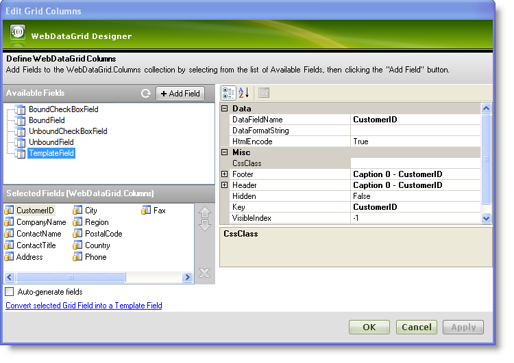
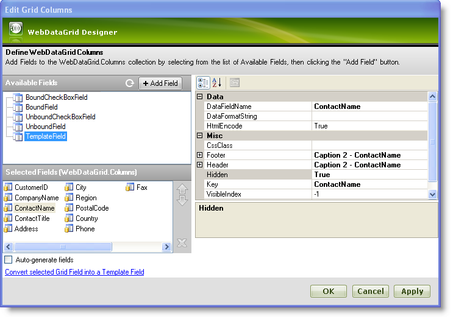

////

|metadata|
{
    "name": "webdatagrid-hiding-a-column",
    "controlName": ["WebDataGrid"],
    "tags": ["Grids"],
    "guid": "{68369569-55AA-4FE2-BDB8-0E2E177C4E7E}",  
    "buildFlags": [],
    "createdOn": "0001-01-01T00:00:00Z"
}
|metadata|
////

= Hiding a Column

The WebDataGrid™ control allows you to hide specific columns from users. You can achieve this by setting the [api link to Hidden] property to true on any type of column. The classes that support the Hidden property are:

*  pick:[asp-net="link:{ApiPlatform}web{ApiVersion}~infragistics.web.ui.gridcontrols.gridfield.html[GridField]"] 
*  pick:[asp-net="link:{ApiPlatform}web{ApiVersion}~infragistics.web.ui.gridcontrols.bounddatafield.html[BoundDataField]"] 
*  pick:[asp-net="link:{ApiPlatform}web{ApiVersion}~infragistics.web.ui.gridcontrols.boundcheckboxfield.html[BoundCheckBoxField]"] 
*  pick:[asp-net="link:{ApiPlatform}web{ApiVersion}~infragistics.web.ui.gridcontrols.unboundfield.html[UnboundField]"] 
*  pick:[asp-net="link:{ApiPlatform}web{ApiVersion}~infragistics.web.ui.gridcontrols.unboundcheckboxfield.html[UnboundCheckBoxField]"] 
*  pick:[asp-net="link:{ApiPlatform}web{ApiVersion}~infragistics.web.ui.gridcontrols.templatedatafield.html[TemplateDataField]"] 
*  pick:[asp-net="link:{ApiPlatform}web{ApiVersion}~infragistics.web.ui.gridcontrols.autogenerateddatafield.html[AutoGeneratedDataField]"] 

You can set the field object's Hidden property to true which causes the field to be hidden from view. However, a hidden column is still accessible programmatically through client-side code as it is still present in the client-side object model. The field’s visibility can be triggered either from the server-side or the client-side.

== To hide a column through the designer:

[start=1]
. From the Visual Studio™ Toolbox, drag and drop a ScriptManager component and a WebDataGrid control onto the form.
[start=2]
. Bind WebDataGrid to a SqlDataSource component retrieving data from the Customers table. For more information on doing this, see link:webdatagrid-getting-started-with-webdatagrid.html[Getting Started with WebDataGrid].
[start=3]
. In the property window, locate the Columns property and click the ellipsis(…) button to launch the Edit Grid Columns dialog.

[start=4]
. Select the column you want to hide from the Selected Fields (WebDataGrid.Columns) section, and set the Hidden property to true. For this example, select ContactName.

[start=5]
. Click Apply and OK to close the Edit Grid Columns dialog.
[start=6]
. Save and run your application. You will observe that the column ContactName is hidden.

== To hide a column programmatically :

*In Visual Basic:*

----
'To hide a column with index 2
Me.WebDataGrid1.Columns[2].Hidden = true
----

*In C#:*

----
//To hide a column with index 2 
this.WebDataGrid1.Columns[2].Hidden = true;
----

*In JavaScript:*

----
//To hide a column with index 2 
$find("WebDataGrid1").get_columns().get_column(2).set_hidden(true);
----

== Related Topics

link:webdatagrid-columns.html[Columns]