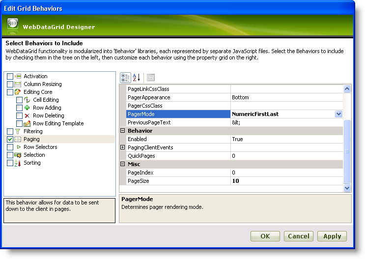

////

|metadata|
{
    "name": "webdatagrid-paging",
    "controlName": ["WebDataGrid"],
    "tags": ["Grids","Paging"],
    "guid": "{E2D0B7D7-481C-4835-B49E-76C3DD468CA8}",  
    "buildFlags": [],
    "createdOn": "2008-12-08T10:46:54Z"
}
|metadata|
////

= Paging

The WebDataGrid™ control’s paging mechanism breaks data into pages reducing load time and increasing performance. The number of pages is determined by the page size and the total number of records from the data source. WebDataGrid retrieves new data for each page as your end-users navigate from page to page. Data is retrieved asynchronously by default, using AJAX.

== *Enabling Paging*

[start=1]
. Bind WebDataGrid to a SqlDataSource component retrieving data from the Customers table. For more information on doing this, see link:webdatagrid-getting-started-with-webdatagrid.html[Binding WebDataGrid to a SQL Data Source].
[start=2]
. In the Microsoft® Visual Studio™ property window, locate the Behaviors property and click the ellipsis (...) button to launch the Behaviors Editor Dialog.
[start=3]
. Check the CheckBox next to Paging from the list on the left to add and enable the behavior.
[start=4]
. In the properties, set  pick:[asp-net="link:infragistics4.web.v{ProductVersion}~infragistics.web.ui.gridcontrols.paging~pagesize.html[PageSize]"]  to 10, increasing the number of records per page to 10\.
[start=5]
. Set  pick:[asp-net="link:infragistics4.web.v{ProductVersion}~infragistics.web.ui.gridcontrols.paging~pagermode.html[PagerMode]"]  to NumericFirstLast which changes the pager links to numbers with links to the first and last pages.

[start=6]
. Click Apply then Ok. You have enabled paging with the default settings.

The following markup is generated:

*In HTML:*

----
<Behaviors>
    <ig:Paging PagerMode="NumericFirstLast" PageSize="10">
    </ig:Paging>
</Behaviors>
----

To add paging from the code-behind, add the following code:

*In Visual Basic:*

----
WebDataGrid1.Behaviors.CreateBehavior(Of Infragistics.Web.UI.GridControls.Paging)()
WebDataGrid1.Behaviors.Paging.PageSize = 10
WebDataGrid1.Behaviors.Paging.PagerMode = Infragistics.Web.UI.GridControls.PagerMode.NumericFirstLast
----

*In C#:*

[source,csharp]
----
WebDataGrid1.Behaviors.CreateBehavior<Infragistics.Web.UI.GridControls.Paging>();
WebDataGrid1.Behaviors.Paging.PageSize = 10;
WebDataGrid1.Behaviors.Paging.PagerMode = Infragistics.Web.UI.GridControls.PagerMode.NumericFirstLast;
----

[start=7]
. In the property window, check that the  pick:[asp-net="link:infragistics4.web.v{ProductVersion}~infragistics.web.ui.gridcontrols.webdatagrid~enableajax.html[EnableAjax]"]  property of WebDataGrid is set to True. If not, set it to True. WebDataGrid is ready to page data using AJAX.

== Related Topics

link:webdatagrid-using-custom-paging-template.html[Using Custom Paging Template]

link:webdatagrid-using-custom-paging-template-in-code.html[Using Custom Paging Template in Code]