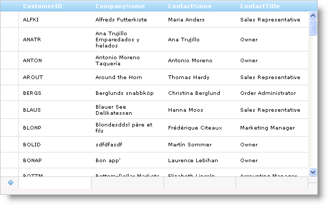

////

|metadata|
{
    "name": "webdatagrid-row-adding",
    "controlName": ["WebDataGrid"],
    "tags": ["Editing","Grids"],
    "guid": "{F7EB50C5-9428-4EAF-92EC-0A847483798B}",  
    "buildFlags": [],
    "createdOn": "0001-01-01T00:00:00Z"
}
|metadata|
////

= Row Adding (WebDataGrid)

WebDataGrid™ allows adding rows with the  pick:[asp-net="link:infragistics4.web.v{ProductVersion}~infragistics.web.ui.gridcontrols.rowadding.html[Row Adding]"]  behavior. Enabling this behavior places an Add New Row, reserved for adding data, onto the control’s user interface. Your end-users can enter values into the cells of this row. When the Add New Row loses focus, the row is added to WebDataGrid and the new record is committed to the underlying data source. You need the  pick:[asp-net="link:infragistics4.web.v{ProductVersion}~infragistics.web.ui.gridcontrols.behaviors~activation.html[Activation]"]  behavior enabled in order to put a row in focus.

.Note:
[NOTE]
====
WebDataGrid commits row adding operations immediately; a row insert causes an immediate postback, persisting the change to the data source.
====

== Add New Row

The Add New Row can be positioned at the bottom or top of WebDataGrid. This is a fixed position and the row will be visible even as your end-users scroll through the data.

The Add New Row uses the editors for WebDataGrid’s columns. It determines what the data type of a column is and uses the default editor for that data type. For example, if one of your fields is of type String, Add New Row uses a TextBox for that cell.

You can also having different settings per cell by adding a  pick:[asp-net="link:infragistics4.web.v{ProductVersion}~infragistics.web.ui.gridcontrols.rowaddingcolumnsetting.html[Row Adding Column Setting]"]  for the behavior. For more information on column settings, see link:webdatagrid-setting-column-settings-for-a-behavior.html[Setting Column Settings for a Behavior].

== Navigation

With the Activation enabled, you can click on a cell to activate a cell in the Add New Row, and depending on the  pick:[asp-net="link:infragistics4.web.v{ProductVersion}~infragistics.web.ui.gridcontrols.editablebehaviorbase~editmodeactions.html[EditModeActions]"] , the cell will enter edit mode. Clicking off the row adds it to WebDataGrid if it contains data. You can use the keyboard to navigate the Add New Row as well.

*Tab* - Focus goes to the next cell. If you are on the last cell, tabbing commits the row.

*Arrow Key* - Focus goes to another cell from the currently active cell based on which arrow key was pressed.

*Enter Key* - Commits if there is data.

== *Enabling Row Adding*

== Before You Begin

You can use the WebDataGrid™ control’s Add New Row feature to allow your end-users to add new records. The  pick:[asp-net="link:infragistics4.web.v{ProductVersion}~infragistics.web.ui.gridcontrols.rowadding.html[Row Adding]"]  behavior provides a blank row that is always present on the control. When you enter new data to the Add New Row and then lose focus on the row, that row is inserted in WebDataGrid and its underlying data source. For a row to obtain or lose focus, you must have the  pick:[asp-net="link:infragistics4.web.v{ProductVersion}~infragistics.web.ui.gridcontrols.behaviors~activation.html[Activation]"]  behavior enabled. For more information on the Activation behavior, see link:webdatagrid-activation.html[Activation].

.Note:
[NOTE]
====
WebDataGrid commits row adding operations immediately; a row insert causes an immediate postback, persisting the change to the data source.
====

== What You Will Accomplish

You will learn how to allow users to add new rows to WebDataGrid, using the Add New Row interface.

== Follow these Steps

[start=1]
. Bind WebDataGrid to a SqlDataSource component retrieving data from the Customers table. For more information on doing this, see link:webdatagrid-getting-started-with-webdatagrid.html[Getting Started with WebDataGrid].
[start=2]
. In the Microsoft® Visual Studio™ property window, Set the  pick:[asp-net="link:infragistics4.web.v{ProductVersion}~infragistics.web.ui.framework.data.flatdataboundcontrol~datakeyfields.html[DataKeyFields]"]  property to CustomerID so that changes in WebDataGrid can be updated to the data source.
[start=3]
. In the same window, locate the  pick:[asp-net="link:infragistics4.web.v{ProductVersion}~infragistics.web.ui.gridcontrols.behaviors.html[Behaviors]"]  property and click the ellipsis (...) button to launch the Behaviors Editor Dialog.
[start=4]
. Check the CheckBox for Row Adding from the list on the left to add the behavior. Notice that the  pick:[asp-net="link:infragistics4.web.v{ProductVersion}~infragistics.web.ui.gridcontrols.behaviors~editingcore.html[EditingCore]"]  behavior is checked as well.
[start=5]
. In the properties, check that  pick:[asp-net="link:infragistics4.web.v{ProductVersion}~infragistics.web.ui.gridcontrols.rowadding~alignment.html[Alignment]"]  is set to Bottom. This positions the Add New Row at the bottom of WebDataGrid.
[start=6]
. Click Apply then Ok to close the editor. Your end-users are now able to add new rows to WebDataGrid by entering data into the row and causing the row to lose focus by clicking elsewhere or by pressing the keyboard Enter key.

== *Add a Row in Code*

You can add a row to WebDataGrid™ on the client side. You do not need the  pick:[asp-net="link:infragistics4.web.v{ProductVersion}~infragistics.web.ui.gridcontrols.rowadding.html[Row Adding]"]  behavior enabled to add a row using code. The only behavior you need enabled is the  pick:[asp-net="link:infragistics4.web.v{ProductVersion}~infragistics.web.ui.gridcontrols.behaviors~editingcore.html[EditingCore]"]  behavior and BatchUpdating should be set to true. In addition, you have to fill in all required values for the row before adding it.

*In JavaScript:*

----
var grid = $find("WebDataGrid1");
var rows = grid.get_rows();var rowsLength = grid.get_length(); // Create array of cell values for all values that cannot be null.
var row = new Array("CustomerID", "CompanyName");
// Add row.
rows.add(row);
var lastRow = rows.get_row(rowsLength);var cell = lastRow.get_cell(1);grid.get_behaviors().get_editingCore().get_behaviors().get_cellEditing().enterEditMode(cell);
----

Another way to add row in code is by using JSON-notation object with { column-key : cell-value } pairs. It is recommended to use this approach when ColumnMoving behavior is enabled.

*In JavaScript:*

----
var grid = $find("WebDataGrid1");
var rows = grid.get_rows();
// Create JSON-notation object
var row = [       { "Value" : new Date().getTime() + 1, "DataKeyField" : "RequiredDate" ) },       { "Value" : true, "DataKeyField" : "Discontinued" ) },
       { "Value" : "Hanari Carnes" , "DataKeyField" : "ShipName" ) },
       { "Value" : 4, "DataKeyField" : "ShipVia" ) },
// Add row.
rows.add(row);
----

Related Topics

link:webdatagrid-cell-editing.html[Cell Editing (WebDataGrid)]

link:webdatagrid-enabling-row-deleting.html[Enabling Row Deleting (WebDataGrid)]

link:webdatagrid-row-editing-template.html[Row Editing Template (WebDataGrid)]