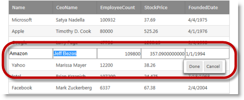

////

|metadata|
{
    "name": "webdatagrid-row-editing-overview",
    "controlName": [],
    "tags": [],
    "guid": "40d3b706-2c75-4ea9-b1a7-9948a3e779fa",  
    "buildFlags": [],
    "createdOn": "2014-03-10T16:13:35.0228476Z"
}
|metadata|
////

= Row Editing Overview (WebDataGrid)

== Topic Overview

=== Purpose

This topic provides an overview of the  _WebDataGrid_   __™__  Row Editing behavior’s features and functionality.

=== Required background

The following topics are prerequisites to understanding this topic:

[options="header", cols="a,a"]
|====
|Topic|Purpose

| link:webdatagrid-behaviors.html[Behaviors]
|This topic describes how behaviors work in the _WebDataGrid_ .

| link:webdatagrid-editting.html[Editing Behavior Overview (WebDataGrid)]
|This topic provides a conceptual overview of the Editing feature (`EditingCore` behavior) of the _WebDataGrid_ .

|====

[[_Hlk382258485]]

=== In this topic

This topic contains the following sections:

* <<_Ref381987238,Introduction>>
* <<_Ref381987250,Main Features>>
* <<_Ref381987257,User Interactions and Usability>>
* <<_Ref381987341,Row Editing Behavior Events>>
* <<_Ref381987348,Related Content>>

** <<_Ref381987356,Topics>>
** <<_Ref381987361,Samples>>

[[_Ref381987238]]

== Introduction

=== Row Editing summary

The Row Editing behavior is an improved  _WebDataGrid_  editing mode, designed to provide a better editing experience to the user. With Row Editing, the editable row displays all of the cell editors making it more apparent which row is editable. Also, there are Done and Cancel buttons displayed in a dialog alongside the editable row. These buttons provide better control when committing or cancelling pending edits.

By default, row editing is disabled. You can enable it from the  _WebDataGrid_   Designer, from the ASPX markup, or in the code-behind. For details, refer to the link:webdatagrid-enabling-row-editing.html[Enabling Row Editing] topic.

[[_Ref381987250]]
== Main Features

=== Main features summary chart

The following table summarizes the main features of the  _WebDataGrid_   Row Editing behavior.

[options="header", cols="a,a"]
|====
|Feature|Description

|Edit mode for the entire row
|In contrast to the link:webdatagrid-cell-editing.html[Cell Editing] behavior, the Row Editing behavior places the entire grid row in Edit mode. This makes it easier for the user to identify better which row is in edit mode.

|Done and Cancel Buttons
|These buttons appear in a dialog beneath the row in Edit mode. They are positioned relative to the right border of the grid container and maintain this position during horizontal scrolling when applicable. They provide a clear way for the user to commit or reject changes to the editable row. 

* Done button – commits the row value changes to the grid and ends Edit mode 

* Cancel button – rejects any row value changes to their state prior to Edit mode and ends Edit mode 

|====

[[_Ref381987257]]
== User Interactions and Usability

=== User interactions summary chart

The following table summarizes the user interaction capabilities of the  _WebDataGrid_   Row Editing behavior.

[options="header", cols="a,a,a,a"]
|====
|The user can…|Using…|Details|Configurable?

|Switch a row to Edit mode
|Double-click or double tap
|By default, row editing is set up to begin Edit mode on double-click or double tap.
|image::images/workaround.png[] 

Configurable with the Editing behavior’s link:infragistics4.web.v{ProductVersion}~infragistics.web.ui.gridcontrols.editmodeactions_members.html[EditModeActions] property.

|Commit the changes made to a row and exit Edit mode
|
* Click or tap 

* The Done button 

* The Enter key 

|By default, when the user clicks or taps a row other than the row in Edit mode, any changes made to the row in Edit mode are committed and the row exits Edit mode. 

Clicking the Done button or pressing the Enter key on the keyboard accepts any changes made to the row in Edit mode and exits Edit mode.
|image::images/workaround.png[] 

* The clicking and tapping behavior is configurable using events. See also the link:{SamplesUrl}/data-grid/row-editing-client-events[Row Editing Client Events] sample. 

* The Done and Cancel button dialog can be hidden with the Editing behavior’s link:infragistics4.web.v{ProductVersion}~infragistics.web.ui.gridcontrols.rowediting~enabledialog.html[EnableDialog] property. 

|Reject the changes made to a row and exit Edit mode
|The Cancel button 

The Esc key
|Clicking the Cancel button or pressing the Esc key on the keyboard rejects any changes made to the row in Edit mode and exits Edit mode.
|image::images/workaround.png[] 

The Done and Cancel button dialog can be hidden with the Editing behavior’s link:infragistics4.web.v{ProductVersion}~infragistics.web.ui.gridcontrols.rowediting~enabledialog.html[EnableDialog] property.

|====

[[_Ref381987341]]
== Row Editing Behavior Events

=== Row editing behavior events reference

The row editing behavior has the following client-side events used to customize client side functionality. All of these events provide access to the cell values through the event arguments.

[options="header", cols="a,a"]
|====
|Event|Description

|`EnteringEditMode`
|Fires prior to a row going into Edit mode. It is cancellable.

|`EnteredEditMode`
|Fires after a row has entered edit mode.

|`ExitingEditMode`
|Fires prior to a row exiting Edit mode. It is cancellable in two ways. You can prevent the row from leaving Edit mode using `eventArgs.keepEditing(true)` or you can force exit Edit mode and reject changes using `eventArgs.set_cancel(true)`.

|`ExitedEditMode`
|Fires after a row has exited edit mode.

|====

==== Related Samples

link:{SamplesUrl}/data-grid/row-editing-client-events[Row Editing Client Events]

[[_Ref381987348]]
== Related Content

[[_Ref381987356]]

=== Topics

The following topics provide additional information related to this topic.

[options="header", cols="a,a"]
|====
|Topic|Purpose

| link:webdatagrid-enabling-row-editing.html[Enabling Row Editing (WebDataGrid)]
|This topic details how to enable the Row Editing behavior in the _WebDataGrid_ .

|====

[[_Ref381987361]]

=== Samples

The following samples provide additional information related to this topic.

[options="header", cols="a,a"]
|====
|Sample|Purpose

| link:{SamplesUrl}/data-grid/row-editing[Row Editing Behavior]
|This sample demonstrates row editing behavior with Done/Cancel buttons and an editor appearing in every cell of the editable row.

| link:{SamplesUrl}/data-grid/customized-row-editing-appearance[Customized Row Editing Appearance]
|This sample customizes the appearance of the Row Editing behavior by hiding the Done/Cancel buttons or by providing custom HTML and CSS classes for the buttons.

| link:{SamplesUrl}/data-grid/row-editing-client-events[Row Editing Client Events]
|This sample demonstrates how to use the `EnteringEditMode` and `ExitingEditMode` events to customize the row editing behavior.

|====