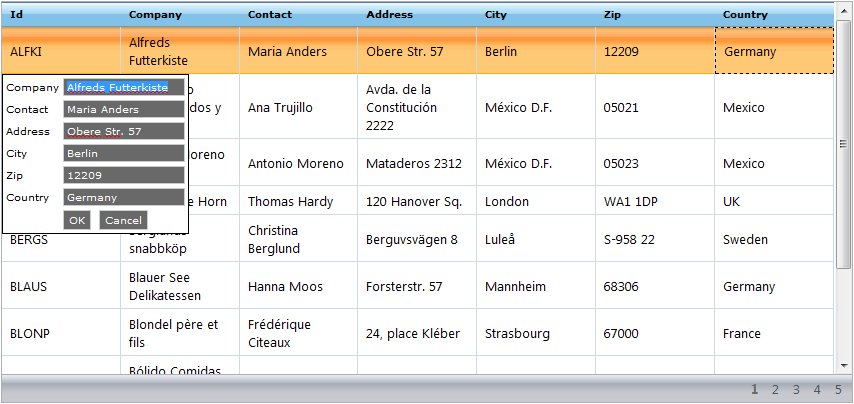

////

|metadata|
{
    "name": "webdatagrid-row-editing-template",
    "controlName": ["WebDataGrid"],
    "tags": ["Editing","Grids","Templating"],
    "guid": "{909EA82B-BEB6-4642-B2E3-74CCCB3A14EF}",  
    "buildFlags": [],
    "createdOn": "2008-12-08T16:10:38Z"
}
|metadata|
////

= Row Editing Template (WebDataGrid)

The  pick:[asp-net="link:infragistics4.web.v{ProductVersion}~infragistics.web.ui.gridcontrols.roweditingtemplate.html[Row Editing Template]"]  is a feature that allows you to present the end-user with a custom interface for data editing in WebDataGrid™. You can populate this template with any controls. The template appears when the end-user attempts to edit a row. You can set options to designate which actions will cause the template to appear using the  pick:[asp-net="link:infragistics4.web.v{ProductVersion}~infragistics.web.ui.gridcontrols.roweditingtemplate~editmodeactions.html[EditModeActions]"]  property. The end-user edits data using the template and when the template closes, changes are applied to the corresponding row.

== Default Template Generation

When you first enable Row Editing Template, you have the option to populate it with the default TextBox editor control. The  pick:[asp-net="link:infragistics4.web.v{ProductVersion}~infragistics.web.ui.gridcontrols.gridfield~header.html[Header]"]  information of each column is written within the created 
 tag.

== Data Binding

By default, WebDataGrid retains changes between its cells and the Row Editing Template’s default editors. If you want to supply different editors for the Row Editing Template you need to bind these editors to their respective columns to reflect changes between the two.

You can specify bindings using the Client Bindings editor. You can achieve more advanced bindings by specifying a Javascript expression. For more information on custom bindings, see link:webdatagrid-using-client-bindings.html[Using Client Bindings].

== Closing Row Editing Template

The Row Editing Template generates default Ok and Cancel buttons. Both buttons close the template; the Ok button commits changes while the Cancel button rejects them.

You can specify a different control for the Ok and Cancel commands. You can use any control that implements the IButtonControl interface (Button, LinkButton, ImageButton, etc.). For more information on setting up Ok and Cancel buttons for the Row Edit Template, see link:webdatagrid-using-client-bindings.html[Using Client Bindings].

The Row Editing Template stays open until the end-user presses the Ok or Cancel buttons. The template also closes if a post back or AJAX call occurs. You can handle the client-side closing event to cancel the closing of the template and hence cancel any callback to the server.

== 

Related Topics

link:webdatagrid-enabling-row-editing-template.html[Enabling Row Editing Template]

link:webdatagrid-using-client-bindings.html[Using Client Bindings]