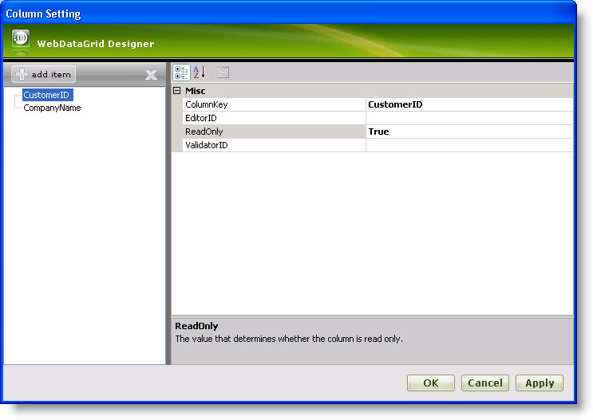
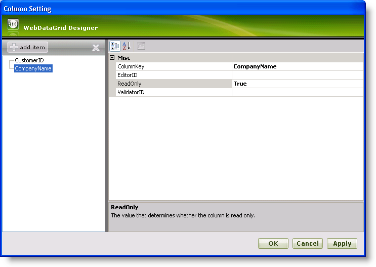

////
|metadata|
{
    "name": "webdatagrid-setting-column-settings-for-a-behavior",
    "controlName": ["WebDataGrid"],
    "tags": ["Grids"],
    "guid": "{BE21A2E2-2E3C-4C65-83DD-E2EB1239E20E}",
    "buildFlags": [],
    "createdOn": "2008-10-09T11:27:13Z"
}
|metadata|
////

= Setting Column Settings for a Behavior

== Before You Begin

You can set certain behaviors column-by-column. This allows you to restrict a behavior to only a select number of columns in WebDataGrid™. This is quite useful when you have a primary key column or a column that your end-users should not edit.

For each behavior that you can set on a per column basis in the behaviors editor, there is a column settings collection to specify which column(s) to enable the behavior in. Adding a column setting allows you to enable/disable a particular behavior for a column.

There are 6 different types of column settings, one for each behavior. The column settings are listed below.

*  pick:[asp-net="link:infragistics4.web.v{ProductVersion}~infragistics.web.ui.gridcontrols.columneditsetting.html[ColumnEditSetting]"] 
*  pick:[asp-net="link:infragistics4.web.v{ProductVersion}~infragistics.web.ui.gridcontrols.columnfilteringsetting.html[ColumnFilteringSetting]"] 
*  pick:[asp-net="link:infragistics4.web.v{ProductVersion}~infragistics.web.ui.gridcontrols.columnresizesetting.html[ColumnResizeSetting]"] 
*  pick:[asp-net="link:infragistics4.web.v{ProductVersion}~infragistics.web.ui.gridcontrols.editingcolumnsetting.html[EditingColumnSetting]"] 
*  pick:[asp-net="link:infragistics4.web.v{ProductVersion}~infragistics.web.ui.gridcontrols.rowaddingcolumnsetting.html[RowAddingColumnSetting]"] 
*  pick:[asp-net="link:infragistics4.web.v{ProductVersion}~infragistics.web.ui.gridcontrols.sortingcolumnsetting.html[SortingColumnSetting]"] 

When adding column settings, especially in markup, make sure the setting corresponds to the behavior ( e.g, EditingColumnSetting is the setting to use for the Editing behavior ).

.Note:
[NOTE]
====
You must add a behavior to WebDataGrid on the control level before you can enable/disable it on the column level.
====

== What You Will Accomplish

You will restrict data editing to only two columns using the behaviors editor of WebDataGrid.

== Follow these Steps

[start=1]
. Bind WebDataGrid to a SqlDataSource component retrieving data from the Customers table. Only include the columns CustomerID, CompanyName, ContactName, and ContactTitle. For more information on doing this, see link:webdatagrid-getting-started-with-webdatagrid.html[Getting Started with WebDataGrid].
[start=2]
. In the Microsoft® Visual Studio™ property window, locate the  pick:[asp-net="link:infragistics4.web.v{ProductVersion}~infragistics.web.ui.gridcontrols.behaviors.html[Behaviors]"]  property and click the ellipsis (...) button to launch the Behaviors Editor Dialog.
[start=3]
. Check the  pick:[asp-net="link:infragistics4.web.v{ProductVersion}~infragistics.web.ui.gridcontrols.cellediting.html[CellEditing]"]  behavior from the list on the left to enable it.
[start=4]
. In the properties for Cell Editing, select the  pick:[asp-net="link:infragistics4.web.v{ProductVersion}~infragistics.web.ui.gridcontrols.cellediting~columnsettings.html[ColumnSettings]"]  property and click the ellipsis (…) button to launch the column settings designer.
[start=5]
. Add 2 Column Setting items for the CustomerID and CompanyName fields. Since these columns, in most cases, should not be edited by the end-user, you will make them read-only.

.. Set the  pick:[asp-net="link:infragistics4.web.v{ProductVersion}~infragistics.web.ui.gridcontrols.columnsetting~columnkey.html[ColumnKey]"]  property of the first column to CustomerID.
+

.. Set the ColumnKey property of the second column to CompanyName.
+

.. Set both ReadOnly properties to True.

[start=6]
. Click Apply then Ok to close the editor.
[start=7]
. Click Apply then Ok to close the Behaviors editor.

*You can also do the above steps in code.*

*In Visual Basic:*

----
Me.WebDataGrid1.Behaviors.CreateBehavior(Of EditingCore)()
Me.WebDataGrid1.Behaviors.EditingCore.Behaviors.CreateBehavior(Of CellEditing)()
' Create column settings 
Dim settingColumn1 As New EditingColumnSetting() 
settingColumn1.ColumnKey = "CustomerID" 
settingColumn1.ReadOnly = True 
Dim settingColumn2 As New EditingColumnSetting() 
settingColumn2.ColumnKey = "CompanyName" 
settingColumn2.ReadOnly = True 
' Add column settings 
Me.WebDataGrid1.Behaviors.EditingCore.Behaviors.CellEditing.ColumnSettings.Add(settingColumn1) 
Me.WebDataGrid1.Behaviors.EditingCore.Behaviors.CellEditing.ColumnSettings.Add(settingColumn2)
----

*In C#:*

----
this.WebDataGrid1.Behaviors.CreateBehavior<EditingCore>();
this.WebDataGrid1.Behaviors.EditingCore.Behaviors.CreateBehavior<CellEditing>();
// Create column settings
EditingColumnSetting settingColumn1 = new EditingColumnSetting();
settingColumn1.ColumnKey = "CustomerID";
settingColumn1.ReadOnly = true;
EditingColumnSetting settingColumn2 = new EditingColumnSetting();
settingColumn2.ColumnKey = "CompanyName";
settingColumn2.ReadOnly = true;
// Add column settings
this.WebDataGrid1.Behaviors.EditingCore.Behaviors.CellEditing.ColumnSettings.Add(settingColumn1);
this.WebDataGrid1.Behaviors.EditingCore.Behaviors.CellEditing.ColumnSettings.Add(settingColumn2);
----

[start=8]
. Run the application. The end-user is only allowed to edit the Contactname and ContactTitle columns.