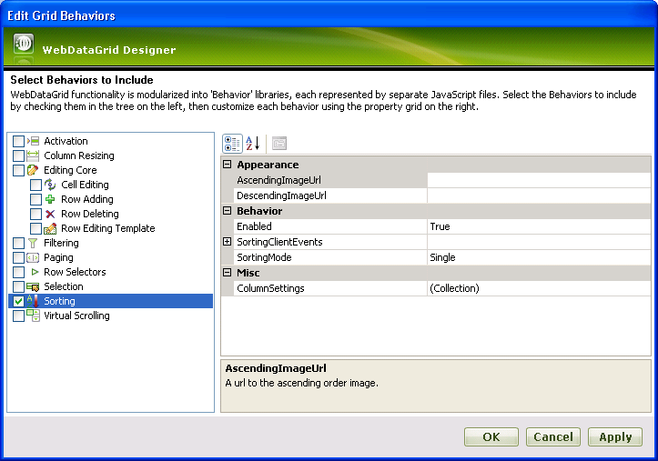
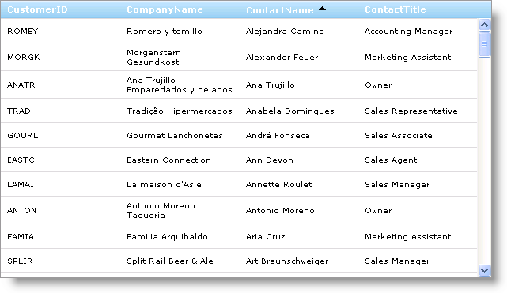

////

|metadata|
{
    "name": "webdatagrid-sorting",
    "controlName": ["WebDataGrid"],
    "tags": ["Grids","Sorting"],
    "guid": "{B7993018-9A76-40C1-B3CF-D2213E50D962}",  
    "buildFlags": [],
    "createdOn": "0001-01-01T00:00:00Z"
}
|metadata|
////

= Sorting

WebDataGrid™ allows sorting of data. You can have single or multiple column sorting. Follow these steps to enable the sorting behavior.

[start=1]
. Bind WebDataGrid to a SqlDataSource component retrieving data from the Customers table. For more information on doing this, see link:webdatagrid-getting-started-with-webdatagrid.html[Getting Started with WebDataGrid].
[start=2]
. In the property window, locate the  pick:[asp-net="link:{ApiPlatform}web{ApiVersion}~infragistics.web.ui.gridcontrols.behaviors.html[Behaviors]"]  property and click the ellipsis (...) button to launch the Behaviors Editor Dialog.
[start=3]
. Check the CheckBox next to Sorting from the list of behaviors on the left to enable the behavior.
[start=4]
. Leave  pick:[asp-net="link:{ApiPlatform}web{ApiVersion}~infragistics.web.ui.gridcontrols.sorting~sortingmode.html[SortingMode]"]  as Single in the properties.

[start=5]
. Click Ok to close the dialog window. The following markup gets generated:

*In HTML:*

----
<Behaviors>
    <ig:Sorting>
    </ig:Sorting>
</Behaviors>
----

To add sorting behavior from the code-behind, add the following code:

*In Visual Basic:*

----
WebDataGrid1.Behaviors.CreateBehavior(Of Infragistics.Web.UI.GridControls.Sorting)()
----

*In C#:*

----
WebDataGrid1.Behaviors.CreateBehavior<Infragistics.Web.UI.GridControls.Sorting>();
----

[start=6]
. Run the application. You can sort one column at a time in WebDataGrid.

You can sort WebDataGrid using server-side or client-side code. On the server side, you have the  pick:[asp-net="link:{ApiPlatform}web{ApiVersion}~infragistics.web.ui.gridcontrols.sorting~sortedcolumns.html[SortedColumns]"]  property. On the client, you have the sortColumn method to use.

The  pick:[asp-net="link:{ApiPlatform}web{ApiVersion}~infragistics.web.ui.gridcontrols.sorting~sortingmode.html[SortingMode]"]  property does not apply to sorting in code. This property is for sorting in the UI. This allows you to restrict users to sorting only single columns,leaving you still capable of sorting multiple columns in code for a flexible data presentation.

The following code shows you how to sort a column in WebDataGrid, assuming sorting is enabled.

*In Visual Basic:*

----
Me.WebDataGrid1.Behaviors.Sorting.SortedColumns.Add(Me.WebDataGrid1.Columns("ContactName"), Infragistics.Web.UI.SortDirection.Ascending)
----

*In C#:*

----
this.WebDataGrid1.Behaviors.Sorting.SortedColumns.Add(this.WebDataGrid1.Columns["ContactName"], Infragistics.Web.UI.SortDirection.Ascending);
----

*In JavaScript:*

----
var grid = $find("WebDataGrid1");
// Sort column by calling sortColumn method and passing in the column and the sort direction
// Sort direction is 0, 1, or 2 for none, ascending, or descending.
grid.get_behaviors().get_sorting().sortColumn(grid.get_columns().get_columnFromKey("ContactName"), 1, false);
----

Sorting and Paging behaviors enabled

.Note:
[NOTE]
====
When both behaviors are enabled if you navigate to a page different than the first one and then sort a column, the WebDataGrid™ automatically navigates to the first page with the sorting applied.
====